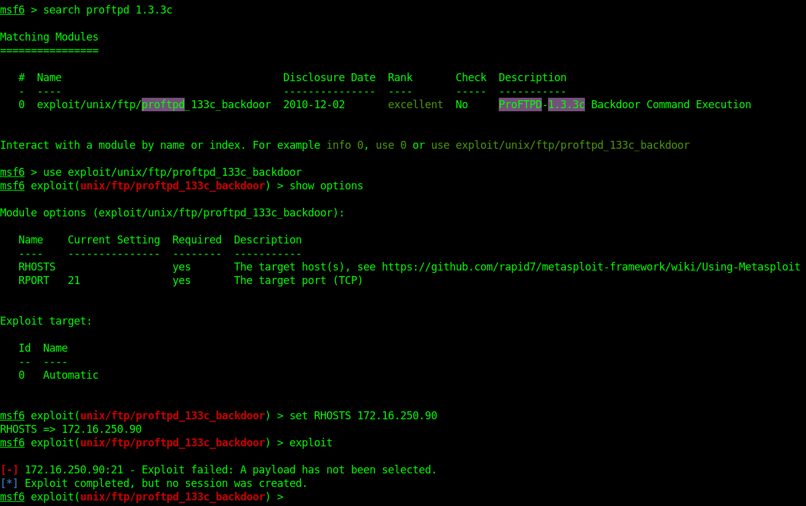
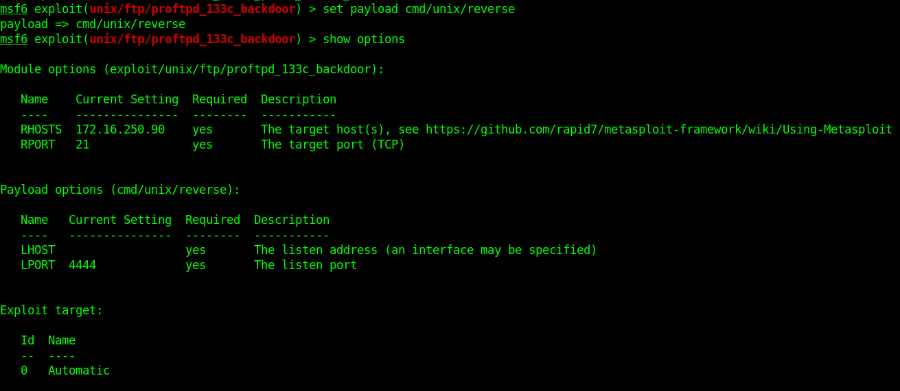
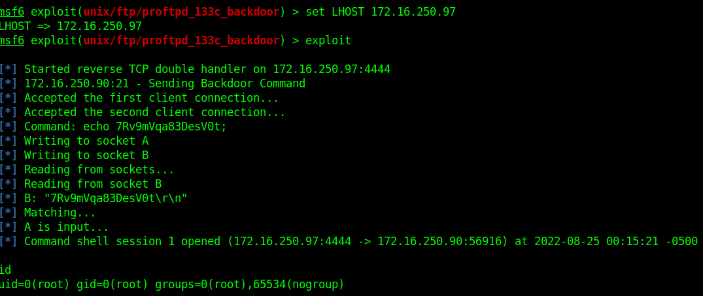
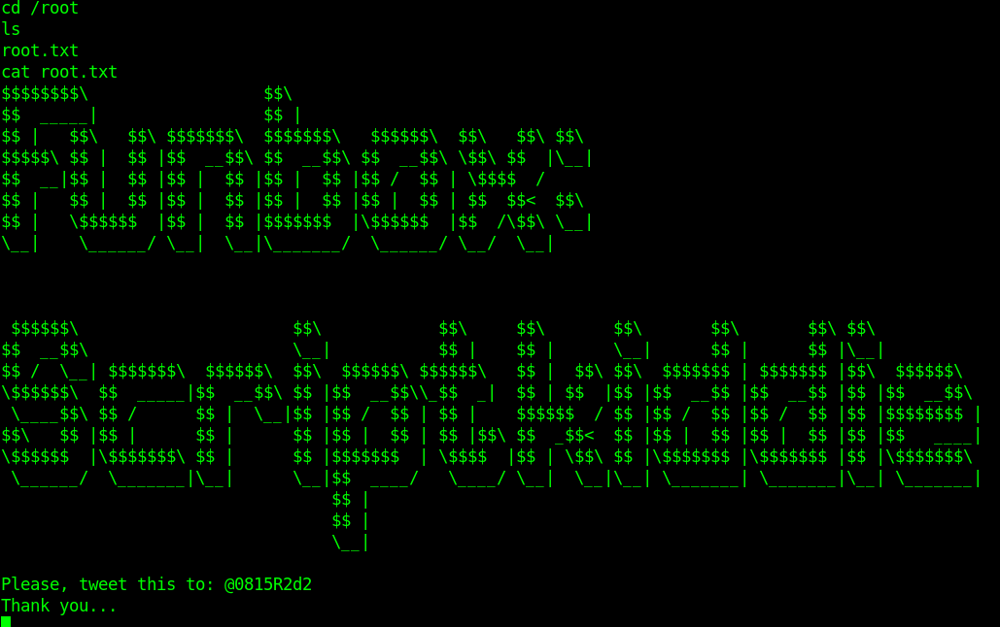

# Funbox: Scriptkiddie (VH)
https://www.vulnhub.com/entry/funbox-scriptkiddie,725/

## Discovery

### Tool used: arp-scan
<br>

```
sudo arp-scan --localnet

Interface: ens33, type: EN10MB, MAC: 00:0c:29:01:a5:1c, IPv4: 172.16.250.97
Starting arp-scan 1.9.7 with 256 hosts (https://github.com/royhills/arp-scan)
172.16.250.90	94:65:9c:78:8c:05	Intel Corporate

25 packets received by filter, 0 packets dropped by kernel
Ending arp-scan 1.9.7: 256 hosts scanned in 1.994 seconds (128.39 hosts/sec). 25 responded
```

## Port scan
### Tool used: nmap
<br>

```
nmap -sV -T4 -p- funbox11

Starting Nmap 7.92 ( https://nmap.org ) at 2022-08-24 21:07 CDT
Nmap scan report for funbox11 (172.16.250.90)
Host is up (0.057s latency).
Not shown: 65482 closed tcp ports (conn-refused), 46 filtered tcp ports (no-response)
PORT    STATE SERVICE     VERSION
21/tcp  open  ftp         ProFTPD 1.3.3c
22/tcp  open  ssh         OpenSSH 7.2p2 Ubuntu 4ubuntu2.10 (Ubuntu Linux; protocol 2.0)
25/tcp  open  smtp        Postfix smtpd
80/tcp  open  http        Apache httpd 2.4.18 ((Ubuntu))
139/tcp open  netbios-ssn Samba smbd 3.X - 4.X (workgroup: WORKGROUP)
143/tcp open  imap        Dovecot imapd
445/tcp open  netbios-ssn Samba smbd 3.X - 4.X (workgroup: WORKGROUP)
Service Info: Host:  funbox11; OSs: Unix, Linux; CPE: cpe:/o:linux:linux_kernel

Service detection performed. Please report any incorrect results at https://nmap.org/submit/ .
Nmap done: 1 IP address (1 host up) scanned in 48.66 seconds
```

## HTTP enumeration

### Tool used: gobuster
<br>

```
gobuster dir --url http://funbox11 --wordlist /usr/share/wordlists/dirb/common.txt 

===============================================================
Gobuster v3.1.0
by OJ Reeves (@TheColonial) & Christian Mehlmauer (@firefart)
===============================================================
[+] Url:                     http://funbox11
[+] Method:                  GET
[+] Threads:                 10
[+] Wordlist:                /usr/share/wordlists/dirb/common.txt
[+] Negative Status codes:   404
[+] User Agent:              gobuster/3.1.0
[+] Timeout:                 10s
===============================================================
2022/08/24 21:10:31 Starting gobuster in directory enumeration mode
===============================================================
/.hta                 (Status: 403) [Size: 273]
/.htpasswd            (Status: 403) [Size: 273]
/.htaccess            (Status: 403) [Size: 273]
/index.php            (Status: 301) [Size: 0] [--> http://funbox11/]
/server-status        (Status: 403) [Size: 273]                     
/wp-admin             (Status: 301) [Size: 307] [--> http://funbox11/wp-admin/]
/wp-content           (Status: 301) [Size: 309] [--> http://funbox11/wp-content/]
/wp-includes          (Status: 301) [Size: 310] [--> http://funbox11/wp-includes/]
/xmlrpc.php           (Status: 405) [Size: 42]                                    
                                                                                  
===============================================================
2022/08/24 21:10:33 Finished
===============================================================
```

At first, we go down the WordPress rabit hole, looking for some sort of way to get in through the app, but in the end we realized the entry point was *much* easier than this way. A quick search for ProFTPD exploits reveals that there is a backdoor for the installed version (1.3.3c). 

A few metasploit commands later, we make our way in to the server as root.
<br><br>




<br><br>

Once we are in, we are able to capture the root.txt flag!
<br><br>

