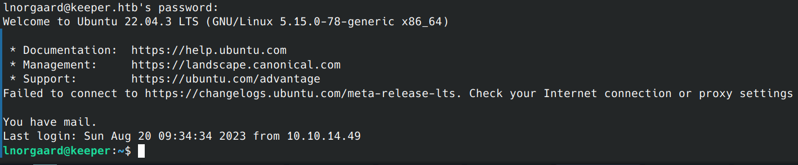

# Keeper CTF (HTB)
https://app.hackthebox.com/machines/Keeper

## Port scan

### Tool used: nmap
<br>

```
nmap -p22,80 -sV keeper.htb
Starting Nmap 7.94 ( https://nmap.org ) at 2023-08-20 01:43 CDT
Nmap scan report for keeper.htb (10.10.11.227)
Host is up (0.046s latency).
rDNS record for 10.10.11.227: keeper

PORT   STATE SERVICE VERSION
22/tcp open  ssh     OpenSSH 8.9p1 Ubuntu 3ubuntu0.3 (Ubuntu Linux; protocol 2.0)
80/tcp open  http    nginx 1.18.0 (Ubuntu)
Service Info: OS: Linux; CPE: cpe:/o:linux:linux_kernel
```

## Web


Browsing the URL indicates the server is running CMS Made Simple (CMSMS):<br><br>


<br><br>


<br><br>

Default credentials: root / password


## Portal enumeration

"Users"


<br><br>

"User Information"


## SSH


<br><br>


<br><br>

We copy the Python code from Exploit Database, then execute it with the arguments indicated in the code:

## user.txt

## KeePass ticket


<br><br>

RT30000.zip --> keepass dump and database files

https://sourceforge.net/p/keepass/discussion/329220/thread/f3438e6283/

https://github.com/vdohney/keepass-password-dumper

## Exploit


<br><br>

https://sourceforge.net/p/keepass/discussion/329220/thread/f3438e6283/

https://github.com/vdohney/keepass-password-dumper

## Password dump


<br><br>


<br><br>

## SSH Key

convert to putty


<br><br>

```
chmod 0600 keeper.key

ssh root@keeper.htb -i keeper.key  
Enter passphrase for key 'keeper.key':  
Welcome to Ubuntu 22.04.3 LTS (GNU/Linux 5.15.0-78-generic x86_64) 
 
 * Documentation:  https://help.ubuntu.com 
 * Management:     https://landscape.canonical.com 
 * Support:        https://ubuntu.com/advantage 
Failed to connect to https://changelogs.ubuntu.com/meta-release-lts. Check your Internet connection or proxy settings 
 
You have new mail. 
Last login: Tue Aug  8 19:00:06 2023 from 10.10.14.41 
root@keeper:~#
```